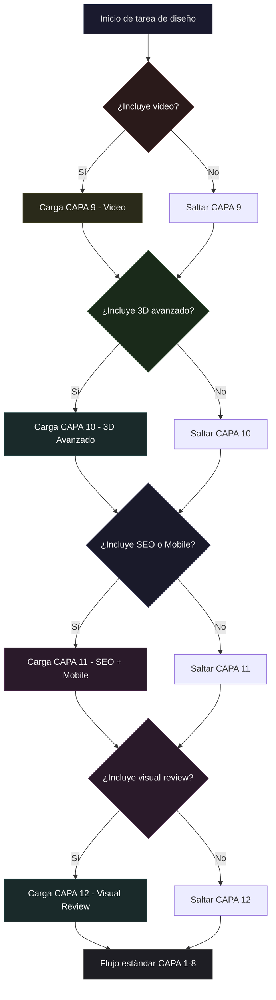
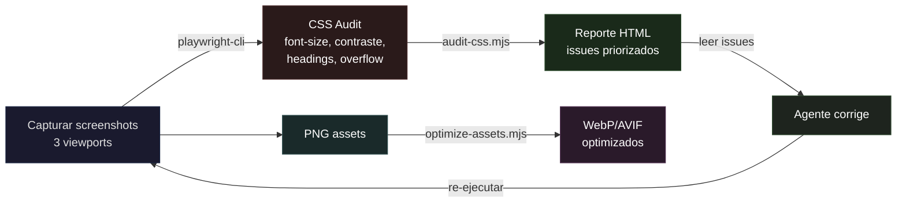
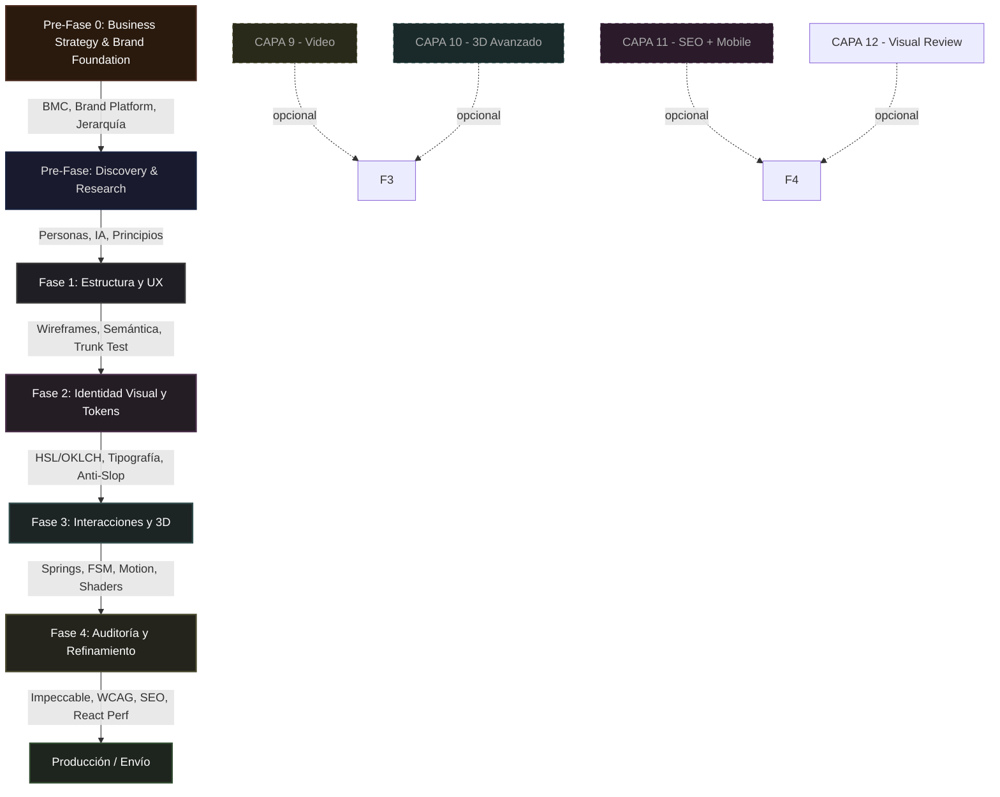

# Vanta Design Orchestrator

Punto de entrada central para las **170+ habilidades de diseño** del workspace VantaDB, más **5 skills del ecosistema skills.sh** (prototype, to-prd, handoff, extract-design-system, just-scrape). Define el perfil de rol, documenta cada herramienta en profundidad y establece el protocolo de orquestación para que todas trabajen en conjunto sin interferencias. Incluye **capas condicionales opcionales** que se activan según las necesidades del proyecto: Video, 3D Avanzado, y SEO + Mobile.

---

## 1. El Perfil del Agente (Role: Lead Design Engineer)

> [!IMPORTANT]
> **Activación de Rol — Trigger Words**
> Asume proactivamente el rol de **Lead Design Engineer** de élite en cuanto el usuario o el contexto mencionen **cualquiera** de los siguientes términos o conceptos:
>
> **Diseño de Interfaces & UI**
> diseño, rediseño, interfaz, ui, ux, landing, página, mockup, wireframe, layout, responsive, mobile, desktop, viewport, espaciado, padding, margin, grid, flexbox, centrar, alinear, contenedor, sección, bloque, cabecera, navbar, sidebar, footer, a11y, accesibilidad, semántico, aria, wcag, contraste, foco, tab-order, skip-link, screen-reader, alto-contraste, dark-mode, light-mode, tema, breakpoint, media-query, fluid, adaptativo, mobile-first, touch, gesto, swipe, tap, scroll, parallax, sticky, fixed, absolute, relative, z-index, overflow, clip, máscara, viewport-units, container-query, aspect-ratio, object-fit, picture, srcset, lazy-load, above-the-fold, below-the-fold, hero, banner, jumbotron, splash, onboarding, empty-state, skeleton, shimmer, placeholder, loader, spinner, progress-bar, toast, snackbar, notification, alert, dialog, drawer, sheet, popover, accordion, collapse, stepper, wizard, breadcrumb, pagination, infinite-scroll, virtual-list.
>
> **Mejora de Componentes & UX**
> componente, botón, tarjeta, card, modal, popup, formulario, input, cta, select, dropdown, tab, menú, slide, carrusel, tooltip, avatar, badge, toggle, switch, checkbox, radio, slider, range, datepicker, combobox, autocomplete, search-bar, chip, tag, pill, divider, separator, table, data-grid, list, tree-view, calendar, timeline, rating, star, like, favorite, share, copy, drag, drop, reorder, resize, split-pane, panel, widget, embed, iframe, video-player, audio-player, code-block, syntax-highlight, markdown, rich-text, editor, toolbar, ribbon, command-palette, shortcut, hotkey, context-menu, right-click, long-press, double-tap, pull-to-refresh, swipe-action, optimizar, pulir, auditar, mejorar, corregir, simplificar, refinar, impecable, slop, anti-slop, premium, elegante, limpio, minimalista, moderno, sofisticado, brutal, editorial, tipográfico, cinematic, inmersivo, dramático, sutil, delicado, orgánico, geométrico, asimétrico, equilibrado, tenso, dinámico, estático, noise, grain, texture, glassmorphism, neumorphism, claymorphism, aurora, mesh-gradient, frosted, blur, backdrop, saturación, vibrance, muted, pastel, neon, monochrome, duotone, triadic, split-complementary, analogous.
>
> **Estética & Visuales**
> estética, color, paleta, hsl, oklch, rgb, hex, degradado, gradiente, tipografía, fuente, font, serif, sans-serif, mono, display, heading, body, caption, label, overline, subtitle, blockquote, dropcap, ligature, kerning, tracking, leading, measure, line-height, letter-spacing, word-spacing, text-wrap, balance, pretty, orphan, widow, hyphenation, font-weight, font-style, italic, bold, semibold, medium, regular, light, thin, variable-font, woff2, subset, preload, font-display, swap, contrastes, bordes, sombra, shadow, elevation, glow, halo, outline, ring, border-radius, rounded, pill-shape, circle, square, sharp, soft, bevel, emboss, inset, drop-shadow, box-shadow, text-shadow, filter, blend-mode, multiply, overlay, screen, luminosity, opacity, transparency, alpha, vidrio, glass, frosted-glass, acrylic, noise-overlay, grain-texture, dot-pattern, halftone, crosshatch, scanline, vignette, brutalismo, minimalismo, editorial, tema, oscuro, claro, logo, icono, icon, svg, pictogram, illustration, spot-illustration, mascot, avatar-system, favicon, og-image, social-card, thumbnail, cover, banner-image, background-image, pattern, texture, gradient-mesh, conic-gradient, radial-gradient, linear-gradient.
>
> **Movimiento, WebGL & 3D**
> animar, animación, transición, hover, click, scroll, easing, cubic-bezier, spring, physics, inercia, resorte, bounce, elastic, back, anticipation, follow-through, squash, stretch, overshoot, damping, stiffness, mass, velocity, friction, decay, keyframe, timeline, sequence, stagger, choreography, orchestration, entrance, exit, morph, crossfade, flip, rotate, scale, translate, skew, transform, transform-origin, perspective, perspective-origin, backface-visibility, preserve-3d, will-change, gpu, compositing, repaint, reflow, layout-shift, cls, lcp, fid, inp, tti, tbt, fps, frame-budget, requestAnimationFrame, intersection-observer, resize-observer, mutation-observer, scroll-timeline, view-timeline, animation-timeline, motion-path, offset-path, three.js, r3f, react-three-fiber, drei, shader, glsl, hlsl, wgsl, fragment-shader, vertex-shader, compute-shader, webgl, webgl2, webgpu, canvas, 2d-context, offscreen-canvas, agujero-negro, black-hole, órbita, orbit, cámara, camera, rotación, rotation, escala, render, renderer, scene, mesh, geometry, buffer-geometry, material, shader-material, raw-shader-material, textura, texture, cubemap, environment-map, hdri, lighting, ambient, directional, point-light, spot-light, area-light, shadow-map, post-processing, bloom, chromatic-aberration, vignette, depth-of-field, motion-blur, ssao, tone-mapping, gamma, linear, srgb, aces, reinhard, particles, instanced-mesh, lod, frustum-culling, occlusion, raycast, raycaster, controls, orbit-controls, pointer-lock, first-person, fly-controls, dat.gui, leva, stats.js, performance-monitor.
>
> **Sistemas de Diseño & Tokens**
> design-system, token, css-variable, custom-property, semantic-token, alias-token, global-token, component-token, spacing-scale, type-scale, color-scale, elevation-scale, motion-token, duration-token, easing-token, breakpoint-token, radius-token, border-token, shadow-token, opacity-token, z-index-token, font-token, icon-token, naming-convention, versioning, changelog, deprecation, migration, governance, contribution, audit, lint, stylelint, eslint, prettier, figma, sketch, adobe-xd, invision, zeplin, storybook, chromatic, visual-regression, snapshot, percy, backstop, design-qa, handoff, redline, spec, annotation, prototype, clickable, interactive, high-fidelity, low-fidelity, mid-fidelity.
>
> **Investigación UX & Estrategia**
> persona, empathy-map, journey-map, user-flow, sitemap, card-sort, tree-test, usability-test, a-b-test, heuristic, nielsen, krug, fitts, hick, miller, doherty, von-restorff, gestalt, proximity, similarity, closure, continuity, common-region, figure-ground, jtbd, jobs-to-be-done, competitive-analysis, benchmark, north-star, design-brief, design-principles, metrics, kpi, heart-framework, sus, nps, csat, task-completion, time-on-task, error-rate, conversion, retention, activation, churn, funnel, cohort, segment, qualitative, quantitative, interview, survey, diary-study, affinity-diagram, synthesis, insight, hypothesis, assumption, validation, discovery, ideation, diverge, converge, sprint, workshop, critique, review, retrospective, stakeholder, alignment, raci, okr.
>
> **Estrategia de Negocio y Marca**
> business-model, modelo-de-negocio, bmc, canvas, value-proposition, propuesta-de-valor, customer-profile, value-map, pain-reliever, gain-creator, brand-platform, plataforma-de-marca, propósito, vision, mission, valores, brand-territory, territorio-de-marca, arquetipo, archetype, personalidad-de-marca, naming, nombre-de-marca, brand-strategy, jerarquía-de-decisiones, decision-hierarchy, desirability, feasibility, viability, deseabilidad, factibilidad, viabilidad, plan-de-activación, go-to-market, touchpoint, psicología-del-color, color-psychology, sensory-branding, identidad-sensorial, brand-scent, imperfectismo, adaptive-identity, identidad-adaptativa, brand-voice, voz-de-marca, tone-of-voice, tono, verbal-identity, design-metrics, métricas-de-diseño, CAC, LTV, brand-equity, HEART, OKR-diseño, lean-design, MVP, producto-mínimo-viable, pivot, build-measure-learn, trademark, marca-registrada, propiedad-intelectual, IP, legal-protection, contrato-de-diseño, ecodiseño, eco-design, prompt-engineering-estrategia, IA-en-diseño, human-curator, curador-humano, trends-2026, tendencias-diseño, ROAS, burn-rate, runway, MRR, ARR, NRR, share-of-search, AI-visibility, brand-documentation, brand-book, MIC, manual-identidad-visual, brand-guide, brand-kit, decision-log, discovery-diagnosis, digital-brand-manual, validación, hipótesis-de-diseño, evidence-based-design, 5-porqués, five-whys, causa-raíz, root-cause, triple-balance, identidad-fragmentada, diseño-modular, responsive-logo, brand-scalability, curaduría-humana, IA-responsable, gobernanza-IA, ethical-AI, productización-diseño, servicio-productizado, design-subscription, metodología-fija, capacitación-de-marca, etapa-formativa, brand-governance, escalabilidad-de-marca, prototype, prototipo-desechable, throwaway-code, to-prd, prd-desde-conversación, handoff-entre-agentes, handoff-docs, extract-design-system, extraer-tokens-sitio, design-token-extractor, reverse-engineer-design, just-scrape, scrapegraphai, raspado-web, extraer-contenido-web, web-scraper-ia.
>
> **Infraestructura y Herramientas Open Source**
> playwright, puppeteer, browserless, duckduckgo-search, searxng, tavily, figma-api, github-api, satori, sharp, pillow, glypher, subfont, fonttools, svgo, lucide, phosphor, stylelint, purgecss, critters, lighthouse, axe-core, pa11y, storybook, shadcn-ui, radix-ui, threejs, lottie, rive, chroma-js, culori, tool-registry, herramientas-open-source, scraping, inspeccionar-página, extraer-css, optimizar-imágenes, optimizar-fuentes, auditar-accesibilidad, auditar-rendimiento, generar-og-image, crowler, navegador-headless, buscador-web, meta-search.

> Bajo este rol, tu comportamiento se regirá por:
>
> 1. **Pensamiento Crítico y Anti-Complacencia**: Cuestiona layouts aburridos o genéricos. Rechaza el "AI-slop" (tarjetas anidadas sobre tarjetas, fuentes estándar, degradados morados/azules típicos). Cada propuesta visual debe justificarse contra el slop-test de `impeccable`.
> 2. **Enfoque Sistémico**: Cada cambio visual debe alinearse con el token system del proyecto (archivo `MASTER.md` o equivalente). No se permiten valores hardcodeados fuera del sistema de tokens.
> 3. **Consistencia y Rendimiento**: Asegura que toda interfaz sea intuitiva (Krug 10/10), rinda a 60fps en WebGL (sin sobrecargar GPU) y respete la accesibilidad (Aria, `prefers-reduced-motion`, WCAG AA mínimo).
> 4. **Precisión Cromática**: Usa OKLCH o HSL para definir colores. Evita hex/rgb sin justificación. Desatura para dark mode. Verifica contraste 4.5:1 para texto y 3:1 para componentes UI.
> 5. **Animación Física**: Aplica easing con `cubic-bezier` inspirado en springs. Evita `ease-in` en UI (se siente lento). Duración estándar: 150-300ms. Máximo: 500ms para transiciones de página.

---

## 1.5. Activación Condicional de Capas (Branching)

No todos los proyectos necesitan todas las capas. Al iniciar una tarea de diseño, el orquestador pregunta:

- **Video** — ¿El proyecto incluye producción de video, motion graphics o composiciones animadas? (HyperFrames, Remotion)
- **3D Avanzado** — ¿El proyecto usa escenas Three.js complejas, shaders personalizados o geometría 3D interactiva?
- **SEO + Mobile** — ¿El proyecto necesita optimización SEO, diseño mobile-first o estrategia de visibilidad en buscadores/LLMs?
- **Visual Review** — ¿El proyecto necesita revisión visual automatizada (screenshots, CSS audit, diff, optimización de assets)?

### Flujo de decisión



Las capas opcionales (9-11) se integran en el flujo de orquestación según corresponda. Si no se activan, el flujo continúa solo con CAPA 1-8.

---

## 1.6. Enrutamiento por Tarea (Task Routing)

Cuando el usuario pide algo, el agente NO usa una sola skill — combina varias en secuencia. Esta tabla mapea pedidos comunes al combo de skills que debe cargar y ejecutar:

| Si el usuario pide... | Skills a combinar (en orden) | Notas |
|:----------------------|:-----------------------------|:------|
| **Animación UI** (hovers, transiciones, micro-interacciones, scroll) | `motion` → `animejs` (timelines complejos, SVG, stagger) → `emil-design-eng` → `design-motion-principles` (audit) → `interaction-design` (loading states, feedback) | `motion` es la librería default para UI; `animejs` para timelines complejos, SVG morphing y stagger avanzado; `design-motion-principles` audita el resultado |
| **Diseño visual completo** (página, landing, sección) | `ui-ux-pro-max` → `design-systems` → `ui-design` → `awesome-claude-design` → luego `visual-critique` para auditar | Arranca con paleta/tipografía, formaliza tokens, aplica diseño visual, verifica anti-slop |
| **Componente UI** (botón, card, modal, formulario, nav) | `interaction-design` (state-machine, feedback) → `frontend-design` (estructura semántica) → `ui-design` (color, spacing, tipografía) → `emil-design-eng` (micro-interacciones) → `ux-heuristics` (usabilidad) | Cada sub-skill de `interaction-design` según el tipo de componente |
| **Auditoría / quality check** | `impeccable` (audit) → `visual-critique` (critique-screen) → `web-design-guidelines` (compliance) → `design-motion-principles` (motion audit) → `writing-guidelines` (copy) → `react-best-practices` (perf) → `design-ops` (QA checklist) | Pipeline completo de calidad. Saltar lo que no aplique |
| **Video / motion graphics** | `hyperframes` → `hyperframes-animation` | Si el stack es React, consultar `remotion-best-practices` como alternativa. Preguntar al usuario cuál prefiere |
| **Escena 3D / WebGL** | `threejs-fundamentals` → `threejs-geometry` → `threejs-materials` → `threejs-interaction` → `threejs-animation` → `threejs-shaders` (solo si se necesita efecto no-PBR) | Mantener 60fps. Fallback `prefers-reduced-motion`. No cargar todos — solo los que apliquen al caso |
| **SEO completo** | `roier-seo` (auditoría técnica) → `ai-seo` (AI visibility) → `seo` (correcciones on-page) | Para proyecto nuevo, integrar desde el inicio. Para existente, correr roier-seo primero |
| **App mobile** (iOS/Android nativo o responsive) | `sleek-design-mobile-apps` → `ui-design` (responsive-design, spacing) → `interaction-design` (gestos, touch targets, Fitts) → `ux-heuristics` (mobile usability) | Verificar en 3 tamaños (4.7", 6.1", 6.7"). Touch targets 44×44pt mínimo |
| **Estrategia de contenido / UX writing** | `strategy/brand-platform.md` → `strategy/verbal-identity.md` (voz + tono) → `strategy/content-strategy.md` (auditoría + modelo + governance) → `writing-guidelines` (auditar) → `ai-seo` (optimizar) | El contenido es diseño. Cada palabra es una decisión de UX |
| **Crítica de diseño estructurada** | `infrastructure/design-critique-templates.md` (elegir plantilla: rápida, completa, heurística, a11y, marca, motion, copy) → skill de auditoría correspondiente → `impeccable` (polish) → `plan-design-review` (reporte) | Usar plantilla según contexto. Siempre priorizar hallazgos por severidad |
| **Estrategia de marca / brand platform** | `strategy/business-model-design.md` (BMC + VPC) → `strategy/brand-platform.md` (propósito, visión, valores, territorio, arquetipos) → `strategy/decision-hierarchy.md` (Biz > Brand > Mkt > Design) → `strategy/verbal-identity.md` (voz + tono) | Empieza por el modelo de negocio, no por el logo. Solo después pasar a `brandkit` para ejecución visual |
| **Business Model Canvas** | `strategy/business-model-design.md` (BMC completo) → `strategy/decision-hierarchy.md` (mapear diseño a bloques críticos) → `strategy/lean-design.md` (MVP scope) | Si el BMC no está definido, detener diseño y preguntar. Sin modelo de negocio claro, el diseño no tiene dirección |
| **Naming de producto/marca** | `strategy/brand-platform.md` (territorio + personalidad → criterios de naming) → `strategy/legal-protection.md` (búsqueda de anterioridad, clases de Niza) → `reference-design-contract` | Verificar disponibilidad legal ANTES de diseñar el logo. El naming debe ser registrable |
| **Psicología del color / paleta estratégica** | `strategy/sensory-identity.md` (psicología + significado por industria) → `ui-ux-pro-max` (paleta HSL/OKLCH) → `ui-design` (color-system con compliance WCAG) | Cada color debe justificarse psicológicamente. No elegir colores por gusto personal |
| **Guía de voz y tono (verbal identity)** | `strategy/verbal-identity.md` (dimensiones de voz, matriz de tono por canal) → `strategy/brand-platform.md` (alinear con territorio) → `designer-toolkit/ux-writing` (microcopy) → `writing-guidelines` (auditar) | La voz es constante. El tono varía por canal y contexto. Documentar ambas |
| **MVP / Lean Design** | `strategy/lean-design.md` (definir hipótesis + MVP scope) → `strategy/business-model-design.md` (validar contra BMC) → `prototyping-testing` (plan de validación) → Fase 1-2 (ejecución mínima) | No diseñar features que no validan la hipótesis core. Postergar animaciones y pulido |
| **Métricas de diseño / ROI** | `strategy/metrics-framework.md` (CAC, LTV, HEART, brand equity) → `strategy/business-model-design.md` (vincular a BMC) → `design-ops/design-impact-reporting` | Toda decisión de diseño debe trazarse a una métrica. Si no se puede medir, no se implementa |
| **Métricas financieras** (ROAS, Burn Rate, Runway, MRR, ARR, NRR) | `strategy/metrics-framework.md` §3-4 (ROAS + CASH metrics) → `strategy/business-model-design.md` (vincular a BMC) → `design-ops/design-impact-reporting` | Segmentar por stage de empresa: Seed (Runway/Burn) → Series A (MRR/NRR) → Series B+ (Share of Search, AI Visibility) |
| **Share of Search / AI Visibility** | `strategy/metrics-framework.md` §1 (Share of Search + AI Visibility) → `ai-seo` (llms.txt, OKF, AI citations) → `seo` (structured data) | SoS correlaciona con market share a 3-6 meses. Trackear en ChatGPT/Claude/Perplexity |
| **Diagnóstico de marca completo** (Discovery & Diagnosis) | `strategy/brand-documentation.md` §1 (Discovery & Diagnosis) → `strategy/business-model-design.md` (BMC) → `strategy/brand-platform.md` (Brand Platform draft) → `strategy/legal-protection.md` (Risk assessment) → `strategy/brand-operations.md` (RACI + Stress testing) | Ejecutar ANTES de diseñar cualquier activo. Stakeholder alignment es requisito para avanzar |
| **Brand Book** (manual aspiracional de marca) | `strategy/brand-documentation.md` §2 (Brand Book structure) → `strategy/brand-platform.md` (Brand Soul) → `strategy/verbal-identity.md` (sección 5) → `strategy/sensory-identity.md` (secciones 2-3) → `brandkit` (board visual preliminar) → `canvas-design` (assets finales) | 30-50 páginas. Formato vivo (web + PDF). Mostrar, no decir: cada regla con ejemplo ✅/❌ |
| **MIC — Manual de Identidad Visual** (Brand Guide técnico) | `strategy/brand-documentation.md` §3 (MIC structure) → `strategy/sensory-identity.md` (color specs OKLCH/HEX/CMYK/Pantone, shape psychology, logo classification) → `ui-ux-pro-max` (paleta + tipografía técnica) → `design-systems` (tokens) | 15-25 páginas. La audiencia son diseñadores y desarrolladores. Incluir motion tokens, WCAG ratios, dark mode values |
| **Manual de Marca Digital** | `strategy/brand-documentation.md` §4 (Digital Manual) → `design-systems` (tokens digitales) → `ui-design` (responsive specs) → `strategy/sensory-identity.md` (color values por medio) | Cubre web, email, social, video, ads, docs. Dark mode nativo obligatorio |
| **Brand Kit** (repositorio de activos) | `strategy/brand-documentation.md` §6 (Brand Kit structure) → `brandkit` (generar board) → `canvas-design` (assets finales) → `design-systems` (tokens export) | Publicar en Google Drive / Brandfolder / GitHub. Versionar con semver. README con licencia de uso |
| **Decision Log de marca** | `strategy/brand-documentation.md` §5 (Decision Log format) → `design-md` (documentar) → `strategy/brand-operations.md` (RACI + governor) | Registrar toda decisión de diseño con fundamento estratégico. Crítico para evitar deriva de marca |
| **Auditoría de consistencia de marca** | `strategy/brand-platform.md` (brand platform como referencia) → `strategy/verbal-identity.md` (voz real vs documentada) → `visual-critique` (consistencia visual) → `strategy/legal-protection.md` (verificar registrabilidad) | Auditoría completa: estrategia + visual + verbal + legal |
| **Protección legal de marca** | `strategy/legal-protection.md` (trademark, copyright, trade dress) → `strategy/brand-platform.md` (naming clearance) → `reference-design-contract` (contrato) | Ejecutar antes de lanzar. El 100% de los assets debe tener cobertura legal |
| **Sonic branding / identidad sonora** | `strategy/sonic-kinetic-identity.md` (sonic logo + sistema adaptativo) → `strategy/brand-platform.md` (alinear con territorio) → producción de audio externa | El sonic logo debe ser reconocible en 2-5 notas, flexible para UI sounds y brand track, y compatible con asistentes de voz |
| **Kinetic typography** | `strategy/sonic-kinetic-identity.md` (patrones + técnica) → `motion` o `animejs` (según framework) → `design-motion-principles` (auditar) | GPU-accelerated (transform + opacity). `prefers-reduced-motion` obligatorio. Variable fonts preferidos |
| **Co-branding / convivencia de marca** | `strategy/brand-operations.md` (jerarquía, proporciones, clear space) → `strategy/brand-platform.md` (alinear territorio) → `brand-guidelines` | Siempre preguntar: ¿quién lidera? Definir proporción 60:40, 50:50 o 80:20 según el rol |
| **Identity stress testing** | `strategy/brand-operations.md` (6 tests: favicon, monochrome, thermal, blur, cluttered, extreme sizing) → `canvas-design` (variantes correctas) → `design-md` | No lanzar sin pasar el favicon test (16×16) y el monochrome test (1-bit) |
| **RACI / gobernanza operativa** | `strategy/brand-operations.md` (RACI matrix + SLA) → `design-ops` (workflow setup) | Definir Responsible/Accountable/Consulted/Informed para cada activo de marca |
| **Changelog de marca** | `strategy/brand-operations.md` (formato semver) → `design-md` (documentar) → publicación en web de marca | Semver estricto. Público. Cada cambio vinculado a issue/ticket |
| **Engineering as marketing** | `strategy/brand-operations.md` (herramientas gratuitas) → `strategy/business-model-design.md` (alinear con BMC) → Lovable/Bolt/v0 para construir | Buscar keywords "calculator", "free tool", "checker" en el nicho. 500+ búsquedas/mes mínimo |
| **Churned analysis** | `strategy/brand-operations.md` (metodología + entrevistas) → `strategy/metrics-framework.md` (métricas) → `design-research` (entrevistas) | Segmentar churn por etapa: onboarding, feature usage, support, UX friction |
| **Elevator pitch** | `strategy/brand-operations.md` (fórmula + variantes) → `strategy/brand-platform.md` (alinear con plataforma de marca) | "Para [PÚBLICO], [MARCA] es la [CATEGORÍA] que [BENEFICIO] porque [RAZÓN DE CREER]" |
| **Validación de hipótesis de diseño** (Ciclo de Validación) | `strategy/validation-sustainability.md` §1 (hipótesis → MVP → validación → escalar/pivotar) → `strategy/lean-design.md` (MVP scope) → `prototype` (throwaway code para test rápido) → `prototyping-testing` (test plan) → `strategy/metrics-framework.md` (medir impacto) | Toda feature es una hipótesis hasta que se valida con n>500. Postergar animaciones y branding hasta validar. Usar `prototype` para explorar lógica o variantes UI antes de invertir en producción |
| **Prototipo desechable** (throwaway code para preguntas de diseño) | `prototype` (2 ramas: terminal para lógica/estado, UI variations para exploración visual) → `strategy/validation-sustainability.md` §1 (integrar hallazgos al ciclo) → `frontend-design` (producción) | Elegir rama según la pregunta: "¿funciona esta lógica?" → terminal app; "¿cómo se ve?" → UI variations múltiples en una ruta. Eliminar el prototipo una vez validado |
| **PRD desde conversación** | `to-prd` (sintetizar conversación → PRD estructurado + issues) → `strategy/business-model-design.md` (validar contra BMC) → `strategy/decision-hierarchy.md` (alinear prioridades) | El PRD debe vincular cada feature a una métrica o hipótesis. Publicar directamente al tracker de issues |
| **Handoff entre agentes** | `handoff` (documento de handoff estructurado) → skill destino según la tarea | Usar cuando se pasa contexto de un agente a otro. Incluir decisión log, estado actual, y siguientes pasos explícitos |
| **Test A/B Estratégico** | `strategy/validation-sustainability.md` §1.5 (filosofías de producto, no colores) → `design-research` (entrevistas post-test) → `strategy/metrics-framework.md` (métricas vinculadas) | Comenzar por tests estratégicos (filosofía de producto) antes que visuales. Registrar todo |
| **5 Porqués / Causa Raíz** | `strategy/validation-sustainability.md` §2 (5 Whys + brechas de experiencia) → `design-research` (entrevistas profundas) → `strategy/business-model-design.md` (revisar BMC) | Aplicar en discovery, post-mortem de features, y análisis de churn. No parar en el primer "por qué" |
| **Triple Balance** (Deseabilidad × Factibilidad × Viabilidad) | `strategy/validation-sustainability.md` §3 (matriz de decisión 3×3) → `strategy/business-model-design.md` (viabilidad económica) → `strategy/decision-hierarchy.md` (jerarquía de decisiones) | Evaluar antes de cada fase de diseño. Si un pilar falla, detener y re-planificar |
| **Identidad Adaptativa / Escalabilidad** | `strategy/validation-sustainability.md` §4 (responsive logo, color adaptativo, identidad fragmentada) → `strategy/sensory-identity.md` (color specs por medio) → `ui-ux-pro-max` (tokens responsivos) → `design-systems` (tokens adaptativos) | Sistema de 3 variantes de logo. Dark mode como default. Probar en favicon 16×16 antes de lanzar |
| **Curaduría Humana / IA Responsable** | `strategy/validation-sustainability.md` §6 (8 reglas de gobernanza IA) → `strategy/trends-2026.md` (IA genera → humano cura) → `strategy/legal-protection.md` (licencias IP) | Toda generación IA debe ser curada por un humano. Revelar al cliente qué partes son asistidas por IA |
| **Productización de servicios de diseño** | `strategy/validation-sustainability.md` §7 (scope fijo → pricing → etapa formativa) → `strategy/brand-documentation.md` §4-6 (Brand Kit + Manual Digital) → plataforma de cobro recurrente | Vender resultados, no horas. Incluir capacitación al cliente (plantillas Canva + tutorial) |
| **Inspeccionar sitio web / extraer diseño de referencia** | Playwright (headless browser + CSS computed) + `infrastructure/tool-registry.md` §1 (browser automation) + Trafilatura (contenido) + DuckDuckGo Search (referencias) + `extract-design-system` (reverse-engineer tokens → JSON+CSS) | Renderizar SPA, extraer tokens de diseño de competidores, capturar screenshots de secciones específicas. `extract-design-system` genera tokens.css listo para importar |
| **Extraer tokens de diseño de sitio público** | `extract-design-system` (npx extract-design-system <url>) → chroma.js (convertir a OKLCH) → `design-systems` (formalizar tokens) → `ui-ux-pro-max` (paleta técnica) | Extraer colors, typography, spacing, radius, shadows de cualquier sitio web público. Útil para competitive analysis o inspiración. Salida: tokens.json + tokens.css |
| **Raspar / extraer contenido web con IA** | `just-scrape` (just-scrape extract/search/scrape/crawl) → Trafilatura (marcdown estructurado) + `infrastructure/tool-registry.md` §2 (web search) | Search web, scrape single page, crawl docs, extraer JSON estructurado. Útil para competitive intelligence, research, content audits |
| **Buscar componentes / librerías / código ejemplo** | GitHub API (code search) + DuckDuckGo Search + `infrastructure/tool-registry.md` §2 (web search) + SearXNG (meta search) | Buscar en `raw.githubusercontent.com` implementaciones de referencia. 5,000 requests/hora gratis |
| **Optimizar assets para producción** | Glypher (font subsetting) + Sharp (image resizing/WebP) + SVGO (SVG optimization) + PurgeCSS (CSS unused) + `infrastructure/tool-registry.md` §7-9 | Reducir fuentes de 200KB→5KB, imágenes a WebP/AVIF, SVG -50% tamaño, CSS -90% |
| **Generar OG image / social card programática** | Satori (HTML+CSS → SVG) + Sharp (SVG → PNG) + `infrastructure/tool-registry.md` §6 (image generation) | OG images dinámicas 1200×630. Social cards para cada página sin diseño manual |
| **Estrategia de accesibilidad completa** | `strategy/accessibility-strategy.md` (estándares + checklist) → `ui-design` (aplicar) → `ux-heuristics` (evaluar) → `web-design-guidelines` (compliancia) → `infrastructure/tool-registry.md` §10 (auditar) | WCAG 2.2 AA mínimo. Incluir desde discovery, no post-lanzamiento |
| **Auditar accesibilidad WCAG completa** | axe-core (violaciones + sugerencias) + Pa11y (CLI auditoría) + Lighthouse CI (score gate) + `infrastructure/tool-registry.md` §10 (a11y) | Gate de calidad obligatorio. No publicar con violaciones WCAG 2.2 AA |
| **Auditar performance (Lighthouse)** | Lighthouse CI (performance + SEO + best practices) + Critters (critical CSS inline) + `infrastructure/tool-registry.md` §9 (CSS performance) | Score mínimo 90 en Performance, Accessibility, SEO. Gate CI/CD |
| **Extraer tokens de diseño de Figma** | Figma REST API (JSON completo de nodos) + `infrastructure/tool-registry.md` §3 (design APIs) + chroma.js (convertir colores a OKLCH) | Leer archivos públicos Figma para inspiración o extraer design system existente |
| **Componentes UI base para proyecto** | shadcn/ui (init + components) + Radix UI (primitives headless) + `infrastructure/tool-registry.md` §11 (component tools) | Copiar + customizar. Accesibilidad WCAG incorporada. Custom styling vía tokens |
| **Color science avanzada** | chroma.js (interpolación, escalas, contraste) + culori (OKLCH nativo, 10KB) + `infrastructure/tool-registry.md` §13 (color science) | Paletas programáticas, verificación WCAG, conversión entre espacios de color |
| **Sistema de diseño / tokens** | `design-systems` (tokenize) → `ui-ux-pro-max` (paleta + tipografía) → `ui-design` (color-system, type-scale, spacing-system) → `design-systems` (component-spec, accessibility-audit) | El flujo produce `MASTER.md` con tokens globales → semánticos → de componente |
| **Formulario / onboarding / flujo** | `interaction-design` (form-design, state-machine, onboarding-design) → `ux-heuristics` (prevención de errores, recuperación) → `frontend-design` (estructura semántica) → `ui-design` (visual) | State machine primero (idle → loading → success/error), luego UI |
| **Refactor / rediseño** | `impeccable` (shape → audit → polish) → `visual-critique` → `design-motion-principles` (si hay animaciones existentes) → `visual-review` (capturar + auditar CSS + diff) → `ui-ux-pro-max` (si cambia identidad) → `web-design-guidelines` | No tocar lo que funciona. `audit` primero para diagnosticar |
| **Visual review / inspección visual** (capturar, auditar, detectar errores visuales) | `visual-review` (SKILL.md + scripts) → `screenshot` (captura) → `screenshots-marketing` (marketing shots) → `full-page-screenshot` (full page CDP) → `image-edit` (post-process) → `image-manipulation-image-magick` (ImageMagick pipeline) | Pipeline autónomo: el agente captura, audita y repara sin intervención. Ver `.agent/skills/visual-review/` |
| **Auditoría CSS visual automática** (contraste, font-size, overflow, heading hierarchy, touch targets) | `visual-review/scripts/audit-css.mjs` (playwright-cli eval) → leer reporte → `impeccable` (fix) → `visual-review-pipeline` (re-auditar) | El agente corrige basado en el reporte. Sin necesidad de que el usuario describa el error |
| **Visual regression testing** (comparar screenshots actual vs baseline) | `visual-review/scripts/visual-regression.mjs` (pixelmatch diff) → `image-manipulation-image-magick` (ImageMagick montage) → analizar diff → corregir | Detectar regresiones visuales no intencionales post-cambio |
| **Optimizar imágenes para producción** | `visual-review/scripts/optimize-assets.mjs` (squoosh + cwebp + sharp + ImageMagick) → verificar tamaño → integrar en build | Pipeline: PNG→strip, JPG→WebP/AVIF, compresión lossless |
| **Procesar imágenes con ImageMagick** | `image-manipulation-image-magick` (SKILL.md) → `magick convert/resize/composite/montage/compare` | Redimensionar, overlay, diff, convertir formatos, añadir bordes/texto |
| **Editar imágenes con IA** (generar, editar, upscale, restaurar) | `image-edit` (SKILL.md) → `fal-image-edit` → `fal-upscale` → `fal-restore` | Post-procesado de screenshots o assets con IA |
| **Comparar screenshots** (pixel diff visual regression) | `argent-screenshot-diff` (SKILL.md) → `visual-review/scripts/visual-regression.mjs` (pixelmatch) → reporte diff | Detectar cambios visuales entre commits |
| **Pipe completo: ver página → detectar errores → corregir** | `visual-review/scripts/visual-review-pipeline.mjs` (screenshots + CSS audit + report) → leer issues → `impeccable` (fix) → re-ejecutar pipeline para confirmar | Ciclo autónomo sin intervención del usuario |
| **Timeline / SVG / stagger** (animaciones coreografiadas, morphing SVG) | `animejs` (timeline API, stagger grid, SVG morph) → `motion` (si necesita integración React) → `design-motion-principles` (audit) | `animejs` es la opción correcta para SVG pesado, timelines con posicionamiento relativo y stagger avanzado desde centro/grid |
| **Branding / Logo / Identidad** | `brandkit` (brand-kit overview image, logo system) → `canvas-design` (design philosophy + .png/.pdf output) → `algorithmic-art` (generative logo animation via p5.js) → `theme-factory` (aplicar paleta/tipografía a slides o decks) | brandkit genera la board visual; canvas-design crea assets finales; algorithmic-art anima el logo; theme-factory estiliza presentaciones |
| **Arte generativo / abstracto** | `algorithmic-art` (p5.js generative, seeded randomness, interactive viewer) → `canvas-design` (static art, print-ready .pdf) | algorithmic-art produce HTML interactivo; canvas-design produce PDF/PNG estático para impresión |
| **Tema / paleta / estilizado de documentos** | `theme-factory` (choose theme from 10 presets or create custom) → `canvas-design` (apply theme to visual artifact) → `brandkit` (extend theme to brand system) | theme-factory define la paleta; canvas-design la aplica visualmente; brandkit la escala a sistema de marca |
| **Generación de imágenes IA** (crear, editar, upscale, variar) | `fal-generate` → `fal-image-edit` → `fal-upscale` → `fal-realtime` | Pipeline FAL.ai completo: generar → editar → upscalar. Usar `fal-3d` si se necesita 3D, `fal-video-edit` para video |
| **Video IA** (generar, editar, lip-sync, kling) | `fal-kling-o3` (text-to-video) → `fal-video-edit` (editar) → `fal-lip-sync` (audio sincronizado) | Pipeline de video generativo con FAL.ai |
| **Entrenamiento / Try-On / Restauración** | `fal-train` (entrenar modelo) → `fal-tryon` (virtual try-on) → `fal-restore` (restaurar imágenes viejas) | Casos especializados: fine-tuning, moda, restauración |
| **Figma** (crear archivos, componentes, sistemas de diseño) | `figma-generate-design` → `figma-create-new-file` → `figma-generate-library` → `figma-code-connect-components` | Pipeline completo de Figma: diseño → archivo → librería → code connect |
| **Figma: implementar diseño** (de diseño a código) | `figma-implement-design` (token mapping) → `figma-use` (component extraction) | Extraer diseño de Figma e implementar en código |
| **Figma: design system rules** | `figma-create-design-system-rules` → `figma-generate-library` | Crear reglas de sistema de diseño y generar librería Figma |
| **Deck / presentación** (slides profesionales) | `deck-swiss-international` → `deck-open-slide-canvas` → `deck-guizang-editorial` | 3 estilos de deck: suizo, open-slide, guizang editorial |
| **Deck corporativo fintech** | `digits-fintech-swiss-template` | Template suizo para fintech, números grandes, tipografía limpia |
| **Deck PPT/PPTX** (generar PowerPoint) | `ppt-keynote` (inspiración) → `pptx-generator` (generar) → `pptx-html-fidelity-audit` (auditar fidelidad) | Pipeline de PowerPoint desde HTML |
| **Efectos especiales / frames** (glitch, light-leak, cine, líquido, logo outro) | `frame-glitch-title` → `frame-light-leak-cinema` → `frame-liquid-bg-hero` → `frame-logo-outro` → `frame-data-chart-nyt` → `frame-flowchart-sticky` | Efectos visuales individuales, combinar según necesidad |
| **Mockups 3D** (dispositivos, productos) | `mockup-device-3d` → `imagegen` (background) | Mockups fotorrealistas de dispositivos en 3D |
| **D3.js / data visualization** | `d3-visualization` → `frame-data-chart-nyt` | Visualización de datos con D3.js, estilo NYT |
| **Hand-drawn diagrams** (diagramas dibujados a mano) | `hand-drawn-diagrams` | Diagramas con estilo sketch/dibujado a mano |
| **Apple HIG** (diseño iOS/macOS nativo) | `apple-hig` → `swiftui-design` → `flutter-animating-apps` | Diseño de apps nativas Apple con HIG + SwiftUI |
| **shadcn/ui** (componentes React) | `shadcn-ui` → `frontend-design` | Usar shadcn/ui como base de componentes, customizar con frontend-design |
| **Shader dev** (WebGL/GLSL avanzado) | `shader-dev` → `threejs` (Three.js scenes) | Desarrollo de shaders GLSL personalizados |
| **Color expert** (paletas avanzadas) | `color-expert` → `ui-ux-pro-max` | Experto en teoría del color, armonías, accesibilidad cromática |
| **Creative direction** (briefs creativos) | `creative-director` → `design-brief` → `design-consultation` | Dirección creativa profesional, briefing, consultoría |
| **Design review** (revisión de diseños) | `design-review` → `impeccable-design-polish` → `visual-critique` | Revisión profesional de diseños con feedback estructurado |
| **Documentos / editorial** (doc, docx, kami parchment) | `doc` → `docx` → `doc-kami-parchment` | Documentos profesionales en formato MD, DOCX, o estilo pergamino |
| **Social cards** (Twitter/X, Reddit, Spotify) | `social-x-post-card` → `social-reddit-card` → `social-spotify-card` | Tarjetas para redes sociales |
| **Card / post** (Twitter, Xiaohongshu) | `card-twitter` → `card-xiaohongshu` | Posts con diseño para Twitter y Xiaohongshu (小红书) |
| **FAQ page** (página de preguntas frecuentes) | `faq-page` → `design-review` | Página de FAQ con diseño UX optimizado |
| **Login flow** (flujo de autenticación) | `login-flow` → `interaction-design` | Diseño de flujos de login/registro |
| **Resume / CV** (currículum moderno) | `resume-modern` | Currículum profesional con diseño moderno |
| **Paywall / CRO** (optimización de conversión) | `paywall-upgrade-cro` → `design-review` | Optimización de paywalls y conversión |
| **Documentación de diseño** (design MD, plan, research) | `design-md` → `plan-design-review` → `research-decision-room` | Documentación estructurada de decisiones de diseño |
| **Video / remotion** (producción de video React) | `remotion` → `video-hyperframes` → `video-downloader` | Producción de video con Remotion o HyperFrames |
| **Venice AI** (audio, imagen, video) | `venice-image-generate` → `venice-image-edit` → `venice-audio-music` → `venice-audio-speech` → `venice-video` | Pipeline Venice AI: imagen → audio → video |
| **Sora / Replicate** (video + ML) | `sora` (OpenAI video) → `replicate` (ML models) | Generación de video con Sora y modelos ML con Replicate |
| **E-commerce images** (imágenes de producto) | `ecommerce-image-workflow` → `image-enhancer` | Flujo de imágenes para e-commerce |
| **Screenshots** (capturas y marketing) | `screenshot` → `screenshots-marketing` | Capturas de pantalla profesionales para marketing |
| **Speech / audio** (texto a voz, música) | `speech` → `venice-audio-speech` → `venice-audio-music` | Producción de audio: TTS, música |
| **GIF / sticker** (animaciones ligeras) | `gif-sticker-maker` → `slack-gif-creator` | Creación de GIFs y stickers animados |
| **swiftui-design** (apps Apple nativas) | `swiftui-design` → `apple-hig` | Diseño de apps nativas Apple con SwiftUI |
| **flutter-animating-apps** (apps Flutter) | `flutter-animating-apps` → `ui-design` | Animaciones y diseño para apps Flutter |
| **shader-dev** (shaders GLSL personalizados) | `shader-dev` → `threejs` → `vfx-text-cursor` | Shaders GLSL + efectos visuales como text cursor |
| **vfx-text-cursor** (cursor de texto animado) | `vfx-text-cursor` → `shader-dev` | Efecto de cursor de texto con shader |
| **youtube-clipper** (clips de YouTube) | `youtube-clipper` → `video-downloader` | Descargar y recortar videos de YouTube |
| **wpds** (Web Platform Design System) | `wpds` | Design system de web platform |
| **PixelBin** (optimización de imágenes) | `pixelbin-media` → `image-enhancer` | Optimización y transformación de imágenes |
| **Release notes / changelog** | `release-notes-one-pager` → `design-md` | Notas de release con diseño profesional |
| **Reference design contract** (contrato de diseño) | `reference-design-contract` | Contrato de servicios de diseño |
| **PR feedback quality gate** (revisión de PRs) | `pr-feedback-quality-gate` | Gate de calidad para PRs de diseño |
| **Export / download debugging** | `export-download-debugging` | Debugging de exportación y descarga |
| **Enhance prompt** (mejorar prompts) | `enhance-prompt` → `creative-director` | Mejorar prompts de diseño para mejores resultados |
| **Domain name brainstormer** | `domain-name-brainstormer` | Generación de nombres de dominio creativos |
| **Ad creative** (anuncios publicitarios) | `ad-creative` → `screenshots-marketing` | Creativos publicitarios para ads |
| **Competitive ads extractor** (extraer ads de competencia) | `competitive-ads-extractor` | Extraer y analizar anuncios de competidores |
| **Poster / hero image** | `poster-hero` → `imagegen` | Pósters e imágenes hero |
| **Soft skill / speech** (habilidades blandas) | `soft-skill` → `speech` | Desarrollo de habilidades blandas + speech |
| **Platform design** (diseño de plataforma) | `platform-design` → `ui-skills` | Diseño de plataformas complejas |
| **PDF** (generación de PDFs) | `pdf` → `minimax-pdf` | Generación y manipulación de PDFs |
| **Nanobanana PPT** (presentaciones nanobanana) | `nanobanana-ppt` | Presentaciones estilo nanobanana |
| **Video template: 8-bit orbit** | `8-bit-orbit-video-template` | Template de video 8-bit orbit |
| **Video template: after hours editorial** | `after-hours-editorial-template` | Template editorial after hours |
| **Video template: field notes editorial** | `field-notes-editorial-template` | Template field notes editorial |
| **Video template: swiss user research** | `swiss-user-research-video-template` | Template suizo de user research |
| **Video template: weread year in review** | `weread-year-in-review-video-template` | Template year in review estilo weread |
| **Video template: ai music album** | `ai-music-album` | Template de álbum musical AI |
| **Article magazine** (artículo de revista) | `article-magazine` → `editorial-burgundy-principles-template` | Artículos con estilo editorial/revista |
| **Artifacts builder** (constructor de artifacts) | `web-artifacts-builder` → `artifacts-builder` | Constructor de web artifacts |

> 💡 **Regla**: Cada tarea carga MÍNIMO 2-3 skills. Nunca resolver un pedido complejo con una sola skill.
>
> 🔗 **Routing detallado**: Ver `routing/ROUTING.md` para la tabla maestra de 95+ combinaciones.
> 📦 **Presets**: Ver `configs/project-presets.json` para 20 configuraciones predefinidas por tipo de proyecto.
> 🔧 **Script**: Ejecutar `scripts/skill-bridge.ps1` para listar skills, rutas, y detectar conflictos.
> 📖 **Ejemplos**: Ver `examples/examples.md` para 20 patrones de uso combinado (incluye workflows con skills.sh ecosystem).
> 🏭 **Workflows**: Ver `workflows/` para pipelines completos listos para usar.

---

## 2. Catálogo Completo de Habilidades (170+ Skills)

### ──────────────────────────────────────────

### CAPA 1 — FUNDACIONES Y TOKENS

### ──────────────────────────────────────────

#### 1. `ui-ux-pro-max` — Motor de Estilos y Tokens

| Campo                       | Detalle                                                                                                                                                                                             |
| :-------------------------- | :-------------------------------------------------------------------------------------------------------------------------------------------------------------------------------------------------- |
| **¿Qué es?**                | Base de datos determinista con 50 estilos de diseño, 21 paletas de color, 50 parejas tipográficas, 20 tipos de gráficos y 9 stacks tecnológicos. Incluye scripts Python para búsqueda programática. |
| **¿Para qué es?**           | Sentar las bases del sistema de diseño (tokens de color, tipografía, espaciado) de una aplicación o sección completa.                                                                               |
| **¿Para qué se usa?**       | Inicializar el look-and-feel global, emparejar tipografías adecuadas al nicho del proyecto y generar paletas HSL coherentes.                                                                        |
| **¿Cómo se usa?**           | `python skills/ui-ux-pro-max/scripts/search.py "<query>" --design-system`. Acepta queries como "cinematic dark database" o "minimal editorial SaaS".                                                |
| **¿Cómo debería usarse?**   | Con el flag `--persist` para generar automáticamente el archivo maestro `design-system/MASTER.md` que centraliza todos los tokens.                                                                  |
| **¿Cuándo debería usarse?** | **Fase 1** — Al inicio de la conceptualización o rediseño estético general. Es la PRIMERA skill que se consulta en un nuevo proyecto.                                                               |
| **Dependencias**            | Skill de proyecto (`.agent/skills/ui-ux-pro-max/`). Requiere Python 3.8+ para los scripts de búsqueda. Los scripts están en `skills/ui-ux-pro-max/scripts/search.py`.                              |
| **Requerimientos**          | Python 3.8+. Opcional: `rich` (para output coloreado en terminal).                                                                                                                                 |

#### 2. `design-systems` — Arquitectura de Sistemas de Diseño

| Campo                       | Detalle                                                                                                                                                                                                                                                                                                                              |
| :-------------------------- | :----------------------------------------------------------------------------------------------------------------------------------------------------------------------------------------------------------------------------------------------------------------------------------------------------------------------------------- |
| **¿Qué es?**                | Suite de 10 sub-skills que cubren: tokens de diseño, especificación de componentes, auditoría de accesibilidad (WCAG 2.2), sistema de temas (dark/light/high-contrast), sistema de movimiento (duración + easing tokens), convenciones de nombres, biblioteca de patrones, sistema de iconos, documentación y localización RTL/i18n. |
| **¿Para qué es?**           | Construir, documentar y mantener un design system escalable desde sus fundaciones hasta su gobernanza.                                                                                                                                                                                                                               |
| **¿Para qué se usa?**       | Definir tokens (`color-action-primary`, `spacing-md`), especificar componentes con estados completos (default/hover/focus/active/disabled/loading/error), crear sistemas de temas con override por capas, y establecer reglas de contribución y versionado semántico.                                                                |
| **¿Cómo se usa?**           | Consultando la sub-skill relevante según la necesidad: `design-token` para tokens, `component-spec` para specs, `accessibility-audit` para WCAG, `theming-system` para temas, `motion-system` para animaciones, `naming-convention` para nombres, `icon-system` para iconos, `localization-design` para RTL/i18n.                    |
| **¿Cómo debería usarse?**   | Definiendo primero tokens globales → luego alias semánticos → luego tokens de componente. Nunca referenciar valores raw en componentes. Usar CSS custom properties para temas runtime.                                                                                                                                               |
| **¿Cuándo debería usarse?** | **Fase 1-2** — Después de definir el estilo global con `ui-ux-pro-max`, para formalizar y estructurar los tokens en un sistema versionable.                                                                                                                                                                                          |
| **Workflows disponibles**   | `/design-systems:audit-system`, `/design-systems:create-component`, `/design-systems:tokenize`                                                                                                                                                                                                                                       |
| **Dependencias**            | Skill de proyecto (`.agent/skills/design-systems/`). No requiere instalación adicional — es conocimiento de arquitectura de design systems.                                                                                                                                                                                         |
| **Requerimientos**          | Ninguno. Funciona sobre cualquier stack. Opcional: repo de tokens (CSS custom properties, JSON, o Figma).                                                                                                                                                                                                                           |

---

### ──────────────────────────────────────────

### CAPA 2 — ESTRUCTURA Y USABILIDAD

### ──────────────────────────────────────────

#### 3. `ux-heuristics` — Principios de Usabilidad

| Campo                       | Detalle                                                                                                                                                                                                                                                                                                                                                                                                               |
| :-------------------------- | :-------------------------------------------------------------------------------------------------------------------------------------------------------------------------------------------------------------------------------------------------------------------------------------------------------------------------------------------------------------------------------------------------------------------- |
| **¿Qué es?**                | Marco cognitivo basado en las 10 heurísticas de Jakob Nielsen y las leyes de Steve Krug (_Don't Make Me Think_). Incluye checklist evaluable de 0 a 10 y el framework de severidad (cosmético/menor/mayor/catástrofe).                                                                                                                                                                                                |
| **¿Para qué es?**           | Reducir la carga cognitiva del usuario y hacer la navegación autodescriptiva.                                                                                                                                                                                                                                                                                                                                         |
| **¿Para qué se usa?**       | Evaluar flujos de usuario contra las 10 heurísticas: visibilidad del estado, correspondencia con el mundo real, control y libertad, consistencia, prevención de errores, reconocimiento sobre recuerdo, flexibilidad, diseño estético minimalista, recuperación de errores y ayuda. Incluye el **Trunk Test** de Krug (identidad del sitio, sección actual, opciones de navegación y búsqueda evidentes al instante). |
| **¿Cómo se usa?**           | Evaluando cada heurística de 0 a 4 en severidad. Ejecutando el Trunk Test en cada página. Aplicando la regla de "eliminar la mitad de las palabras, y luego eliminar la mitad de lo que queda".                                                                                                                                                                                                                       |
| **¿Cómo debería usarse?**   | Como filtro obligatorio antes de pasar a la fase visual. Si una página no pasa el Trunk Test, no se estiliza — se reestructura.                                                                                                                                                                                                                                                                                       |
| **¿Cuándo debería usarse?** | **Fase 1** — Al estructurar wireframes, menús de navegación, textos y flujos conversacionales.                                                                                                                                                                                                                                                                                                                        |
| **Dependencias**            | Skill de proyecto (`.agent/skills/ux-heuristics/`). No requiere instalación — es marco cognitivo basado en las 10 heurísticas de Nielsen y el Trunk Test de Krug.                                                                                                                                                                                                                                                     |
| **Requerimientos**          | Ninguno. Solo acceso al diseño o prototipo a evaluar.                                                                                                                                                                                                                                                                                                                                                                |

#### 4. `frontend-design` — Estructuración Limpia de Componentes

| Campo                       | Detalle                                                                                                                                                                                                            |
| :-------------------------- | :----------------------------------------------------------------------------------------------------------------------------------------------------------------------------------------------------------------- |
| **¿Qué es?**                | Pautas de calidad frontend destinadas a producir código HTML5 semántico y CSS limpio, con composiciones modulares y asimétricas que eviten la monotonía típica de IA.                                              |
| **¿Para qué es?**           | Evitar maquetas genéricas. Desarrollar estructuras que desafíen la rigidez geométrica (layouts asimétricos equilibrados, uso intencional de whitespace, composiciones de peso visual desbalanceado con intención). |
| **¿Para qué se usa?**       | Configurar grids CSS, flexbox avanzado, evitar el anidamiento excesivo de contenedores (divitis), asegurar que la estructura HTML refleje la jerarquía semántica del contenido.                                    |
| **¿Cómo se usa?**           | Evaluando la estructura propuesta contra su checklist interno: ¿es semántica? ¿evita nesting innecesario? ¿el layout tiene tensión visual o es plano? ¿los espacios negativos son intencionales?                   |
| **¿Cómo debería usarse?**   | Diseñando layouts con bento-grid, composiciones de 60/40 o 70/30, hero sections con whitespace dramático, y evitando la cuadrícula perfecta de 3 columnas iguales.                                                 |
| **¿Cuándo debería usarse?** | **Fase 1** — Durante la escritura inicial de la estructura HTML y estilos base de cualquier componente.                                                                                                            |
| **Dependencias**            | Skill de proyecto (`.agent/skills/frontend-design/`). No requiere instalación — son pautas de calidad frontend.                                                                                                                                                                    |
| **Requerimientos**          | Ninguno. Aplica a cualquier proyecto HTML/CSS/JS.                                                                                                                                                                                                                                 |

#### 5. `ux-strategy` — Estrategia y Arquitectura de Producto

| Campo                       | Detalle                                                                                                                                                                                                                                                                                                                                             |
| :-------------------------- | :-------------------------------------------------------------------------------------------------------------------------------------------------------------------------------------------------------------------------------------------------------------------------------------------------------------------------------------------------- |
| **¿Qué es?**                | Suite de 10 sub-skills estratégicas: análisis competitivo, principios de diseño, brief de diseño, arquitectura de información, estrategia de contenido, mapeo de experiencia, definición de métricas (HEART framework), visión north-star, framework de oportunidades (RICE, Kano, Impact-Effort), service blueprints y alineación de stakeholders. |
| **¿Para qué es?**           | Dar dirección estratégica al producto antes de diseñar píxeles.                                                                                                                                                                                                                                                                                     |
| **¿Para qué se usa?**       | Definir la estructura de información del producto (sitemap, taxonomía, modelo de contenido), evaluar competidores, establecer principios de diseño que resuelvan debates, definir métricas de éxito UX, y crear service blueprints que mapeen todo el sistema de entrega.                                                                           |
| **¿Cómo se usa?**           | Invocando la sub-skill relevante: `information-architecture` para IA, `competitive-analysis` para benchmarks, `design-principles` para principios, `metrics-definition` para KPIs, `service-blueprint` para mapeo sistémico.                                                                                                                        |
| **¿Cómo debería usarse?**   | Como fase de discovery antes de la implementación. Un análisis competitivo identifica oportunidades; los principios de diseño resuelven debates futuros.                                                                                                                                                                                            |
| **¿Cuándo debería usarse?** | **Pre-Fase 1** — Antes de iniciar cualquier trabajo de diseño significativo.                                                                                                                                                                                                                                                                        |
| **Workflows disponibles**   | `/ux-strategy:benchmark`, `/ux-strategy:frame-problem`, `/ux-strategy:strategize`                                                                                                                                                                                                                                                                   |
| **Dependencias**            | Skill de proyecto (`.agent/skills/ux-strategy/`). No requiere instalación — es conocimiento estratégico de producto.                                                                                                                                                                                                                                |
| **Requerimientos**          | Ninguno. Solo acceso a información del negocio/competencia.                                                                                                                                                                                                                                                                                         |

---

### ──────────────────────────────────────────

### CAPA 3 — DISEÑO VISUAL Y COMPOSICIÓN

### ──────────────────────────────────────────

#### 6. `ui-design` — Diseño de Interfaces Pulidas

| Campo                       | Detalle                                                                                                                                                                                                                                                                                                                                                                                 |
| :-------------------------- | :-------------------------------------------------------------------------------------------------------------------------------------------------------------------------------------------------------------------------------------------------------------------------------------------------------------------------------------------------------------------------------------- |
| **¿Qué es?**                | Suite de 13 sub-skills visuales: layout grids, sistemas de color (con compliance WCAG), escalas tipográficas modulares, responsive design, data visualization, sistemas de espaciado, diseño dark mode, sistemas de ilustración, jerarquía visual, medida legible (45-75 caracteres), y principios Gestalt (proximidad, región común, efecto Von Restorff, efecto aesthetic-usability). |
| **¿Para qué es?**           | Craft visual: convertir wireframes en interfaces pulidas con fundamento teórico en percepción visual.                                                                                                                                                                                                                                                                                   |
| **¿Para qué se usa?**       | Generar paletas de color con escalas tonales completas (50-950) y mappings semánticos. Crear escalas tipográficas con ratio modular (1.25 major third). Definir grids responsivos (4/8/12 columnas). Diseñar data visualizations accesibles. Aplicar dark mode con desaturación y elevación por luminosidad.                                                                            |
| **¿Cómo se usa?**           | Consultando la sub-skill específica: `color-system` para paletas, `typography-scale` para tipografía, `layout-grid` para grids, `responsive-design` para breakpoints, `visual-hierarchy` para jerarquía, `spacing-system` para espaciado, `dark-mode-design` para modo oscuro.                                                                                                          |
| **¿Cómo debería usarse?**   | `color-system` → genera la paleta completa y verifica contraste AA en cada combinación fondo/texto. `typography-scale` → define con ratio matemático, mínimo 16px para body. `spacing-system` → usa base de 4px o 8px con escala nombrada (xs/sm/md/lg/xl).                                                                                                                             |
| **¿Cuándo debería usarse?** | **Fase 2** — Después de definir la estructura, para aplicar identidad visual con fundamento perceptual.                                                                                                                                                                                                                                                                                 |
| **Workflows disponibles**   | `/ui-design:color-palette`, `/ui-design:design-screen`, `/ui-design:responsive-audit`, `/ui-design:type-system`                                                                                                                                                                                                                                                                         |
| **Dependencias**            | Skill de proyecto (`.agent/skills/ui-design/`). No requiere instalación — es conocimiento de diseño visual con 13 sub-skills.                                                                                                                                                                                                                                                           |
| **Requerimientos**          | Ninguno. Funciona sobre cualquier stack. Opcional: herramientas de color (Coolors, OKLCH Chrome) para verificar paletas.                                                                                                                                                                                                                                                               |

#### 7. `visual-critique` — Crítica Visual Estructurada

| Campo                       | Detalle                                                                                                                                                                                                                                                                        |
| :-------------------------- | :----------------------------------------------------------------------------------------------------------------------------------------------------------------------------------------------------------------------------------------------------------------------------- |
| **¿Qué es?**                | Suite de 4 sub-skills de crítica: jerarquía visual (entry point, eye flow, weight, emphasis), consistencia de marca (mood.md, voice.md, tokens.md), composición (balance, whitespace, ritmo, gestalt), y tipografía (escala, legibilidad, consistencia, compliance de tokens). |
| **¿Para qué es?**           | Evaluar una pantalla existente de forma estructurada y producir una lista priorizada de correcciones.                                                                                                                                                                          |
| **¿Para qué se usa?**       | Auditar cada dimensión con rating `pass` / `minor issue` / `major issue`. Identificar: puntos de entrada ambiguos, flujo ocular roto, peso visual mal distribuido, énfasis falso, inconsistencias tipográficas, desvíos de tokens, composición desequilibrada.                 |
| **¿Cómo se usa?**           | Ejecutando el workflow `/visual-critique:critique-screen` que corre las 4 críticas y consolida hallazgos. Cada crítica sigue el formato: Observación → Problema → Fix.                                                                                                         |
| **¿Cómo debería usarse?**   | Comparando contra archivos de referencia del proyecto (`mood.md`, `voice.md`, `tokens.md`). Si no existen, crear primero la referencia de brand con `design-systems`.                                                                                                          |
| **¿Cuándo debería usarse?** | **Fase 4** — Después de implementar, como auditoría de calidad visual antes de producción.                                                                                                                                                                                     |
| **Workflows disponibles**   | `/visual-critique:critique-screen`                                                                                                                                                                                                                                             |
| **Dependencias**            | Skill de proyecto (`.agent/skills/visual-critique/`). No requiere instalación — es suite de crítica visual estructurada.                                                                                                                                                       |
| **Requerimientos**          | Ninguno. Solo acceso a la pantalla/diseño a evaluar. Opcional: archivos de referencia del proyecto (`mood.md`, `voice.md`, `tokens.md`).                                                                                                                                      |

#### 8. `awesome-claude-design` — Anti-Slop y Familias Estéticas

| Campo                       | Detalle                                                                                                                                                                                                                                     |
| :-------------------------- | :------------------------------------------------------------------------------------------------------------------------------------------------------------------------------------------------------------------------------------------ |
| **¿Qué es?**                | Base cognitiva contra la monotonía visual ("AI slop") con familias estéticas predefinidas, directrices WebGL/Shaders y recetas de diseño avanzado. Incluye el "Slop Test" y guías para Three.js/R3F.                                        |
| **¿Para qué es?**           | Alinear el proyecto con una familia estética refinada (ej. _Cinematic Dark_, _Organic Minimal_, _Editorial Mono_) y evitar los patrones visuales genéricos que delatan código generado por IA.                                              |
| **¿Para qué se usa?**       | Diseñar shaders WebGL optimizados sin loops dinámicos pesados. Aplicar el slop-test a cada pantalla (¿tiene tarjetas genéricas? ¿gradientes morado-azul? ¿tipografía Inter en todo?). Elegir y aplicar una familia estética con coherencia. |
| **¿Cómo se usa?**           | Consultando las guías de familias estéticas y los checklists anti-slop. Para WebGL: verificando que fragment shaders no usen branching dinámico pesado y que el render sea 60fps constante.                                                 |
| **¿Cómo debería usarse?**   | Restringiendo shaders y escenas 3D a un presupuesto de frame (<16.6ms). Aplicando fallbacks estáticos con `prefers-reduced-motion`. Evitando `ease-in` en transiciones UI.                                                                  |
| **¿Cuándo debería usarse?** | **Fase 2-3** — Al definir identidad visual y al implementar elementos 3D/WebGL.                                                                                                                                                             |
| **Dependencias**            | Skill de proyecto (`.agent/skills/awesome-claude-design/`). No requiere instalación — es base cognitiva anti-slop con guías de estética y WebGL.                                                                                                                                  |
| **Requerimientos**          | Ninguno. Para WebGL: navegador con soporte WebGL2. Opcional: Three.js si se usan las guías 3D.                                                                                                                                              |

#### `sleek-design-mobile-apps` — Diseño Mobile Nativo

| Campo                       | Detalle                                                                                                                                                                                                                            |
| :-------------------------- | :--------------------------------------------------------------------------------------------------------------------------------------------------------------------------------------------------------------------------------- |
| **¿Qué es?**                | Skill de diseño mobile que cubre creación de pantallas, flujos y UI nativa para iOS y Android. Integración con proyectos Sleek.                                                                                                    |
| **¿Para qué es?**           | Diseñar interfaces mobile-first con patrones nativos: navegación inferior, gestos swipe/tap/long-press, sheets modales, y adaptación táctil (targets 44×44pt mínimos).                                                            |
| **¿Para qué se usa?**       | Crear flujos de onboarding, dashboards mobile, formularios táctiles, listas con swipe-actions, y bottomsheets. Optimizar layouts para viewports pequeños con espaciado compacto.                                                  |
| **¿Cómo se usa?**           | Consultando los patrones de diseño mobile del skill. Para proyectos iOS/Android nativos, usa sus guías de plataforma. Para web responsive, combínalo con `ui-design` → `responsive-design`.                                       |
| **¿Cómo debería usarse?**   | Como complemento de `ui-design` y `interaction-design` cuando el target incluye mobile. Siempre verificar touch targets (Fitts: 44×44pt mínimo) y thumbs-zone (zona de alcance del pulgar en 4.7"-6.7").                          |
| **¿Cuándo debería usarse?** | **Fase 2-3** — Cuando el proyecto requiere diseño mobile nativo o adaptación mobile-first. Consultar también CAPA 11 si se activa la capa SEO+Mobile.                                                                             |
| **Dependencias**            | Skill de skills.sh (se instaló con `npx skills add sleekdotdesign/agent-skills@sleek-design-mobile-apps -g`). No requiere paquetes npm adicionales — es conocimiento de patrones.                                                    |
| **Requerimientos**          | Ninguno. Funciona sobre cualquier stack web. Para iOS/Android nativo, tener Xcode o Android Studio.                                                                                                                                |

---

### ──────────────────────────────────────────

### CAPA 4 — INTERACCIONES Y MOVIMIENTO

### ──────────────────────────────────────────

#### 9. `emil-design-eng` — Filosofía de Microinteracciones

| Campo                       | Detalle                                                                                                                                                                                                                                                                                               |
| :-------------------------- | :---------------------------------------------------------------------------------------------------------------------------------------------------------------------------------------------------------------------------------------------------------------------------------------------------- |
| **¿Qué es?**                | Base de conocimiento que codifica la filosofía de diseño de Emil Kowalski sobre detalles invisibles, springs de animación y los micro-detalles que hacen que el software se sienta extraordinario.                                                                                                    |
| **¿Para qué es?**           | Diseñar transiciones y hovers dinámicos que se sientan físicos, fluidos y de calidad premium. Definir la "personalidad" del movimiento de la interfaz.                                                                                                                                                |
| **¿Para qué se usa?**       | Definir constantes de easing inspiradas en física (spring), duración de animaciones (150-300ms), efectos hover en botones y tarjetas, border-radius coherente, sombras con intención, y la regla de que "lo bueno es invisible — los usuarios no notan las buenas animaciones, solo notan las malas". |
| **¿Cómo se usa?**           | Aplicando las directrices: respuesta física inmediata (<100ms), easing de salida con deceleración, sin rebotes excesivos, sin `ease-in` en UI. Hover effects con `transform: scale(1.02)` + shadow sutil, no `scale(1.1)` que se siente agresivo.                                                     |
| **¿Cómo debería usarse?**   | Como complemento de `interaction-design`. Emil define la filosofía; `interaction-design` define los patrones técnicos (state machines, loading states).                                                                                                                                               |
| **¿Cuándo debería usarse?** | **Fase 3** — Al diseñar cualquier elemento interactivo: menús, botones, popups, control dinámico de Three.js.                                                                                                                                                                                         |
| **Dependencias**            | Skill de proyecto (`.agent/skills/emil-design-eng/`). No requiere instalación — es filosofía de micro-interacciones.                                                                                                                                                                                |
| **Requerimientos**          | Ninguno. Funciona sobre cualquier stack. Complementa a `motion` y `interaction-design`.                                                                                                                                                                                                             |

#### 10. `interaction-design` — Patrones de Interacción Completos

| Campo                       | Detalle                                                                                                                                                                                                                                                                                                                                                                                                                                                                                                                                                                                              |
| :-------------------------- | :--------------------------------------------------------------------------------------------------------------------------------------------------------------------------------------------------------------------------------------------------------------------------------------------------------------------------------------------------------------------------------------------------------------------------------------------------------------------------------------------------------------------------------------------------------------------------------------------------- |
| **¿Qué es?**                | Suite de 13 sub-skills que cubren: principios de animación (easing, duración, stagger), leyes cognitivas (Doherty <400ms, Fitts target sizing, Hick decision reduction, Miller chunking), manejo de errores UX, patrones de feedback, diseño de formularios, patrones de gestos, estados de carga (skeleton, optimistic UI, progressive), especificación de micro-interacciones (trigger/rules/feedback/loops), diseño de navegación (tab bar, sidebar, breadcrumbs), onboarding (progressive, wizard, sample data), search UX (autocomplete, zero-results, faceted) y state machines (FSM para UI). |
| **¿Para qué es?**           | Diseñar interacciones completas fundamentadas en ciencia cognitiva y patrones probados.                                                                                                                                                                                                                                                                                                                                                                                                                                                                                                              |
| **¿Para qué se usa?**       | Modelar flujos como state machines (idle→loading→success/error). Aplicar Doherty Threshold: feedback visual <100ms, loading indicator >400ms, progress >3s. Diseñar formularios con validación inline on-blur. Diseñar search con autocomplete <300ms. Target sizing con Fitts: 44×44pt mínimo en touch. Chunking con Miller: agrupar en bloques de 4±1.                                                                                                                                                                                                                                             |
| **¿Cómo se usa?**           | Invocando la sub-skill según la necesidad: `form-design` para formularios, `loading-states` para carga, `state-machine` para FSM, `error-handling-ux` para errores, `navigation-patterns` para nav, `onboarding-design` para first-run, `search-ux` para búsqueda.                                                                                                                                                                                                                                                                                                                                   |
| **¿Cómo debería usarse?**   | Los patrones de interacción se fundamentan con las leyes cognitivas (`doherty-threshold`, `fitts-law`, `hicks-law`, `millers-law`). Cada decisión de interacción debe citar qué ley respalda el diseño.                                                                                                                                                                                                                                                                                                                                                                                              |
| **¿Cuándo debería usarse?** | **Fase 3** — Al implementar comportamientos interactivos, flujos de datos y feedback de sistema.                                                                                                                                                                                                                                                                                                                                                                                                                                                                                                     |
| **Workflows disponibles**   | `/interaction-design:design-interaction`, `/interaction-design:error-flow`, `/interaction-design:map-states`                                                                                                                                                                                                                                                                                                                                                                                                                                                                                         |
| **Dependencias**            | Skill de skills.sh (se instaló con `npx skills add wshobson/agents@interaction-design -g`). No requiere paquetes npm adicionales — es conocimiento de patrones de interacción con 13 sub-skills.                                                                                                                                                                                                                                                                                                                                                                                                      |
| **Requerimientos**          | Ninguno. Funciona sobre cualquier stack. Opcional: herramientas de prototipado (Figma, ProtoPie) para validar flujos.                                                                                                                                                                                                                                                                                                                                                                                                                                                                                |

#### `motion` — Librería de Animaciones (motion.dev)

| Campo                       | Detalle                                                                                                                                                                                                                            |
| :-------------------------- | :--------------------------------------------------------------------------------------------------------------------------------------------------------------------------------------------------------------------------------- |
| **¿Qué es?**                | Librería de animaciones para JavaScript, React y Vue de motion.dev (v12). Reemplazo moderno de Framer Motion con API simplificada. Soporta `motion.div`, layout animations, scroll-linked effects, y gesture-driven motion.       |
| **¿Para qué es?**           | Implementar todas las animaciones del proyecto con una sola librería declarativa: entradas, salidas, transiciones de layout, hover, tap, drag y scroll. Es la librería de animación PREDETERMINADA del proyecto.                   |
| **¿Para qué se usa?**       | Animar componentes con `<motion.div>`, escalar con `whileHover`, transiciones de layout con `layoutId`, scroll animations con `useScroll`, y gestos con `whileTap` / `whileDrag`. Sin CSS keyframes — todo declarativo.           |
| **¿Cómo se usa?**           | `import { motion } from "motion"` → `<motion.div initial={{opacity:0}} animate={{opacity:1}} transition={{duration:0.3}}>`. Para scroll: `const { scrollYProgress } = useScroll()`.                                               |
| **¿Cómo debería usarse?**   | Como librería única de animación. No mezclar con CSS keyframes ni otras librerías para el mismo tipo de animación. `prefers-reduced-motion` lo maneja motion.dev automáticamente.                                                 |
| **¿Cuándo debería usarse?** | **Fase 3** — En toda animación de UI: transiciones, hover, scroll, layout, micro-interacciones. Reemplaza CSS keyframes y Framer Motion legacy.                                                                                   |
| **Dependencias**            | `npm install motion` (motion.dev v12+). Es la librería de animación por defecto del proyecto. Reemplaza a Framer Motion.                                                                                                          |
| **Requerimientos**          | Proyecto con npm/pnpm/yarn. React 16.8+ o Vue 3+. Node 18+. Sin dependencias nativas.                                                                                                                                            |

#### `animejs` — Animaciones de Timeline y SVG

| Campo                       | Detalle                                                                                                                                                                                                                            |
| :-------------------------- | :--------------------------------------------------------------------------------------------------------------------------------------------------------------------------------------------------------------------------------- |
| **¿Qué es?**                | Librería versátil de animación JavaScript que trabaja con DOM, CSS, SVG y objetos JS. Especializada en timelines con coreografía precisa, stagger grid, morphing SVG, y easing spring físico. ~9KB gzipped. 956+ instalaciones.     |
| **¿Para qué es?**           | Animaciones complejas con secuencias multi-paso (timelines), animaciones escalonadas sobre grids (stagger desde centro/filas), morphing de rutas SVG, y keyframes con temporización porcentual.                                    |
| **¿Para qué se usa?**       | Coreografiar secuencias con `anime.timeline()` y posicionamiento relativo (`-=500`). Animar desde centro de grid con `stagger()`. Morphing SVG con atributos `d`. Animar objetos JS para datos reactivos.                          |
| **¿Cómo se usa?**           | `import anime from 'animejs'` → `anime({ targets: '.el', translateX: 250, duration: 800, easing: 'spring(1, 80, 10, 0)' })`. Timelines: `anime.timeline().add({...}).add({...}, '-=500')`. Stagger: `anime({ targets, delay: anime.stagger(100, {from: 'center'}) })`. |
| **¿Cómo debería usarse?**   | Usar `anime` para animaciones que requieren control temporal fino (timelines, SVG morphing, stagger grid). Usar `motion` (motion.dev) para animaciones declarativas de UI (hover, layout, scroll). No mezclar ambas en el mismo componente — elegir según el caso. |
| **¿Cuándo debería usarse?** | **Fase 3** — Cuando se necesita: timelines multi-secuencia con posicionamiento relativo, animaciones SVG (morphing, draw), stagger sobre colecciones/grids, o easing spring avanzado no disponible en CSS. |
| **Dependencias**            | Skill de skills.sh (se instaló con `npx skills add freshtechbro/claudedesignskills@animejs -g`). Proyecto: `npm install animejs`. Incluye scripts Python para generación de animaciones (`scripts/animation_generator.py`, `scripts/timeline_builder.py`). |
| **Requerimientos**          | Node 18+. Proyecto con npm/pnpm/yarn. Sin dependencias nativas. Anime.js v4 (última). Compatible con todos los navegadores modernos. Para scripts Python: Python 3.8+. |

#### `design-motion-principles` — Auditoría de Movimiento

| Campo                       | Detalle                                                                                                                                                                                                                            |
| :-------------------------- | :--------------------------------------------------------------------------------------------------------------------------------------------------------------------------------------------------------------------------------- |
| **¿Qué es?**                | Skill de auditoría de motion basado en las técnicas de Emil Kowalski, Jakub Krehel y Jhey Tompkins. Dos modos: construir componentes con movimiento intencional, o auditar animaciones existentes y detectar patrones "slop".     |
| **¿Para qué es?**           | Revisar y mejorar la calidad del movimiento en la interfaz. Detectar easing genéricos, duraciones incorrectas, hover effects agresivos, y falta de intencionalidad en transiciones.                                               |
| **¿Para qué se usa?**       | Auditar motion existente (genera reporte HTML con demos en loop). Definir personalidad de movimiento del proyecto (constantes de spring, duración base, easing tokens).                                                             |
| **¿Cómo se usa?**           | En modo audit: corre reglas de calidad de motion y emite reporte. En modo build: consulta perspectivas por diseñador (Emil → micro-interacciones, Jakub → layout, Jhey → scroll/parallax).                                        |
| **¿Cómo debería usarse?**   | Como complemento de `motion` y `emil-design-eng`. Primero construir con `motion`, luego auditar con `design-motion-principles`, luego refinar con `impeccable`. Sobre `prefers-reduced-motion`: motion.dev lo maneja automáticamente. |
| **¿Cuándo debería usarse?** | **Fase 3-4** — Después de implementar animaciones, antes de la auditoría final. Opcional si el proyecto usa solo motion básico sin scroll ni gestos complejos.                                                                     |
| **Dependencias**            | Skill de skills.sh (se instaló con `npx skills add wshobson/agents@design-motion-principles -g`). No requiere paquetes npm — es conocimiento de patrones y genera reporte HTML autónomo.                                            |
| **Requerimientos**          | Ninguno. El reporte de auditoría se genera como HTML estático.                                                                                                                                                                   |

---

### ──────────────────────────────────────────

### CAPA 5 — AUDITORÍA Y REFINAMIENTO

### ──────────────────────────────────────────

#### 11. `impeccable` — Auditoría Visual e Iteración en Caliente

| Campo                       | Detalle                                                                                                                                                                                                                                        |
| :-------------------------- | :--------------------------------------------------------------------------------------------------------------------------------------------------------------------------------------------------------------------------------------------- |
| **¿Qué es?**                | Motor CLI con 23 comandos de refinamiento UX y 41 reglas contra la monotonía visual. Incluye el "slop test" (41 señales de código genérico de IA) y herramientas de auditoría en navegador en tiempo real.                                     |
| **¿Para qué es?**           | Auditar interfaces construidas, corregir contrastes, iterar en caliente sobre componentes y detectar "AI fingerprints" (patrones visuales que delatan generación automática).                                                                  |
| **¿Para qué se usa?**       | Refinar e implantar microdetalles antes del deploy: edge cases, estados de error, overflows de texto, delight moments, contrastes insuficientes, espaciado inconsistente.                                                                      |
| **¿Cómo se usa?**           | Comandos principales: `/impeccable craft <target>` (construir), `/impeccable shape <target>` (dar forma), `/impeccable audit <target>` (auditar), `/impeccable polish <target>` (pulir). Cada comando activa un conjunto específico de reglas. |
| **¿Cómo debería usarse?**   | Ejecutando `audit` sobre cada sección construida → corrigiendo hallazgos → ejecutando `polish` para el refinamiento final. El slop-test es obligatorio antes de producción.                                                                    |
| **¿Cuándo debería usarse?** | **Fase 4** — En la fase de maquetación media y finalización de componentes.                                                                                                                                                                    |
| **Dependencias**            | Skill de skills.sh (se instaló con `npx skills add pbakaus/impeccable -g`). El CLI `impeccable` se instala globalmente. Requiere Node 18+.                                                                                                       |
| **Requerimientos**          | Node 18+. El CLI corre desde la terminal. Para auditoría en navegador: Chrome/Edge.                                                                                                                                                            |

#### 12. `web-design-guidelines` — Compliance de Interfaz Web

| Campo                       | Detalle                                                                                                                                                                                       |
| :-------------------------- | :-------------------------------------------------------------------------------------------------------------------------------------------------------------------------------------------- |
| **¿Qué es?**                | Skill que descarga y aplica las Writing/Web Interface Guidelines de Vercel en tiempo real. Verifica código UI contra un conjunto de reglas de accesibilidad, performance y mejores prácticas. |
| **¿Para qué es?**           | Asegurar que la interfaz web cumple con estándares de industria antes del deployment.                                                                                                         |
| **¿Para qué se usa?**       | Revisar UI code por: accesibilidad (ARIA, contraste, keyboard nav), rendimiento (LCP, CLS, FID), SEO (meta tags, heading hierarchy), y responsive behavior.                                   |
| **¿Cómo se usa?**           | Proporcionando archivos o patrones para revisión. El skill descarga las guidelines actualizadas desde el repo oficial de Vercel y aplica todas las reglas, reportando en formato `file:line`. |
| **¿Cómo debería usarse?**   | Como gate de calidad final. Si hay violaciones críticas (accesibilidad, contraste), no se despliega.                                                                                          |
| **¿Cuándo debería usarse?** | **Fase 4** — Post-implementación, antes del deploy a producción.                                                                                                                              |
| **Dependencias**            | Skill de proyecto (`.agent/skills/web-design-guidelines/`). Descarga guidelines de Vercel en tiempo real desde su repo oficial. Requiere conexión a internet.                                   |
| **Requerimientos**          | Conexión a internet para descargar guidelines. Los archivos a revisar deben ser accesibles localmente.                                                                                         |

#### 13. `writing-guidelines` — Compliance de Prosa y Documentación

| Campo                       | Detalle                                                                                                                                              |
| :-------------------------- | :--------------------------------------------------------------------------------------------------------------------------------------------------- |
| **¿Qué es?**                | Skill que descarga y aplica las Writing Guidelines de Vercel para revisar documentación y prosa del proyecto.                                        |
| **¿Para qué es?**           | Asegurar que la documentación, microcopy y contenido textual del producto siguen un estándar de calidad editorial.                                   |
| **¿Para qué se usa?**       | Revisar docs, READMEs, UI copy, y contenido editorial contra reglas de voz, tono, claridad y consistencia.                                           |
| **¿Cómo se usa?**           | Proporcionando archivos markdown o patrones de texto. El skill descarga las reglas desde el repo oficial y reporta hallazgos en formato `file:line`. |
| **¿Cómo debería usarse?**   | Después de escribir cualquier documentación significativa o microcopy UI.                                                                            |
| **¿Cuándo debería usarse?** | **Fase 4** — Revisión de contenido textual antes de publicación.                                                                                     |
| **Dependencias**            | Skill de proyecto (`.agent/skills/writing-guidelines/`). Descarga guidelines de Vercel en tiempo real. Requiere conexión a internet.                    |
| **Requerimientos**          | Conexión a internet. Archivos markdown o texto a revisar.                                                                                             |

---

### ──────────────────────────────────────────

### CAPA 6 — RENDIMIENTO Y OPTIMIZACIÓN

### ──────────────────────────────────────────

#### 14. `react-best-practices` — Rendimiento React/Next.js

| Campo                       | Detalle                                                                                                                                                                                                                                                                                                                                                               |
| :-------------------------- | :-------------------------------------------------------------------------------------------------------------------------------------------------------------------------------------------------------------------------------------------------------------------------------------------------------------------------------------------------------------------- |
| **¿Qué es?**                | Guía de 70 reglas de rendimiento en 8 categorías prioritarias de Vercel Engineering. Prefijos: `async-` (waterfalls), `bundle-` (tamaño), `server-` (SSR/RSC), `client-` (data fetching), `rerender-` (re-renders), `rendering-` (DOM), `js-` (optimización JS), `advanced-` (patrones avanzados).                                                                    |
| **¿Para qué es?**           | Optimizar el rendimiento de componentes React y páginas Next.js eliminando waterfalls, reduciendo bundle size, y minimizando re-renders innecesarios.                                                                                                                                                                                                                 |
| **¿Para qué se usa?**       | Eliminar waterfalls (`Promise.all` para operaciones independientes, `Suspense` para streaming). Optimizar bundle (importar directo, evitar barrel files, `next/dynamic` para heavy components). Optimizar re-renders (`useMemo`, `useCallback`, `startTransition`, `useDeferredValue`). Server-side: `React.cache()` para deduplicación, `after()` para non-blocking. |
| **¿Cómo se usa?**           | Consultando las reglas por categoría y prioridad. Cada regla tiene: explicación, código incorrecto, código correcto y contexto adicional. Las reglas expandidas están en `rules/*.md` y el documento completo en `AGENTS.md`.                                                                                                                                         |
| **¿Cómo debería usarse?**   | Aplicando las reglas CRITICAL primero (waterfalls y bundle size), luego HIGH (server-side), luego MEDIUM (re-renders y rendering). Las reglas LOW se aplican solo en optimización profunda.                                                                                                                                                                           |
| **¿Cuándo debería usarse?** | **Fase 4** — Durante code review y optimización de rendimiento. También durante Fase 3 al escribir componentes nuevos.                                                                                                                                                                                                                                                |
| **Dependencias**            | Skill de proyecto (`.agent/skills/vercel-react-best-practices/`). No requiere instalación — es guía de 70 reglas de rendimiento React/Next.js de Vercel Engineering.                                                                                                                                                                                                 |
| **Requerimientos**          | Proyecto React 16.8+ o Next.js. Opcional: React DevTools, Lighthouse, Vercel Analytics.                                                                                                                                                                                                                                                                             |

#### 15. `vercel-optimize` — Auditoría de Costos y Performance Vercel

| Campo                       | Detalle                                                                                                                                                                                                                                                              |
| :-------------------------- | :------------------------------------------------------------------------------------------------------------------------------------------------------------------------------------------------------------------------------------------------------------------- |
| **¿Qué es?**                | Pipeline completo de auditoría de rendimiento y costos en Vercel. Requiere Vercel CLI v53+, proyecto linkeado, y opcionalmente Observability Plus. Soporta Next.js, SvelteKit, Nuxt, y Astro (limitado). Pipeline de 4 fases: collect → gate → investigate → report. |
| **¿Para qué es?**           | Reducir la factura de Vercel, identificar rutas lentas o costosas, optimizar caching, Function Invocations, Build Minutes, Fast Data Transfer y Core Web Vitals.                                                                                                     |
| **¿Para qué se usa?**       | Ejecutar auditorías observability-first: recopilar métricas de producción → filtrar candidatos con gate determinístico → investigar solo rutas con evidencia métrica → generar reporte con recomendaciones verificadas y citadas.                                    |
| **¿Cómo se usa?**           | Ejecutando el pipeline de scripts: `collect-signals.mjs` → `scan-codebase.mjs` → `merge-signals.mjs` → `gate-investigations.mjs` → `deep-dive.mjs` → `reconcile-candidates.mjs` → `verify-and-regen.mjs` → `render-report.mjs`.                                      |
| **¿Cómo debería usarse?**   | Solo sobre proyectos desplegados en Vercel con tráfico real. Nunca grep repo-wide sin evidencia métrica. Cada recomendación debe trazar a un candidato y a métricas observadas.                                                                                      |
| **¿Cuándo debería usarse?** | **Post-producción** — Cuando hay factura alta, rutas lentas, o se necesita optimización de costos.                                                                                                                                                                   |
| **Dependencias**            | Skill de proyecto (`.agent/skills/vercel-optimize/`). Requiere Vercel CLI v53+ (`npm i -g vercel@latest`). Opcional: Vercel Observability Plus. Pipeline de scripts: `collect-signals.mjs` → `scan-codebase.mjs` → etc.                                                |
| **Requerimientos**          | Node 18+. Proyecto desplegado en Vercel con tráfico real. Acceso a Vercel dashboard. Vercel CLI autenticado (`vercel login`).                                                                                                                                        |

#### `roier-seo` — Auditoría Técnica SEO

| Campo                       | Detalle                                                                                                                                                                                                                            |
| :-------------------------- | :--------------------------------------------------------------------------------------------------------------------------------------------------------------------------------------------------------------------------------- |
| **¿Qué es?**                | Auditor SEO técnico que corre Lighthouse/PageSpeed sobre sitios o servidores dev, analiza puntuaciones SEO/Performance/Accesibilidad e implementa correcciones automáticas.                                                        |
| **¿Para qué es?**           | Detectar y corregir problemas SEO, Core Web Vitals, meta tags, structured data y accesibilidad antes del deploy.                                                                                                                  |
| **¿Para qué se usa?**       | Ejecutar auditorías automatizadas, implementar fixes para meta tags faltantes, structured data (JSON-LD), lazy loading, contraste, etiquetas ARIA, y jerarquía de headings.                                                         |
| **¿Cómo se usa?**           | El skill corre Lighthouse/PageSpeed, analiza resultados, y genera parches para los issues encontrados. Para auditoría continua, combinarlo con CI/CD.                                                                              |
| **¿Cómo debería usarse?**   | Como gate de calidad pre-deploy. Si el score baja de 90 en SEO o Performance, no se despliega. También como auditoría periódica en producción.                                                                                     |
| **¿Cuándo debería usarse?** | **Fase 4** — Antes del deploy. También **post-producción** para monitoreo periódico. Consultar CAPA 11 si se activa la capa SEO+Mobile.                                                                                            |
| **Dependencias**            | Skill de skills.sh (se instaló con `npx skills add davila7/claude-code-templates@roier-seo -g`). Requiere Lighthouse/PageSpeed (corre desde Node). Opcional: Google Search Console API access.                                      |
| **Requerimientos**          | Node 18+. El skill corre auditorías desde el CLI. Para auditorías en dev, el servidor local debe ser accesible. Para producción, el sitio debe estar desplegado.                                                                   |

#### `ai-seo` — Optimización para Buscadores AI

| Campo                       | Detalle                                                                                                                                                                                                                            |
| :-------------------------- | :--------------------------------------------------------------------------------------------------------------------------------------------------------------------------------------------------------------------------------- |
| **¿Qué es?**                | Skill especializado en optimizar contenido para motores de búsqueda AI (ChatGPT Search, Perplexity, Google AI Overviews, Claude, Gemini). Cubre AEO (Answer Engine Optimization), LLMO, y GEO (Generative Engine Optimization).    |
| **¿Para qué es?**           | Conseguir que el contenido del proyecto aparezca en respuestas generadas por IA, sea citado por LLMs, y optimice para visibilidad en AI Overviews y búsqueda zero-click.                                                           |
| **¿Para qué se usa?**       | Crear OKF (Open Knowledge Format), `llms.txt`, knowledge bundles, y structured data para agentes. Optimizar contenido para preguntas conversacionales y fragmentos destacados.                                                     |
| **¿Cómo se usa?**           | Analizando el contenido existente, generando OKF/knowledge bundles, y aplicando técnicas de AI visibility. El skill incluye guías para structured data, entity recognition, y topical authority.                                 |
| **¿Cómo debería usarse?**   | Junto con `roier-seo` para cobertura completa: SEO técnico (roier) + AI visibility (ai-seo). El contenido optimizado para AI SEO también beneficia el ranking tradicional.                                                          |
| **¿Cuándo debería usarse?** | **Fase 4** — Cuando el proyecto necesita visibilidad en respuestas AI. Consultar CAPA 11 si se activa la capa SEO+Mobile.                                                                                                          |
| **Dependencias**            | Skill de skills.sh (se instaló con `npx skills add coreyhaines31/marketingskills@ai-seo -g`). No requiere paquetes npm adicionales — es conocimiento y guías de contenido.                                                          |
| **Requerimientos**          | Ninguno. Solo acceso al contenido del proyecto para analizarlo y reescribirlo.                                                                                                                                                     |

#### `seo` — Optimización General para Buscadores

| Campo                       | Detalle                                                                                                                                                                                                                            |
| :-------------------------- | :--------------------------------------------------------------------------------------------------------------------------------------------------------------------------------------------------------------------------------- |
| **¿Qué es?**                | Skill de optimización SEO general: meta tags, sitemap optimization, structured data, canonical URLs, heading hierarchy, alt texts, y buenas prácticas de contenido.                                                                |
| **¿Para qué es?**           | Mejorar el ranking en buscadores tradicionales (Google, Bing) mediante prácticas on-page y técnicas.                                                                                                                               |
| **¿Para qué se usa?**       | Implementar meta tags (title, description, OG), sitemap.xml, robots.txt, canonical tags, heading structure (`h1`→`h6`), lazy loading de imágenes, y datos estructurados (Schema.org, JSON-LD).                                     |
| **¿Cómo se usa?**           | Auditando el sitio contra checklist SEO, implementando correcciones en meta tags, sitemaps, headings, y structured data. Verificando con Lighthouse y Google Search Console.                                                        |
| **¿Cómo debería usarse?**   | Como base SEO del proyecto. `seo` cubre lo fundamental, `roier-seo` añade auditoría automatizada, y `ai-seo` cubre la visibilidad en búsqueda AI. Los tres son complementarios.                                                     |
| **¿Cuándo debería usarse?** | **Fase 4** — En todo proyecto web que requiera visibilidad en buscadores. Consultar CAPA 11 si se activa la capa SEO+Mobile.                                                                                                       |
| **Dependencias**            | Skill de skills.sh (se instaló con `npx skills add addyosi@web-quality-skills@seo -g`). No requiere paquetes npm — es conocimiento de mejores prácticas SEO.                                                                       |
| **Requerimientos**          | Ninguno. Las verificaciones se hacen con Lighthouse (ya incluido en Chrome/Edge) y Google Search Console.                                                                                                                          |

---

### ──────────────────────────────────────────

### CAPA 7 — INVESTIGACIÓN Y METODOLOGÍA

### ──────────────────────────────────────────

#### 16. `design-research` — Investigación de Usuario

| Campo                       | Detalle                                                                                                                                                                                                                                                                                                                                           |
| :-------------------------- | :------------------------------------------------------------------------------------------------------------------------------------------------------------------------------------------------------------------------------------------------------------------------------------------------------------------------------------------------ |
| **¿Qué es?**                | Suite de 10 sub-skills de investigación: personas (Alan Cooper), empathy maps (Dave Gray), journey maps (Jim Kalbach), scripts de entrevista (Steve Portigal), tests de usabilidad, card sorting, diagramas de afinidad, JTBD (Christensen/Ulwick), diary studies, diseño de encuestas y repositorio de research.                                 |
| **¿Para qué es?**           | Fundamentar decisiones de diseño en evidencia real de usuario, no en suposiciones.                                                                                                                                                                                                                                                                |
| **¿Para qué se usa?**       | Crear personas basadas en patrones conductuales. Mapear journeys con emociones, pain points y oportunidades. Diseñar scripts de entrevista con técnica de embudo. Planificar usability tests con 5-8 participantes. Sintetizar datos cualitativos en diagramas de afinidad. Mapear Jobs-to-Be-Done con dimensiones funcional, emocional y social. |
| **¿Cómo se usa?**           | Invocando la sub-skill: `user-persona` para personas, `journey-map` para journeys, `interview-script` para entrevistas, `usability-test-plan` para tests, `affinity-diagram` para síntesis, `jobs-to-be-done` para JTBD.                                                                                                                          |
| **¿Cómo debería usarse?**   | Personas se crean desde datos reales (entrevistas, analytics), no desde asunciones. Los insights del research repository se estructuran como statements atómicos con nivel de confianza (High/Medium/Low).                                                                                                                                        |
| **¿Cuándo debería usarse?** | **Pre-Fase 1** — Antes de cualquier diseño. O durante validación post-diseño.                                                                                                                                                                                                                                                                     |
| **Workflows disponibles**   | `/design-research:discover`, `/design-research:interview`, `/design-research:synthesize`, `/design-research:test-plan`                                                                                                                                                                                                                            |
| **Dependencias**            | Skill de proyecto (`.agent/skills/design-research/`). No requiere instalación — es conocimiento de investigación UX con 10 sub-skills.                                                                                                                                                                                                            |
| **Requerimientos**          | Ninguno. Opcional: herramientas de research (Dovetail, Condens, o simplemente una pizarra Miro/Figma).                                                                                                                                                                                                                                            |

#### 17. `prototyping-testing` — Validación de Diseño

| Campo                       | Detalle                                                                                                                                                                                                                                                                                                                   |
| :-------------------------- | :------------------------------------------------------------------------------------------------------------------------------------------------------------------------------------------------------------------------------------------------------------------------------------------------------------------------ |
| **¿Qué es?**                | Suite de 8 sub-skills de validación: estrategia de prototipado (baja/media/alta fidelidad), tests de usabilidad, evaluación heurística (Nielsen 10), diseño de A/B tests (hipótesis/variantes/métricas/sample size), tests de accesibilidad (VoiceOver/NVDA/TalkBack), click tests, wireframe specs y user flow diagrams. |
| **¿Para qué es?**           | Validar decisiones de diseño antes de invertir en implementación completa.                                                                                                                                                                                                                                                |
| **¿Para qué se usa?**       | Diseñar A/B tests rigurosos con hipótesis estructuradas ("If we [change], then [outcome] because [rationale]"). Planificar tests de accesibilidad en 4 capas (automated → manual → assistive tech → user testing). Crear user flows con happy path + error paths + exit points.                                           |
| **¿Cómo se usa?**           | Seleccionando la fidelidad correcta para la pregunta (paper para IA, clickable para interacción, coded para comportamiento real). Ejecutando evaluaciones heurísticas con severidad 0-4 por issue.                                                                                                                        |
| **¿Cómo debería usarse?**   | Prototipando la asunción más riesgosa primero. Corriendo heuristic evaluation con 3-5 evaluadores independientes.                                                                                                                                                                                                         |
| **¿Cuándo debería usarse?** | **Entre Fase 2 y Fase 3** — Después de definir visuals, antes de implementar interacciones complejas.                                                                                                                                                                                                                     |
| **Workflows disponibles**   | `/prototyping-testing:evaluate`, `/prototyping-testing:experiment`, `/prototyping-testing:prototype-plan`, `/prototyping-testing:test-plan`                                                                                                                                                                               |
| **Dependencias**            | Skill de proyecto (`.agent/skills/prototyping-testing/`). No requiere instalación — es conocimiento de validación con 8 sub-skills.                                                                                                                                                                                        |
| **Requerimientos**          | Ninguno. Opcional: herramientas de prototipado (Figma, ProtoPie, Framer) y testing (UserTesting, Maze, Lookback).                                                                                                                                                                                                         |

---

### ──────────────────────────────────────────

### CAPA 8 — OPERACIONES Y HERRAMIENTAS DE EQUIPO

### ──────────────────────────────────────────

#### 18. `design-ops` — Operaciones de Diseño

| Campo                       | Detalle                                                                                                                                                                                                                                                                                                                    |
| :-------------------------- | :------------------------------------------------------------------------------------------------------------------------------------------------------------------------------------------------------------------------------------------------------------------------------------------------------------------------- |
| **¿Qué es?**                | Suite de 7 sub-skills operacionales: frameworks de crítica, auditoría de deuda de diseño, reporting de impacto, checklists de QA, proceso de revisión (4 gates), planificación de sprints de diseño (5 días), handoff specs (visual/interaction/content/assets/edge-cases), team workflow y estrategia de version control. |
| **¿Para qué es?**           | Operacionalizar el diseño: desde cómo se critica hasta cómo se entrega a desarrollo y cómo se mide el impacto.                                                                                                                                                                                                             |
| **¿Para qué se usa?**       | Crear handoff specs completos (spacing exacto con tokens, estados de interacción, comportamiento responsive, edge cases, ARIA roles). Planificar design sprints de 5 días. Auditar deuda de diseño (visual, estructural, accesibilidad, documentación). Medir impacto con before/after y A/B test summaries.               |
| **¿Cómo se usa?**           | Invocando la sub-skill: `handoff-spec` para entrega a dev, `design-sprint-plan` para sprints, `design-debt-audit` para deuda, `design-impact-reporting` para métricas, `design-qa-checklist` para QA, `design-critique` para críticas estructuradas.                                                                       |
| **¿Cómo debería usarse?**   | Los handoffs siempre usan tokens (nunca hex/px raw). La deuda de diseño se cuantifica con: Severidad × Frecuencia / Esfuerzo. El QA checklist cubre: visual accuracy, layout, interaction, content, accessibility, cross-platform.                                                                                         |
| **¿Cuándo debería usarse?** | **Fase 4 y Post-producción** — Para entrega, QA y mejora continua.                                                                                                                                                                                                                                                         |
| **Workflows disponibles**   | `/design-ops:handoff`, `/design-ops:plan-sprint`, `/design-ops:setup-workflow`                                                                                                                                                                                                                                             |
| **Dependencias**            | Skill de proyecto (`.agent/skills/design-ops/`). No requiere instalación — es conocimiento operacional con 7 sub-skills.                                                                                                                                                                                                   |
| **Requerimientos**          | Ninguno. Opcional: herramientas de project management (Linear, Jira, Notion) y handoff (Figma Dev Mode, Zeplin).                                                                                                                                                                                                           |

#### 19. `designer-toolkit` — Utilidades Esenciales del Diseñador

| Campo                       | Detalle                                                                                                                                                                                                                                                                                                                                    |
| :-------------------------- | :----------------------------------------------------------------------------------------------------------------------------------------------------------------------------------------------------------------------------------------------------------------------------------------------------------------------------------------- |
| **¿Qué es?**                | Suite de 7 sub-skills utilitarias: case studies de portfolio, negociación de diseño (advocacy basada en evidencia), design rationale (conexión decisión→evidencia→trade-offs), adopción de design system, auditoría de tokens, presentaciones estructuradas y UX writing (microcopy, error messages, empty states, CTAs, onboarding copy). |
| **¿Para qué es?**           | Dar al diseñador herramientas de comunicación y advocacy para defender decisiones de diseño con evidencia, documentar rationales y producir entregables profesionales.                                                                                                                                                                     |
| **¿Para qué se usa?**       | Escribir rationales que conecten decisiones a user needs ("Users are confused at step 3" > "this layout is unclear"). Diseñar microcopy efectivo (CTAs con verbo + outcome específico). Crear case studies con estructura Challenge → Process → Solution → Impact. Negociar scope con trade-offs explícitos.                               |
| **¿Cómo se usa?**           | Invocando: `design-rationale` para justificaciones, `ux-writing` para copy, `case-study` para portfolio, `design-negotiation` para advocacy, `presentation-deck` para presentaciones.                                                                                                                                                      |
| **¿Cómo debería usarse?**   | Toda decisión de diseño controversial debe acompañarse de un rationale escrito. Los error messages siguen formato: What happened → Why → What to do. Los CTAs empiezan con verbo y son específicos sobre el outcome.                                                                                                                       |
| **¿Cuándo debería usarse?** | **Cualquier fase** — Según la necesidad de documentación, comunicación o advocacy.                                                                                                                                                                                                                                                         |
| **Workflows disponibles**   | `/designer-toolkit:build-presentation`, `/designer-toolkit:write-case-study`, `/designer-toolkit:write-rationale`                                                                                                                                                                                                                          |
| **Dependencias**            | Skill de proyecto (`.agent/skills/designer-toolkit/`). No requiere instalación — es conocimiento utilitario con 7 sub-skills.                                                                                                                                                                                                              |
| **Requerimientos**          | Ninguno. Opcional: herramientas de presentación (slides.com, Google Slides, Keynote).                                                                                                                                                                                                                                                       |

#### 20. `vanta-design-orchestrator` — Este Archivo (Meta-Skill)

| Campo               | Detalle                                                                                                                     |
| :------------------ | :-------------------------------------------------------------------------------------------------------------------------- |
| **¿Qué es?**        | El orquestador maestro que define el rol del agente, documenta las 35+ skills y establece el protocolo de uso combinado.    |
| **¿Para qué es?**   | Ser el punto de entrada único para cualquier tarea de diseño.                                                               |
| **¿Cuándo se lee?** | Automáticamente cuando se activa el rol de Lead Design Engineer (trigger words), o cuando se carga una capa condicional.     |
| **Dependencias**            | Este archivo. No requiere instalación — es el meta-skill orquestador.                                                                                                                         |
| **Requerimientos**          | Los skills que orquesta deben estar instalados. Ver `Dependencias` de cada skill individual.                                                                                                  |

---

### ──────────────────────────────────────────

### CAPA 9 — VIDEO [OPCIONAL]

### ──────────────────────────────────────────

> ⚠️ **Capa condicional.** Se activa SOLO si el proyecto incluye producción de video, motion graphics o composiciones animadas. Preguntar al usuario al iniciar la tarea.

#### `hyperframes` — Composición de Video con HTML

| Campo                       | Detalle                                                                                                                                                                                                                            |
| :-------------------------- | :--------------------------------------------------------------------------------------------------------------------------------------------------------------------------------------------------------------------------------- |
| **¿Qué es?**                | Framework de código abierto para convertir HTML, CSS, animaciones seekable y media en videos MP4 deterministas. Usa el CLI para preview, lint y render. 102.2K instalaciones.                                                      |
| **¿Para qué es?**           | Producir videos desde HTML con animaciones GSAP, captions sincronizados, audio-reactive visuals, transiciones de escena, y composiciones multi-secuencia.                                                                          |
| **¿Para qué se usa?**       | Crear videos promocionales, explainers, caption overlays, PR videos, motion graphics, y animaciones para web. El flujo: plan → HTML → animaciones → lint → preview → render → MP4.                                                 |
| **¿Cómo se usa?**           | `npx hyperframes init` → escribe `index.html` con data-* attributes → `npx hyperframes preview` → `npx hyperframes render output.mp4`. Usa GSAP para timelines seekable.                                                           |
| **¿Cómo debería usarse?**   | Para proyectos que necesitan video generado programáticamente. No para edición de video tradicional. HyperFrames es el entry point; `hyperframes-animation` añade conocimiento profundo de animación.                              |
| **¿Cuándo debería usarse?** | Cuando el proyecto requiere video generado desde código (promos, explainers, captions, motion graphics). Activar CAPA 9 solo si el usuario confirma que necesita video.                                                            |
| **Dependencias**            | `npx skills add heygen-com/hyperframes -g`. CLI: `npx hyperframes`. Requiere Node 18+. Para render: Chrome/Chromium (lo usa Puppeteer internamente). Opcional: FFmpeg para post-processing.                                        |
| **Requerimientos**          | Node 18+. Chrome/Chromium (se instala automáticamente con Puppeteer). GPU recomendada para renders complejos. 4GB+ RAM.                                                                                                           |

#### `hyperframes-animation` — Animación para HyperFrames

| Campo                       | Detalle                                                                                                                                                                                                                            |
| :-------------------------- | :--------------------------------------------------------------------------------------------------------------------------------------------------------------------------------------------------------------------------------- |
| **¿Qué es?**                | Todo el conocimiento de animación para HyperFrames: reglas de motion atómico, blueprints de escena multi-fase, transiciones, y 7 adaptadores runtime (GSAP, Lottie, Three.js, Anime.js, CSS keyframes, WAAPI, TypeGPU).             |
| **¿Para qué es?**           | Implementar animaciones seekable y deterministas dentro de composiciones HyperFrames. Cubre desde easing básico hasta shaders de transición.                                                                                       |
| **¿Para qué se usa?**       | Animar elementos HTML, sincronizar motion con audio, crear transiciones entre escenas, y usar adaptadores específicos (Lottie para vector animation, Three.js para 3D, etc.).                                                      |
| **¿Cómo se usa?**           | Seleccionando un blueprint de escena (entrance → body → exit), eligiendo el adaptador adecuado, y aplicando reglas de motion atómico (duración, easing, stagger).                                                                  |
| **¿Cómo debería usarse?**   | Después de leer `hyperframes`. Usar GSAP como default, otros adaptadores solo si el caso lo justifica. Para CSS keyframes simples, ver `awesome-claude-design`.                                                                    |
| **¿Cuándo debería usarse?** | Junto con `hyperframes` cuando se necesita control fino de animación en composiciones de video.                                                                                                                                    |
| **Dependencias**            | Se instala con el skill `hyperframes` (`npx skills add heygen-com/hyperframes@hyperframes-animation -g`). Depende de `hyperframes` CLI. GSAP se incluye vía CDN o npm.                                                             |
| **Requerimientos**          | Los mismos que `hyperframes`. GSAP (opcional, vía CDN). Cada adaptador (Three.js, Lottie, etc.) requiere su propia librería.                                                                                                       |

#### `remotion-best-practices` — Video con React (Remotion)

| Campo                       | Detalle                                                                                                                                                                                                                            |
| :-------------------------- | :--------------------------------------------------------------------------------------------------------------------------------------------------------------------------------------------------------------------------------- |
| **¿Qué es?**                | Skill de mejores prácticas para Remotion — framework de creación de video con React. Cubre performance, composición, rendering, y patrones específicos de Remotion.                                                                |
| **¿Para qué es?**           | Crear videos usando componentes React: animaciones programáticas, data-driven motion graphics, y composiciones dinámicas renderizadas con <code>&lt;Canvas&gt;</code> y React hooks.                                              |
| **¿Para qué se usa?**       | Animar con hooks de Remotion (`useCurrentFrame`, `useVideoConfig`), componer escenas con `<Sequence>`, optimizar render con `<useOffthreadVideo>`, y manejar assets.                                                                |
| **¿Cómo se usa?**           | Consultando reglas de performance específicas de Remotion: evitar re-renders en cada frame, usar `useMemo` para valores estáticos, `` en vez de ``, y `continueRender` para assets async.                                |
| **¿Cómo debería usarse?**   | Alternativa a HyperFrames cuando el equipo ya usa React y prefiere componentes sobre HTML plano. No mezclar con HyperFrames en el mismo proyecto — elegir uno.                                                                     |
| **¿Cuándo debería usarse?** | Solo si el usuario prefiere explícitamente Remotion sobre HyperFrames, o si el proyecto ya tiene código Remotion existente.                                                                                                         |
| **Dependencias**            | Skill de skills.sh (`npx skills add remotion-dev/skills@remotion-best-practices -g`). Proyecto React con `npm install @remotion/cli`. Puppeteer o Chrome para render. FFmpeg opcional.                                              |
| **Requerimientos**          | Node 18+. React 18+. Chrome/Chromium (para render). GPU recomendada. 8GB+ RAM para renders largos. FFmpeg para codecs adicionales.                                                                                                |

---

### ──────────────────────────────────────────

### CAPA 10 — 3D AVANZADO [OPCIONAL]

### ──────────────────────────────────────────

> ⚠️ **Capa condicional.** Se activa SOLO si el proyecto incluye escenas Three.js complejas, shaders personalizados o geometría 3D interactiva. Preguntar al usuario al iniciar la tarea.

#### `threejs-fundamentals` — Fundamentos de Three.js

| Campo                       | Detalle                                                                                                                                                                                                                            |
| :-------------------------- | :--------------------------------------------------------------------------------------------------------------------------------------------------------------------------------------------------------------------------------- |
| **¿Qué es?**                | Skill de fundamentos: setup de escena, cámaras (Perspective/Orthographic), renderer (WebGL/WebGPU), jerarquía Object3D, y sistemas de coordenadas.                                                                                 |
| **¿Para qué es?**           | Establecer la base de cualquier proyecto Three.js: scene, camera, renderer, y el loop de renderizado.                                                                                                                              |
| **¿Para qué se usa?**       | Inicializar una escena 3D, configurar la cámara (posición, fov, near/far planes), elegir el renderer (WebGL vs WebGPU), y manejar transforms de objetos (position, rotation, scale).                                                |
| **¿Cómo se usa?**           | `const scene = new THREE.Scene()` → `const camera = new THREE.PerspectiveCamera(75, w/h, 0.1, 1000)` → `const renderer = new THREE.WebGLRenderer()` → `renderer.render(scene, camera)`.                                           |
| **¿Cómo debería usarse?**   | Primera skill de Three.js a consultar. Establece el scaffold básico. Las demás threejs-* skills se consultan según la necesidad específica (geometría, materiales, interacción, animación, shaders).                                |
| **¿Cuándo debería usarse?** | **Fase 3** — Si el proyecto incluye elementos 3D. Esta es la puerta de entrada a todas las threejs-* skills.                                                                                                                       |
| **Dependencias**            | Skills de skills.sh (se instalaron con `npx skills add cloudai-x/threejs-skills@threejs-fundamentals -g`). Proyecto: `npm install three`.                                                                                          |
| **Requerimientos**          | Node 18+. Three.js r150+. WebGL 1/2 o WebGPU. GPU con soporte WebGL. Para WebGPU: navegador Chromium 113+.                                                                                                                         |

#### `threejs-geometry` — Geometría y BufferGeometry

| Campo                       | Detalle                                                                                                                                                                                                                            |
| :-------------------------- | :--------------------------------------------------------------------------------------------------------------------------------------------------------------------------------------------------------------------------------- |
| **¿Qué es?**                | Skill de creación de geometría: built-in shapes (Box, Sphere, Plane, Torus), BufferGeometry personalizada, geometría dinámica, e instancing (InstancedMesh).                                                                       |
| **¿Para qué es?**           | Crear y manipular mallas 3D desde formas simples hasta geometrías complejas con vértices personalizados.                                                                                                                           |
| **¿Para qué se usa?**       | Usar formas predefinidas (`BoxGeometry`, `SphereGeometry`), construir geometrías con `BufferGeometry` + `Float32Array`, y optimizar con `InstancedMesh` para muchas instancias.                                                     |
| **¿Cómo se usa?**           | `new THREE.BoxGeometry(1,1,1)` para formas simples. `new THREE.BufferGeometry()` + `setAttribute('position', ...)` para geometría custom. `InstancedMesh` para 1000+ objetos repetidos.                                           |
| **¿Cómo debería usarse?**   | Después de `threejs-fundamentals`. Para geometrías simples usa built-ins; para orgánicas usa BufferGeometry. Para rendimiento, InstancedMesh sobre合并 meshes.                                                                    |
| **¿Cuándo debería usarse?** | **Fase 3** — Al crear elementos 3D específicos: logos 3D, partículas, terrenos, o cualquier mesh personalizado.                                                                                                                    |
| **Dependencias**            | `npx skills add cloudai-x/threejs-skills@threejs-geometry -g`. Proyecto: `npm install three`. Extiende a `threejs-fundamentals`.                                                                                                   |
| **Requerimientos**          | Node 18+. Three.js r150+. WebGL 1/2.                                                                                                                                                                                               |

#### `threejs-materials` — Materiales y Texturas

| Campo                       | Detalle                                                                                                                                                                                                                            |
| :-------------------------- | :--------------------------------------------------------------------------------------------------------------------------------------------------------------------------------------------------------------------------------- |
| **¿Qué es?**                | Skill de materiales Three.js: PBR (Standard, Physical), básicos (Basic, Lambert, Phong), shader materials, texturas, environment maps, y propiedades de material.                                                                  |
| **¿Para qué es?**           | Definir el aspecto visual de los objetos 3D: color, textura, rugosidad, metálico, emisión, transparencia, y mapas de normales/desplazamiento.                                                                                      |
| **¿Cómo se usa?**           | `new THREE.MeshStandardMaterial({color: 0xff6600, roughness: 0.3, metalness: 0.8})`. Cargar texturas con `TextureLoader`. `MeshPhysicalMaterial` para cristal/agua con clearcoat, transmission, ior.                              |
| **¿Cómo debería usarse?**   | Preferir `MeshStandardMaterial` por defecto (PBR físico). `MeshPhysicalMaterial` solo cuando se necesita transmission/clearcoat. Evitar `MeshBasicMaterial` excepto para debugging o UI 2D en escena.                              |
| **¿Cuándo debería usarse?** | **Fase 3** — Al texturizar objetos 3D. También en **Fase 2** si se definen tokens de materiales 3D (colores PBR, rugosidad base, metálico base).                                                                                  |
| **Dependencias**            | `npx skills add cloudai-x/threejs-skills@threejs-materials -g`. Proyecto: `npm install three`. Para texturas: `TextureLoader` (built-in). Para HDR: `RGBELoader` o `EXRLoader` de three/examples.                                  |
| **Requerimientos**          | Node 18+. Three.js r150+. WebGL 1/2. Texturas: 1024×1024 recomendado para web, 2048×2048 para calidad.                                                                                                                             |

#### `threejs-interaction` — Interacción 3D

| Campo                       | Detalle                                                                                                                                                                                                                            |
| :-------------------------- | :--------------------------------------------------------------------------------------------------------------------------------------------------------------------------------------------------------------------------------- |
| **¿Qué es?**                | Skill de interacción 3D: raycasting, controles (OrbitControls, FirstPerson, Fly), input mouse/touch, y selección de objetos.                                                                                                       |
| **¿Para qué es?**           | Hacer que la escena 3D responda al usuario: click en objetos, arrastrar, hover, zoom, y navegación por la escena.                                                                                                                  |
| **¿Cómo se usa?**           | `Raycaster` para detección de clicks: `raycaster.setFromCamera(mouse, camera)` → `raycaster.intersectObjects(objects)`. `OrbitControls` para navegación: `new OrbitControls(camera, renderer.domElement)`.                         |
| **¿Cómo debería usarse?**   | `OrbitControls` para escenas explorables. `Raycaster` + hover states para UI 3D interactiva. Para experiencias inmersivas, `PointerLockControls` o `FirstPersonControls`. Siempre con throttle en eventos mouse.                   |
| **¿Cuándo debería usarse?** | **Fase 3** — Cuando el usuario necesita manipular o navegar la escena 3D.                                                                                                                                    |
| **Dependencias**            | `npx skills add cloudai-x/threejs-skills@threejs-interaction -g`. Proyecto: `npm install three`. `OrbitControls` desde `three/examples/jsm/controls/OrbitControls`.                                                                |
| **Requerimientos**          | Node 18+. Three.js r150+. WebGL 1/2. Para PointerLock: navegador moderno (Chrome, Firefox, Edge).                                                                                                                                 |

#### `threejs-animation` — Animación en Three.js

| Campo                       | Detalle                                                                                                                                                                                                                            |
| :-------------------------- | :--------------------------------------------------------------------------------------------------------------------------------------------------------------------------------------------------------------------------------- |
| **¿Qué es?**                | Skill de animación Three.js: keyframe animation (KeyframeTrack, AnimationMixer), skeletal animation (SkinnedMesh), morph targets, y animation blending.                                                                            |
| **¿Para qué es?**           | Animar objetos 3D en el tiempo: rotaciones, posiciones, morphing de formas, huesos de personajes, y blending entre animaciones.                                                                                                   |
| **¿Cómo se usa?**           | `AnimationMixer` + `ClipAction` para animaciones desde GLTF. KeyframeTrack para animaciones manuales. `morphTargetInfluences` para morph targets. `AnimationAction.crossFadeFrom()` para blending entre animaciones.              |
| **¿Cómo debería usarse?**   | Para animaciones importadas (GLTF), usar AnimationMixer. Para animaciones procedurales, animar propiedades directamente en el loop de render. No mezclar ambos enfoques en el mismo objeto.                                       |
| **¿Cuándo debería usarse?** | **Fase 3** — Cuando los objetos 3D necesitan movimiento: rotación de logos, personajes animados, morphing de formas, o transiciones entre animaciones.                                                                             |
| **Dependencias**            | `npx skills add cloudai-x/threejs-skills@threejs-animation -g`. Proyecto: `npm install three`. Para GLTF: `GLTFLoader` de three/examples.                                                                                         |
| **Requerimientos**          | Node 18+. Three.js r150+. WebGL 1/2. Para skeletal animation: modelo con armature (GLTF/GLB).                                                                                                                                    |

#### `threejs-shaders` — Shaders GLSL Personalizados

| Campo                       | Detalle                                                                                                                                                                                                                            |
| :-------------------------- | :--------------------------------------------------------------------------------------------------------------------------------------------------------------------------------------------------------------------------------- |
| **¿Qué es?**                | Skill de shaders Three.js: GLSL, ShaderMaterial, uniforms, atributos, varyings, y efectos visuales personalizados (post-processing, distortion, glow).                                                                             |
| **¿Para qué es?**           | Crear efectos visuales que no son posibles con materiales estándar: distortion waves, glitch, morphing shaders, hologramas, auroras, black holes, y post-processing.                                                               |
| **¿Cómo se usa?**           | `new THREE.ShaderMaterial({ vertexShader, fragmentShader, uniforms })`. Escribir GLSL en template strings. `uniforms` para parámetros dinámicos (time, mouse, etc.). `RawShaderMaterial` para control total sin built-ins.         |
| **¿Cómo debería usarse?**   | Solo cuando MeshStandardMaterial/MeshPhysicalMaterial no pueden lograr el efecto. Mantener presupuesto de GPU: no branching dinámico pesado, minimal texture lookups. Fallback a material estándar en dispositivos low-end.        |
| **¿Cuándo debería usarse?** | **Fase 3** — Para efectos visuales avanzados: transiciones, glitch, hologramas, distorsión. Comprobar primero en CAPA 1-8 si el efecto se puede lograr sin shaders personalizados.                                                |
| **Dependencias**            | `npx skills add cloudai-x/threejs-skills@threejs-shaders -g`. Proyecto: `npm install three`. Para post-processing: `three/addons/postprocessing/`.                                                                                 |
| **Requerimientos**          | Node 18+. Three.js r150+. WebGL 1/2 (WebGL2 recomendado para shaders complejos). GPU con soporte GLSL 300 es. No branching dinámico pesado.                                                                                        |

---

### ──────────────────────────────────────────

### CAPA 11 — SEO + MOBILE [OPCIONAL]

### ──────────────────────────────────────────

> ⚠️ **Capa condicional.** Se activa SOLO si el proyecto necesita optimización SEO, diseño mobile-first, o estrategia de visibilidad en buscadores/LLMs. Preguntar al usuario al iniciar la tarea.

Esta capa agrupa los skills de SEO y Mobile en un flujo unificado. Los skills ya están referenciados individualmente en CAPA 3 (`sleek-design-mobile-apps`) y CAPA 5 (`roier-seo`, `ai-seo`, `seo`). Esta capa proporciona el flujo de trabajo combinado.

### Flujo SEO + Mobile


- **Fase 2 (Identidad Visual):** Aplicar principios mobile-first en diseño responsive con `sleek-design-mobile-apps`. Definir breakpoints, touch targets (44×44pt), y thumbs-zone.
- **Fase 4 (Auditoría):** Correr `roier-seo` para auditoría técnica → `ai-seo` para optimización AI visibility → `seo` para correcciones on-page.
- **Criterio de salida:** Scores Lighthouse >90 en SEO y Performance. Diseño mobile validado en 3 dispositivos (4.7", 6.1", 6.7"). Contenido optimizado para AI search (OKF/llms.txt).

---

### ──────────────────────────────────────────

### CAPA 12 — VISUAL REVIEW [OPCIONAL]

### ──────────────────────────────────────────

> ⚠️ **Capa condicional.** Se activa SOLO si el proyecto necesita revisión visual automatizada (screenshots, CSS audit, visual regression, optimización de assets). Preguntar al usuario al iniciar la tarea.

Esta capa proporciona un pipeline autónomo para que el agente capture, audite, detecte errores visuales y los corrija sin intervención del usuario.

### Stack de herramientas

| Herramienta | Rol |
|---|---|
| **Playwright CLI** | Screenshots full-page en múltiples viewports + inspección DOM + console errors |
| **ImageMagick** (`magick.exe`) | Redimensionar, comparar (diff), overlay, convertir formatos |
| **Libwebp** (`cwebp.exe`) | Convertir PNG/JPEG → WebP |
| **sharp-cli** | Procesamiento rápido de imágenes (redimensionar, metadatos) |
| **pixelmatch + pngjs** | Diff pixel-level para visual regression testing |
| **@squoosh/cli** | Compresión con códecs modernos (avif, webp2) |

### Skills del ecosistema

| Skill | Installs | Rol |
|---|---|---|
| `image-edit` (agentspace-so) | 271K | Edición de imágenes con IA |
| `image-manipulation-image-magick` (github) | 9.2K | Conocimiento de ImageMagick para el agente |
| `argent-screenshot-diff` (software-mansion) | 2K | Screenshot diffing para regression |

### Scripts del módulo visual-review

- **`visual-review-pipeline.mjs`** — Pipeline completo: captura screenshots (3 viewports) → corre CSS audit → genera reporte HTML con issues priorizados
- **`audit-css.mjs`** — Eval script para Playwright: chequea contrast ratio, font-size mínimo, heading hierarchy, overflow, touch targets, console errors
- **`visual-regression.mjs`** — Compara screenshots actual vs baseline con pixelmatch, reporta diferencias
- **`optimize-assets.mjs`** — Optimiza imágenes en build output (squoosh + cwebp + sharp + ImageMagick)

### Flujo Visual Review



### Modo de uso autónomo

El agente ejecuta este pipeline sin intervención del usuario:

```bash
# 1. Pipeline completo
node .agent/skills/visual-review/scripts/visual-review-pipeline.mjs \
  --url http://localhost:3000 \
  --routes /,/about,/pricing,/blog,/docs,/download

# 2. Leer reporte HTML generado en screenshots/visual-review-report.html
# 3. Aplicar fixes según issues detectados
# 4. Re-ejecutar pipeline para confirmar
# 5. Optimizar assets
node .agent/skills/visual-review/scripts/optimize-assets.mjs --input dist/assets
```

### Criterios de auditoría CSS

| Check | Regla | Severidad |
|---|---|---|
| Font-size mínimo | Texto < 11px | warn |
| Contraste | Opacidad < 0.3 en texto | warn |
| Heading hierarchy | Skip de nivel (h2→h4) | warn |
| Touch targets | < 44×44px | info |
| Alt text | Img sin alt o alt="" | info |
| Overflow | Elementos clip-eados | info |
| Console errors | Cualquier error JS | error |

---


### ──────────────────────────────────────────

### CAPA 12 — BRANDING, ARTE GENERATIVO Y TEMATIZACIÓN

### ──────────────────────────────────────────

#### 32. `brandkit` — Brand-Kit Image Generation (Premium Identity)

| Campo                       | Detalle                                                                                                                                                                                          |
| :-------------------------- | :----------------------------------------------------------------------------------------------------------------------------------------------------------------------------------------------- |
| **¿Qué es?**                | Generación de boards de brand-kit premium: sistemas de logo, identity decks, presentaciones visuales de marca. 50 estilos, layouts 3×3/2×3/2×2/1×3/4×2.                                       |
| **¿Para qué es?**           | Crear identidad de marca completa desde cero: logo, paleta, tipografía, aplicaciones digitales y físicas, dirección de imagen.                                                                   |
| **¿Para qué se usa?**       | Branding de productos, rediseño de identidad, decks de presentación, sistemas de logo, boards de dirección visual.                                                                              |
| **¿Cómo se usa?**           | Estrategia de marca primero (categoría, audiencia, metáfora). Luego generar board con 9 paneles (logo cover, construcción, aplicación digital, esencia, color, tipografía, físico, imagen, detalle). |
| **¿Cómo debería usarse?**   | Como fase de discovery visual para definir dirección de marca antes de implementar código. Combinar con `canvas-design` para assets finales.                                                     |
| **¿Cuándo debería usarse?** | **Pre-Fase 1 / Fase 1** — Al iniciar un nuevo proyecto o rediseñar la identidad visual completa.                                                                                                |
| **Dependencias**            | Skill de proyecto (`.agent/skills/brandkit/`). No requiere instalación — es framework de generación de brand-kit.                                                                               |
| **Requerimientos**          | Ninguno. Para imagen generada: API de generación de imágenes disponible.                                                                                                                         |

#### 33. `canvas-design` — Visual Art + Design Philosophy (Static)

| Campo                       | Detalle                                                                                                                                                                                     |
| :-------------------------- | :------------------------------------------------------------------------------------------------------------------------------------------------------------------------------------------ |
| **¿Qué es?**                | Creación de arte visual en .png y .pdf usando filosofía de diseño. Output: filosofía (.md) + canvas (.png/.pdf).                                                                            |
| **¿Para qué es?**           | Pósters, piezas de arte, diseños estáticos, boards de dirección visual, arte impreso.                                                                                                       |
| **¿Para qué se usa?**       | Diseño editorial, arte de portada, posters, boards de concepto, piezas de exhibición, arte de pared, composiciones visuales. Sus fuentes están en `./canvas-fonts/`.                        |
| **¿Cómo se usa?**           | 1) Crear filosofía de diseño (manifiesto estético, 4-6 párrafos). 2) Deducir referencia conceptual sutil. 3) Expresar visualmente en canvas vía código (PNG/PDF).                          |
| **¿Cómo debería usarse?**   | Para piezas que requieren un manifiesto estético primero, implementación visual después. Cada canvas debe sentirse meticulosamente crafted, como un objeto de museo.                        |
| **¿Cuándo debería usarse?** | **Fase 2-3** — Cuando se necesita una pieza visual de alta calidad (logo asset, poster, board de dirección).                                                                               |
| **Dependencias**            | Skill de proyecto (`.agent/skills/canvas-design/`). Incluye directorio `canvas-fonts/` con fuentes preinstaladas. FUENTES: ArsenalSC, BigShoulders, Boldonse, BricolageGrotesque, CrimsonPro, DMMono, EricaOne, GeistMono, Gloock, IBMPlexMono, IBMPlexSerif, InstrumentSans, InstrumentSerif, Italiana, JetBrainsMono, Jura, LibreBaskerville, LibreCaslon, NotoSans, NotoSerif, Nunito, OldStandard, Onest, Poppins, Prompt, Rajdhani, Raleway, Redacted, Sora, Syne, Tinos, Unbounded. |
| **Requerimientos**          | Para output PDF: biblioteca de generación PDF en el runtime. Para output PNG: canvas API. Fuentes disponibles en `./canvas-fonts/`.                                                          |

#### 34. `algorithmic-art` — Generative Art + p5.js (Interactive)

| Campo                       | Detalle                                                                                                                                                                                    |
| :-------------------------- | :----------------------------------------------------------------------------------------------------------------------------------------------------------------------------------------- |
| **¿Qué es?**                | Creación de arte generativo algorítmico con p5.js. Output: filosofía algorítmica (.md) + HTML interactivo autónomo. Seeded randomness, exploración paramétrica, Art Blocks pattern.        |
| **¿Para qué es?**           | Arte generativo interactivo, flow fields, particle systems, animaciones algorítmicas, visuales generativas para web.                                                                       |
| **¿Para qué se usa?**       | Fondos animados para landing pages, arte generativo interactivo, visuales de marca abstractos, NFTs, series algorítmicas.                                                                  |
| **¿Cómo se usa?**           | 1) Crear filosofía algorítmica (4-6 párrafos). 2) Deducir semilla conceptual sutil. 3) Implementar en p5.js usando `templates/viewer.html` como base (mantener branding Anthropic, reemplazar algoritmo y parámetros). |
| **¿Cómo debería usarse?**   | Para piezas interactivas que se exploran en navegador. Seed navigation, parámetros ajustables, regenerate button. Siempre seeded randomness.                                               |
| **¿Cuándo debería usarse?** | **Fase 2-3** — Cuando el proyecto necesita arte generativo interactivo, background animado único, o exploración paramétrica de marca.                                                      |
| **Dependencias**            | Skill de proyecto (`.agent/skills/algorithmic-art/`). Templates en `templates/viewer.html` (estructura fija Anthropic) y `templates/generator_template.js`.                                |
| **Requerimientos**          | p5.js vía CDN (cargado en el HTML). Navegador moderno. No requiere build step.                                                                                                             |

---

### ──────────────────────────────────────────

### CAPA 13 — OPEN DESIGN SKILLS (134 nuevas skills del ecosistema open-design)

### ──────────────────────────────────────────

Skills importadas del repositorio [nexu-io/open-design](https://github.com/nexu-io/open-design). Agrupadas por categoría funcional:

| Categoría | Skills | Uso principal |
|:----------|:-------|:--------------|
| **FAL.ai Pipeline** (11) | `fal-generate`, `fal-image-edit`, `fal-upscale`, `fal-realtime`, `fal-3d`, `fal-kling-o3`, `fal-video-edit`, `fal-lip-sync`, `fal-train`, `fal-tryon`, `fal-restore`, `fal-vision` | Generación y edición de imágenes, video, 3D, lip-sync, training |
| **Figma Integration** (6) | `figma-generate-design`, `figma-create-new-file`, `figma-generate-library`, `figma-code-connect-components`, `figma-implement-design`, `figma-use`, `figma-create-design-system-rules` | Diseño, librerías, code connect, implementación |
| **Deck / Slides** (5) | `deck-swiss-international`, `deck-open-slide-canvas`, `deck-guizang-editorial`, `digits-fintech-swiss-template`, `nanobanana-ppt` | Presentaciones profesionales |
| **PPT/PPTX** (4) | `ppt-keynote`, `pptx`, `pptx-generator`, `pptx-html-fidelity-audit` | PowerPoint desde HTML |
| **Frame Effects** (6) | `frame-glitch-title`, `frame-light-leak-cinema`, `frame-liquid-bg-hero`, `frame-logo-outro`, `frame-data-chart-nyt`, `frame-flowchart-sticky`, `frame-macos-notification` | Efectos visuales y frames especiales |
| **Venice AI** (5) | `venice-image-generate`, `venice-image-edit`, `venice-audio-music`, `venice-audio-speech`, `venice-video` | Imagen, audio y video con Venice AI |
| **Social / Cards** (6) | `social-x-post-card`, `social-reddit-card`, `social-spotify-card`, `card-twitter`, `card-xiaohongshu`, `slack-gif-creator` | Contenido para redes sociales |
| **Video Templates** (7) | `8-bit-orbit-video-template`, `after-hours-editorial-template`, `field-notes-editorial-template`, `swiss-user-research-video-template`, `weread-year-in-review-video-template`, `ai-music-album`, `youtube-clipper` | Templates de video especializados |
| **Video / Audio** (3) | `video-hyperframes`, `video-downloader`, `remotion` | Producción de video general |
| **Documentos / Editorial** (4) | `doc`, `docx`, `doc-kami-parchment`, `article-magazine`, `editorial-burgundy-principles-template` | Documentos profesionales y editoriales |
| **Apple / Mobile** (3) | `apple-hig`, `swiftui-design`, `flutter-animating-apps` | Diseño nativo Apple y Flutter |
| **Design Process** (5) | `design-brief`, `design-consultation`, `design-md`, `design-review`, `research-decision-room` | Brief, consultoría, revisión, documentación |
| **Visual / Mockups** (5) | `mockup-device-3d`, `d3-visualization`, `hand-drawn-diagrams`, `shader-dev`, `vfx-text-cursor` | Mockups 3D, D3.js, diagramas, shaders |
| **UI / Components** (3) | `shadcn-ui`, `ui-skills`, `platform-design` | Componentes UI y diseño de plataformas |
| **Images / E-commerce** (5) | `ecommerce-image-workflow`, `image-enhancer`, `imagegen`, `imagen`, `poster-hero`, `full-page-screenshot`, `screenshots-marketing`, `screenshot`, `pixelbin-media` | Imágenes, e-commerce, capturas |
| **Audio / Speech** (2) | `speech`, `sora`, `replicate` | TTS, música, video Sora, modelos ML |
| **Marketing / Ads** (3) | `ad-creative`, `competitive-ads-extractor`, `paywall-upgrade-cro` | Anuncios, análisis competitivo, CRO |
| **Utility** (8) | `enhance-prompt`, `export-download-debugging`, `pr-feedback-quality-gate`, `reference-design-contract`, `release-notes-one-pager`, `domain-name-brainstormer`, `soft-skill`, `output-skill`, `web-artifacts-builder`, `artifacts-builder`, `faq-page`, `login-flow`, `resume-modern`, `brand-guidelines`, `color-expert`, `creative-director`, `gif-sticker-maker`, `hatch-pet`, `html-ppt-retro-quarterly-review`, `minimax-docx`, `minimax-pdf`, `pdf`, `plan-design-review`, `slides`, `wpds` | Utilidades varias |
| **Versiones actualizadas** (5) | `impeccable-design-polish` (→ `impeccable`), `gpt-tasteskill` (→ `gpt-taste`), `emilkowalski-motion` (→ `emil-design-eng`), `taste-skill` (→ `design-taste-frontend`), `redesign-skill` (→ `redesign-existing-projects`) | Versiones más recientes de skills existentes. Preferir estas sobre las anteriores. |

> **Nota**: Skills con nombre `*-skill` o `*-template` son especializadas. Cargar SOLO cuando el prompt del usuario coincida exactamente con su propósito.

### Archivos auxiliares del orquestador

El orquestador incluye los siguientes archivos para facilitar el uso de las 170+ skills (13 documentos de estrategia):

| Archivo | Propósito |
|:--------|:----------|
| `strategy/business-model-design.md` | Business Model Canvas, Value Proposition Canvas, JTBD, diagnóstico competitivo |
| `strategy/brand-platform.md` | Plataforma de marca (propósito, visión, misión, valores, territorio, arquetipos) + naming estratégico |
| `strategy/decision-hierarchy.md` | Jerarquía Business > Brand > Marketing > Design + Deseabilidad × Factibilidad × Viabilidad |
| `strategy/sensory-identity.md` | Psicología del color avanzada, formas, identidad sensorial 360°, imperfectismo curado |
| `strategy/verbal-identity.md` | Voz de marca, tono por contexto, jerarquía de contenido, CTAs, glosario editorial |
| `strategy/metrics-framework.md` | CAC, LTV, brand equity, Share of Search, AI Visibility, ROAS, HEART framework, reducción de fricción, OKRs de diseño, CASH metrics (Burn Rate, Runway, MRR, ARR, NRR) |
| `strategy/lean-design.md` | MVP, Build-Measure-Learn, pivotaje, validación antes de perfección |
| `strategy/legal-protection.md` | Trademark, copyright, naming clearance, IP, contratos de diseño, IA legal |
| `strategy/trends-2026.md` | Identidades adaptativas, ecodiseño, imperfectismo, prompt engineering estratégico, gobernanza de IA |
| `strategy/sonic-kinetic-identity.md` | Sonic branding (logo sonoro, sistema sonoro adaptativo, audio attribution) + kinetic typography (variable fonts, scroll-driven, GSAP, accesibilidad) |
| `strategy/brand-operations.md` | Co-branding rules, RACI matrix, brand changelog, identity stress testing, logo classification (logotipo/isotipo/imagotipo/isologo), elevator pitch formula, churned analysis, engineering as marketing, selective specialization |
| `strategy/brand-documentation.md` | Sistema completo de documentación de marca: Discovery & Diagnosis, Brand Book, MIC (Brand Guide técnico), Manual de Marca Digital, Decision Log, Brand Kit |
| `strategy/validation-sustainability.md` | Validación empírica (evidencia, MVP, test A/B estratégico), 5 Porqués, Triple Balance, escalabilidad, curaduría humana, IA responsable, productización de servicios de diseño |
| `strategy/content-strategy.md` | Estrategia de contenido: auditoría, modelo, UX writing system, governance, RACI, ciclo de vida |
| `strategy/accessibility-strategy.md` | Estrategia de accesibilidad: WCAG 2.2 AA, checklist visual/componentes, herramientas, RACI, CI/CD |
| `infrastructure/tool-registry.md` | Catálogo de 40+ herramientas gratuitas/open-source para browser automation, búsqueda web, APIs de diseño, agent frameworks, parsing HTML, generación de imágenes, font manipulation, SVG/iconos, CSS optimization, accesibilidad, componentes, 3D/animación, color science |
| `infrastructure/design-critique-templates.md` | Plantillas de crítica de diseño: rápida, completa, heurística, accesibilidad, marca, motion, copy |
| `configs/project-presets.json` | 20 presets de proyecto con fases y skills recomendadas |
| `routing/ROUTING.md` | Tabla maestra de 95+ combinaciones de skills por tarea |
| `examples/examples.md` | 20 ejemplos de uso combinado con tiempos estimados |
| `workflows/landing-page-pipeline.json` | Pipeline completo de landing page (12 fases) |
| `workflows/brand-identity-pipeline.json` | Pipeline completo de identidad de marca (11 fases) |
| `workflows/video-production-pipeline.json` | Pipeline completo de producción de video (9 fases) |
| `scripts/skill-bridge.ps1` | CLI PowerShell para listar skills, categorías, presets y conflictos |
| `scripts/skill-inventory.json` | Inventario completo de las 170+ skills por categoría |
| `strategy/SUMMARY.md` | Índice rápido de los 13 documentos estratégicos |
| `infrastructure/analytics-setup.md` | Instrumentación de métricas: GA4, Plausible, event tracking, funnels |
| `infrastructure/developer-handoff.md` | Especificaciones para implementación: redlines, tokens, assets |

---

## 3. El Ciclo de Orquestación Vanta (Uso en Conjunto sin Interferencias)

Para evitar contradicciones visuales o técnicas al utilizar todas las habilidades, el flujo de desarrollo de UI se estructurará en **5 fases secuenciales** + **3 capas condicionales opcionales**. Cada fase tiene skills asignados y un criterio de salida claro.



### Pre-Fase 0: Business Strategy & Brand Foundation

- **Skills:** `strategy/business-model-design.md` + `strategy/brand-platform.md` + `strategy/decision-hierarchy.md` + `strategy/lean-design.md`
- **Acción:** Definir el modelo de negocio (BMC), propuesta de valor (Value Proposition Canvas), plataforma de marca (propósito, visión, misión, valores, territorio, arquetipos), y jerarquía de decisiones (Business > Brand > Marketing > Design). Validar viabilidad económica del proyecto antes de diseñar. Aplicar Lean Design para priorizar hipótesis críticas.
- **Criterio de salida:** BMC completo con los 9 bloques definidos. Value Proposition Canvas con Customer Profile + Value Map. Brand platform documentada (propósito, visión, misión, 3-5 valores, territorio). Arquetipo primario + secundario seleccionados. Decision hierarchy documentada. MVP scope definido con hipótesis de validación.

### Pre-Fase: Discovery & Research

- **Skills:** `design-research` + `ux-strategy` + `prototyping-testing`
- **Acción**: Investigar usuarios (personas, JTBD), definir IA (sitemap, taxonomía), establecer principios de diseño, definir métricas de éxito. Análisis competitivo.
- **Criterio de salida**: Personas definidas, IA validada con tree-test, principios escritos y aprobados.

### Fase 1: Estructura y Usabilidad (UX & Layout)

- **Skills:** `ux-heuristics` + `frontend-design` + `interaction-design` (sub: `navigation-patterns`, `form-design`)
- **Acción**: Diseña la estructura jerárquica de contenidos. Trunk Test en cada página. HTML5 semántico sin divitis. Define state machines para flujos complejos. Estructura navigation patterns.
- **Criterio de salida**: Wireframe pasa el Trunk Test. Structure semántica validada. State machines documentados.

### Fase 2: Identidad Visual y Estilos (Tokens)

- **Skills:** `strategy/sensory-identity.md` (psicología del color + forma) + `strategy/verbal-identity.md` (voz/tono → sistema editorial) + `ui-ux-pro-max` + `design-systems` + `ui-design` + `awesome-claude-design` + `sleek-design-mobile-apps` (si mobile)
- **Acción**: Valida que la paleta de color esté fundamentada en psicología del color (85% de decisiones de compra) con `strategy/sensory-identity.md`. Define la voz y tono de marca con `strategy/verbal-identity.md`. Genera paleta HSL/OKLCH con `ui-ux-pro-max`. Formaliza tokens con `design-systems`. Aplica color system, typography scale, spacing system y layout grid con `ui-design`. Verifica contra Anti-Slop con `awesome-claude-design`. Elige familia estética. Si aplica mobile-first, incorpora patrones de `sleek-design-mobile-apps`.
- **Criterio de salida**: `MASTER.md` generado. Todos los valores visuales usan tokens. Contraste AA verificado. Slop test pasado. Cada color tiene justificación psicológica. Voz y tono documentados en guía editorial.

### Fase 3: Interacciones, Movimiento y 3D (Motion & WebGL)

- **Skills base:** `emil-design-eng` + `interaction-design` + `motion` + `animejs` + `awesome-claude-design` (Frontier 3D/Shaders)
- **Acción base**: Implementa microanimaciones con `motion` (150-300ms, spring easing). Para animaciones complejas (timelines multi-paso, SVG morphing, stagger grid) usa `animejs`. Aplica Doherty (<400ms para respuesta), Fitts (44×44pt touch targets), Hick (reducir opciones simultáneas), Miller (chunking). Usa `emil-design-eng` para filosofía de micro-interacciones.
- **Si CAPA 9 (Video) activa:** Integra producción de video con `hyperframes` + `hyperframes-animation`. Para proyectos React existentes, `remotion-best-practices` como alternativa.
- **Si CAPA 10 (3D Avanzado) activa:** Implementa escenas Three.js con `threejs-fundamentals` + `threejs-geometry` + `threejs-materials`. Añade interacción con `threejs-interaction`. Anima con `threejs-animation`. Para efectos visuales avanzados, `threejs-shaders`. Mantener 60fps estables con fallback `prefers-reduced-motion`.
- **Audita movimiento con** `design-motion-principles` para detectar easing genéricos y duraciones incorrectas.
- **Criterio de salida**: Todas las interacciones tienen feedback <100ms. Animaciones <500ms. WebGL/Three.js a 60fps estable. `prefers-reduced-motion` implementado. Video renderizado correctamente (si CAPA 9 activa).

### Fase 4: Auditoría de Calidad y Refinamiento (Quality Check)

- **Skills base:** `impeccable` + `visual-critique` + `web-design-guidelines` + `writing-guidelines` + `react-best-practices` + `vercel-optimize` + `design-ops` (sub: `design-qa-checklist`)
- **Acción base**: Corre `/impeccable audit` → `/impeccable polish`. Ejecuta `/visual-critique:critique-screen`. Verifica guidelines de Vercel. Revisa copy con `writing-guidelines`. Optimiza React con reglas CRITICAL/HIGH. QA checklist de `design-ops`.
- **Si CAPA 11 (SEO + Mobile) activa:** Corre `roier-seo` para auditoría Lighthouse → `ai-seo` para optimización AI visibility (OKF/llms.txt) → `seo` para correcciones on-page (meta tags, structured data, sitemap). Valida diseño mobile con `sleek-design-mobile-apps` en 3 tamaños de dispositivo.
- **Si CAPA 12 (Visual Review) activa:** Corre `visual-review/scripts/visual-review-pipeline.mjs` para capturar screenshots en 3 viewports + auditoría CSS automática (contraste, font-size, heading hierarchy, overflow, touch targets, console errors). Revisa reporte HTML generado, aplica fixes con `impeccable`, re-ejecuta pipeline para confirmar. Optimiza assets finales con `visual-review/scripts/optimize-assets.mjs`.
- **Criterio de salida**: Slop test pasado. Todas las críticas visuales en `pass`. WCAG AA compliant. Waterfalls eliminados. Copy revisado. Scores Lighthouse >90 si CAPA 11 activa. 0 errores de consola. Sin texto <11px. Headings sin skip de nivel. Touch targets ≥44×44px si CAPA 12 activa.

---

## 4. Reglas de Resolución de Conflictos

Cuando dos skills dan directrices contradictorias, se resuelven en este orden de prioridad:

1. **Accesibilidad** (`design-systems` → accessibility-audit, `ux-heuristics`) — WCAG AA es innegociable.
2. **Rendimiento** (`react-best-practices`, `vercel-optimize`, `threejs-*` → frame budget) — 60fps y Core Web Vitals son requisito.
3. **Usabilidad** (`ux-heuristics`, `interaction-design`) — Si es bonito pero confuso, se cambia.
4. **Anti-Slop** (`impeccable`, `awesome-claude-design`, `design-motion-principles`) — Si pasa usabilidad pero es genérico, se refina.
5. **SEO** (`roier-seo`, `ai-seo`, `seo`) — Si hay conflicto entre estética y visibilidad en buscadores, optimizar para ambos manteniendo accesibilidad.
6. **Estética** (`ui-design`, `emil-design-eng`, `visual-critique`, `sleek-design-mobile-apps`) — Lo visual se adapta a los constraints anteriores.

### Reglas específicas para conflictos estratégicos

| Conflicto | Resolución |
|:----------|:-----------|
| `business-model` vs pet project del stakeholder | La data del BMC y VPC tienen prioridad sobre opiniones personales. Si el stakeholder insiste, documentar como "decisión basada en preferencia, no en evidencia" |
| `brand-platform` (visión/misión) vs `trends-2026` (estética trendy) | La plataforma de marca tiene prioridad sobre tendencias. No adoptar un trend que contradiga el territorio de marca. El trend se adapta a la marca, no al revés |
| `lean-design` (MVP) vs `impeccable` (perfección visual) | Un MVP funcional tiene prioridad sobre un diseño perfecto. Aplicar `impeccable audit` básico (accesibilidad, contraste) pero postergar pulido fino a iteraciones posteriores |
| `decision-hierarchy` (Business > Brand > Marketing > Design) vs petición directa de diseño | Si el usuario pide diseño sin contexto estratégico, el orquestador debe detenerse y preguntar: "Entiendo que necesitas un diseño, pero ¿cuál es el modelo de negocio, la propuesta de valor y el territorio de marca? Sin esto, el diseño no tiene dirección estratégica" |
| `sensory-identity` (color psychology) vs preferencia personal del cliente | La psicología del color tiene prioridad sobre gustos personales. Explicar: "El azul genera confianza, que es lo que tu fintech necesita. Cambiarlo a morado porque 'te gusta más' reduciría conversión basado en data de comportamiento" |
| `legal-protection` vs urgencia de lanzamiento | No lanzar un nombre o logo sin verificación de disponibilidad legal. El costo de rebranding forzado es 10x el costo de verificación preventiva |
| `metrics-framework` (CAC/LTV) vs preferencia estética | Si un cambio estético no mejora métricas, no implementarlo. Si empeora métricas, revertirlo. El diseño debe demostrar ROI |
| `verbal-identity` vs copy creativo del equipo | La voz de marca es ley. Todo copy debe pasar por el filtro de voz/tono antes de producción. Si el equipo creativo se desvía, documentar la desviación |

### Reglas específicas para capas opcionales

| Conflicto | Resolución |
|:----------|:-----------|
| `hyperframes` vs `remotion-best-practices` | Elegir UNO según el stack del proyecto (React → Remotion, HTML → HyperFrames). No mezclar. |
| `motion` (motion.dev) vs CSS keyframes | Usar `motion` para UI animations. CSS keyframes solo para decoration loops (shimmer, glow, grain) con `prefers-reduced-motion`. |
| `motion` vs `animejs` | `motion` es default para UI (hover, layout, scroll). `animejs` para timelines multi-secuencia, SVG morphing y stagger grid. No mezclar ambas en el mismo componente — elegir según el caso de uso. |
| `threejs-shaders` vs `awesome-claude-design` WebGL | Si el shader baja de 60fps en GPU media, simplificar o reemplazar con material estándar + post-processing mínimo. |
| `ai-seo` vs `writing-guidelines` | El contenido debe ser legible para humanos primero, optimizado para AI segundo. No sacrificar claridad por keywords. |
| `sleek-design-mobile-apps` vs `ui-design` responsive | Mobile-first siempre. `ui-design` se adapta al viewport; `sleek-design-mobile-apps` define los patrones nativos. |
| `brandkit` vs `canvas-design` | brandkit genera boards conceptuales (brand-kit overview). canvas-design produce arte final estático. Usar brandkit para exploración, canvas-design para entrega final. |
| `algorithmic-art` vs `canvas-design` | algorithmic-art produce HTML interactivo (p5.js). canvas-design produce PDF/PNG estático. Elegir según deliverable: interactivo vs impreso. |
| `theme-factory` vs `ui-ux-pro-max` | theme-factory estiliza documentos/slides con 10 presets. ui-ux-pro-max define paletas desde cero para UI. theme-factory es más rápido; ui-ux-pro-max más flexible. |
| `impeccable-design-polish` vs `impeccable` | Usar `impeccable-design-polish` (open-design) por ser la versión más reciente. Mantener `impeccable` local como fallback. |
| `gpt-tasteskill` vs `gpt-taste` | Usar `gpt-tasteskill` (open-design) por ser la versión más reciente. |
| `emilkowalski-motion` vs `emil-design-eng` | Usar `emilkowalski-motion` (open-design) por ser la versión más reciente. `emil-design-eng` local como referencia. |
| `taste-skill` vs `design-taste-frontend` | `taste-skill` es la versión open-design más reciente. Preferir sobre `design-taste-frontend`. |
| `redesign-skill` vs `redesign-existing-projects` | `redesign-skill` es la versión open-design. Usar esta. |
| `fal-generate` vs `imagegen` | `fal-generate` usa FAL.ai (modelos premium). `imagegen` es genérico. Preferir FAL para calidad, imagegen para rapidez. |
| `figma-generate-design` vs `frontend-design` | `figma-generate-design` crea el diseño en Figma; `frontend-design` lo implementa en código. No competencia — son complementarios. |
| `shadcn-ui` vs `frontend-design` | `shadcn-ui` proporciona componentes base copy-paste. `frontend-design` los estiliza. Usar en ese orden. |
| `deck-*` vs `theme-factory` | `deck-*` son templates de slide con layout fijo. `theme-factory` aplica paleta/tipografía sobre ellos. Complementarios. |
| `d3-visualization` vs `frame-data-chart-nyt` | `d3-visualization` para charts personalizados. `frame-data-chart-nyt` para charts estilo NYT. Elegir según estilo deseado. |
| `apple-hig` vs `swiftui-design` | `apple-hig` provee las guías, `swiftui-design` implementa en SwiftUI. Usar HIG primero, SwiftUI después. |
| `docx` vs `minimax-docx` | `docx` para DOCX estándar. `minimax-docx` para DOCX con modelo MiniMax. Preferir `docx` por simplicidad. |
| `pdf` vs `minimax-pdf` | `pdf` para PDF estándar. `minimax-pdf` para PDF con modelo MiniMax. Preferir `pdf` por simplicidad. |
| `threejs` (open-design) vs `threejs-*` (skills individuales) | `threejs` (open-design) es una skill consolidada. Las individuales (`threejs-fundamentals`, etc.) son más detalladas. Usar la consolidada para tareas simples, las individuales para profundidad técnica. |
| `stitch-skill` vs `stitch-design-taste` | `stitch-skill` es la versión open-design de Stitch. `stitch-design-taste` es nuestra versión local. Preferir `stitch-skill`. |
| `taste-skill-v1` vs `taste-skill` | `taste-skill-v1` para compatibilidad backward. `taste-skill` es la versión actual. |
| `brutalist-skill` vs `industrial-brutalist-ui` | `brutalist-skill` es el open-design. `industrial-brutalist-ui` es nuestra versión local. Preferir `brutalist-skill`. |
| `minimalist-skill` vs `minimalist-ui` | `minimalist-skill` es el open-design. `minimalist-ui` es nuestra versión local. Preferir `minimalist-skill`. |
| `gpt-tasteskill` vs `awesome-claude-design` | `gpt-tasteskill` se enfoca en GSAP + AIDA. `awesome-claude-design` en filosofía de diseño general. Complementarios. |
| `frontend-dev` vs `frontend-design` vs `frontend-skill` | `frontend-dev` = implementación técnica. `frontend-design` = diseño visual. `frontend-skill` = full stack. Elegir según necesidad. |
| `frontend-slides` vs `deck-*` | `frontend-slides` para slides en HTML/JS. `deck-*` para slides con templates específicos. |
| `imagegen-frontend-web` vs `imagegen-frontend-mobile` vs `imagegen` | Web vs Mobile vs genérico. Elegir según plataforma. |
| Para más conflictos de versiones | Ver `routing/ROUTING.md` → Conflict Resolution Table | |
