# Developer Handoff — Especificaciones para Implementación

> Puente entre diseño y código. Traduce decisiones visuales en especificaciones ejecutables por desarrollo.

---

## Tabla de Contenidos

1. [Principios del Handoff](#1-principios-del-handoff)
2. [Formato de Spec](#2-formato-de-spec)
3. [Redlines y Anotaciones](#3-redlines-y-anotaciones)
4. [Figma → Código](#4-figma--código)
5. [Design Tokens Handoff](#5-design-tokens-handoff)
6. [Assets y Exportación](#6-assets-y-exportación)
7. [Checklist de Handoff](#7-checklist-de-handoff)
8. [Integración con el Orquestador](#8-integración-con-el-orquestador)

---

## 1. Principios del Handoff

### Reglas de oro

1. **Zero ambiguity.** Toda decisión de diseño debe ser ejecutable sin preguntas.
2. **Context > Pixels.** Explica el "por qué" detrás de cada decisión.
3. **Versionado.** Cada handoff tiene un número de versión y changelog.
4. **Unidirectional.** El handoff fluye de diseño → desarrollo, no al revés.
5. **Ready for review.** El desarrollador debe poder revisar el spec en <5 min.

### Qué incluye un handoff completo

- [ ] Spec de diseño (redlines + medidas)
- [ ] Design tokens (colores, tipografía, spacing)
- [ ] Assets exportados (SVG, PNG, WebP)
- [ ] Prototipo interactivo (Figma / HTML)
- [ ] Decision log (por qué se diseñó así)
- [ ] Edge states (loading, error, empty, hover, focus, disabled)
- [ ] Responsive variants (mobile, tablet, desktop)
- [ ] Motion specs (timing, easing, stagger)

---

## 2. Formato de Spec

### Spec mínimo por componente

```yaml
component: Button/Primary
variant: Default
state: idle
spec:
  width: auto (min 120px)
  height: 44px
  padding: 16px 24px
  background: $color-action-primary
  border: none
  border-radius: 8px
  font:
    family: $font-ui
    size: 14px
    weight: 600
    color: $color-text-inverse
    line-height: 20px
  shadow: 0 1px 3px rgba(0,0,0,0.12)
states:
  hover:
    background: $color-action-primary-hover
    shadow: 0 2px 6px rgba(0,0,0,0.16)
    transition: background 200ms ease
  focus:
    outline: 2px solid $color-focus-ring
    outline-offset: 2px
  active:
    background: $color-action-primary-active
    transform: scale(0.98)
  disabled:
    background: $color-surface-disabled
    color: $color-text-disabled
    cursor: not-allowed
responsive:
  mobile: width="fill_container"
  tablet: width="fill_container"
  desktop: width="auto"
```

### Spec de layout (página completa)

```yaml
page: Landing / Hero Section
viewport: 1440×900
grid: 12 columns, gutter 24px, margin 80px
layout:
  - component: Navbar
    position: top, fixed
    height: 72px
    z-index: 100
  - component: Hero
    position: below navbar
    height: 600px
    padding: 80px 80px
    background: gradient($color-brand-primary, $color-brand-secondary)
    content:
      - heading: left, 48px, 4 columns
      - description: left, 18px, 4 columns
      - cta: left, below description
      - image: right, 6 columns
responsive:
  tablet:
    columns: 8
    margin: 40px
    hero: stack vertical, image below text
  mobile:
    columns: 4
    margin: 20px
    hero: 450px height, full-width stack
```

---

## 3. Redlines y Anotaciones

### Formato de redline

```
┌──────────────────────────────────────┐
│                                      │
│  48px                                │
│  ┌────────────────────┐              │
│  │                    │              │
│  │  16px              │  24px gap    │
│  │  ┌────┐  ┌──────┐  │              │
│  │  │    │  │      │  │              │
│  │  └────┘  └──────┘  │              │
│  │                    │              │
│  └────────────────────┘              │
│  32px                                │
│                                      │
└──────────────────────────────────────┘
```

### Anotaciones de comportamiento

| Anotación | Significado |
|:----------|:------------|
| `*` | Valor dinámico / depende de contenido |
| `~` | Aproximado (padding puede variar ±4px) |
| `!` | Crítico — mantener exacto |
| `?` | Por definir / depende de desarrollo |
| `[ ]` | Debe ser tokenizado |
| `{ }` | Debe ser componente reutilizable |

---

## 4. Figma → Código

### Pipeline recomendado

```mermaid
graph LR
    A[Figma Design] --> B[Figam Tokens Studio]
    B --> C[Token export JSON]
    C --> D[Style Dictionary]
    D --> E[CSS / JS / Swift / Kotlin tokens]
    A --> F[Figam Code Connect]
    F --> G[Component code snippets]
    A --> H[Handoff PDF]
    H --> I[Developer spec]
    
    style A fill:#1a1a2e
    style E fill:#1e3a1e
    style I fill:#3e2a1e
```



### Herramientas Figma para handoff

| Herramienta | Propósito | Gratis |
|:------------|:----------|:-------|
| **Figma Dev Mode** | Inspeccionar medidas, colores, spacing | Sí (viewer) |
| **Tokens Studio** | Exportar tokens a JSON | Sí (core) |
| **Anima** | Redlines + specs automáticos | Freemium |
| **Specify** | Token delivery a código | Freemium |
| **Figside** | Handoff PDF | Sí |

---

## 5. Design Tokens Handoff

### Formato de entrega

```json
{
  "color": {
    "action": {
      "primary": { "value": "#3B82F6", "type": "color" },
      "primary-hover": { "value": "#2563EB", "type": "color" },
      "primary-active": { "value": "#1D4ED8", "type": "color" }
    },
    "surface": {
      "primary": { "value": "#FFFFFF", "type": "color" },
      "secondary": { "value": "#F3F4F6", "type": "color" },
      "disabled": { "value": "#E5E7EB", "type": "color" }
    },
    "text": {
      "primary": { "value": "#111827", "type": "color" },
      "secondary": { "value": "#6B7280", "type": "color" },
      "inverse": { "value": "#FFFFFF", "type": "color" },
      "disabled": { "value": "#9CA3AF", "type": "color" }
    }
  },
  "font": {
    "ui": { "value": "Inter", "type": "fontFamily" },
    "display": { "value": "Playfair Display", "type": "fontFamily" },
    "mono": { "value": "JetBrains Mono", "type": "fontFamily" },
    "scale": {
      "xs": { "value": "12px", "type": "fontSize" },
      "sm": { "value": "14px", "type": "fontSize" },
      "base": { "value": "16px", "type": "fontSize" },
      "lg": { "value": "20px", "type": "fontSize" },
      "xl": { "value": "24px", "type": "fontSize" },
      "2xl": { "value": "32px", "type": "fontSize" },
      "3xl": { "value": "48px", "type": "fontSize" }
    }
  },
  "spacing": {
    "xs": { "value": "4px", "type": "spacing" },
    "sm": { "value": "8px", "type": "spacing" },
    "md": { "value": "16px", "type": "spacing" },
    "lg": { "value": "24px", "type": "spacing" },
    "xl": { "value": "32px", "type": "spacing" },
    "2xl": { "value": "48px", "type": "spacing" },
    "3xl": { "value": "64px", "type": "spacing" }
  }
}
```

### Generación CSS

```css
:root {
  --color-action-primary: #3B82F6;
  --color-action-primary-hover: #2563EB;
  --color-action-primary-active: #1D4ED8;
  --color-surface-primary: #FFFFFF;
  --color-surface-secondary: #F3F4F6;
  --color-text-primary: #111827;
  --color-text-secondary: #6B7280;
  --font-ui: 'Inter', sans-serif;
  --font-display: 'Playfair Display', serif;
  --spacing-xs: 4px;
  --spacing-sm: 8px;
  --spacing-md: 16px;
}
```

---

## 6. Assets y Exportación

| Tipo | Formato | Resolución | Convención nombre |
|:-----|:--------|:-----------|:------------------|
| Iconos | SVG | 24×24px | `icon-{name}.svg` |
| Logos | SVG + PNG | 1x, 2x, 3x | `logo-{variant}-{size}.svg` |
| Imágenes | WebP + JPEG | 2x | `img-{page}-{name}-{desc}.webp` |
| Ilustraciones | SVG | — | `ill-{name}.svg` |
| Favicons | ICO + PNG | 16×16, 32×32, 192×192 | `favicon.ico`, `icon-{size}.png` |
| OG | PNG | 1200×630 | `og-{page}.png` |

---

## 7. Checklist de Handoff

### Pre-entrega

- [ ] Todos los estados cubiertos (idle, hover, focus, active, disabled, error, loading, empty)
- [ ] Variantes responsive (mobile, tablet, desktop)
- [ ] Design tokens exportados y validados
- [ ] Assets exportados en los formatos correctos
- [ ] Motion specs documentados (timing, easing, stagger)
- [ ] Anotaciones de comportamiento claras
- [ ] Decision log adjunto
- [ ] Versión del handoff incrementada

### Post-entrega

- [ ] Review de implementación (QA visual)
- [ ] Gap analysis (lo que se implementó vs lo que se diseñó)
- [ ] Retro de handoff (¿qué faltó? ¿qué sobró?)
- [ ] Actualización de tokens si hubo cambios

---

## 8. Integración con el Orquestador

**Trigger words:** "handoff", "developer handoff", "spec", "redline", "design tokens", "entrega a desarrollo", "implementación", "Figma a código", "pase a producción"

**Flujo:** `Fase 3-4` → `infrastructure/developer-handoff.md` → `figma-implement-design` → `handoff` (skills.sh) → QA

**Skills relacionadas:**
- `figma-code-connect-components` — Conectar componentes Figma a código
- `figma-implement-design` — Traducir diseño Figma a código
- `handoff` (skills.sh) — Documento de handoff entre agentes
- `reference-design-contract` — Contrato visual de referencia
- `design-systems` — Arquitectura de design system completa

