# Decision Hierarchy — Business > Brand > Marketing > Design

> El error más común en diseño es ejecutar sin estrategia. Esta skill establece la jerarquía de decisiones que todo proyecto debe seguir.

---

## 1. La Jerarquía

```
1. ESTRATEGIA DE NEGOCIO
   └─ Define: ¿Dónde competir? ¿Cómo ganar?
   └─ Output: BMC, propuesta de valor, modelo de ingresos
         ↓
2. ESTRATEGIA DE MARCA
   └─ Define: ¿Quiénes somos? ¿Qué ocupamos en la mente del mercado?
   └─ Output: Plataforma de marca, personalidad, territorio, naming
         ↓
3. ESTRATEGIA DE MARKETING
   └─ Define: ¿Cómo llegamos a quienes nos necesitan?
   └─ Output: Canales, mensajes, campaigns, contenido
         ↓
4. COMUNICACIÓN Y EJECUCIÓN
   └─ Define: ¿Cómo se ve y se siente?
   └─ Output: Diseño visual, UI, copy, motion
```

### Regla de oro
**No diseñar la ejecución (nivel 4) sin haber definido los niveles 1-3.**
Cada píxel debe poder trazarse hasta una decisión de negocio.

---

## 2. El Marco de Evaluación: Deseabilidad × Factibilidad × Viabilidad

Todo diseño debe ser evaluado en tres dimensiones antes de producción:

```
      Deseabilidad (¿La gente lo quiere?)
            ×
      Factibilidad (¿Podemos construirlo?)
            ×
      Viabilidad (¿Es rentable?)
```

### Deseabilidad
- Validada con research de usuario (entrevistas, tests, data)
- Responde a un JTBD real
- Pasa el Trunk Test de Krug

### Factibilidad
- Time-to-build estimado
- Dependencias técnicas existentes
- Skills del equipo disponibles
- Stack compatibility

### Viabilidad
- CAC estimado vs LTV proyectado
- Costo de implementación vs retorno esperado
- Impacto en métricas core del negocio

### Matriz de decisión
| Deseable | Factible | Viable | Decisión |
|:--------:|:--------:|:------:|:---------|
| Sí | Sí | Sí | **Implementar** |
| Sí | Sí | No | Revisar modelo de ingresos |
| Sí | No | Sí | Buscar alternativa técnica |
| No | Sí | Sí | Validar con usuario primero |

---

## 3. Plan de Activación

La estrategia sin activación es irrelevante. Toda decisión de diseño debe tener un plan de cómo llega al mercado.

| Plataforma | Touchpoint | Diseño requerido |
|:-----------|:-----------|:-----------------|
| **Web** | Landing, dashboard, blog, docs | UI responsive, tokens web |
| **Mobile** | App nativa, mobile web | HIG/iOS, Material/Android |
| **Email** | Transactional, marketing | Email templates responsive |
| **Social** | X, LinkedIn, Instagram | Cards, banners, templates |
| **Print** | Tarjetas, brochures, empaque | CMYK, bleed, die-cuts |
| **Physical** | Espacios, eventos, signage | Wayfinding, environmental |

### Checklist de activación
- [ ] ¿El diseño existe en todos los touchpoints donde el cliente interactúa?
- [ ] ¿Cada touchpoint tiene variante para el canal correcto?
- [ ] ¿Los tokens se traducen correctamente entre digital y físico?
- [ ] ¿Hay guías para partner/co-branding?

---

## 4. Resolución de Conflictos Cross-Level

Cuando dos niveles de la jerarquía entran en conflicto, el nivel superior siempre gana. Pero no todos los conflictos son obvios.

### Matriz de conflictos comunes

| Conflicto | Nivel 1 (Gana) | Nivel 2 | Nivel 3 | Nivel 4 | Resolución |
|:----------|:--------------:|:--------:|:--------:|:--------:|:-----------|
| Rentabilidad vs Estética | Negocio | — | — | Diseño | Si el diseño reduce conversión, se rediseña. Si el diseño premium justifica precio premium, se mantiene |
| Marca vs Tendencias | — | Marca | Marketing | — | Ser trendy si el territorio lo permite. Si no, la marca dicta |
| Marketing vs Usabilidad | — | — | Marketing | Diseño | La campaña puede priorizar atención sobre usabilidad, pero el producto nunca |
| Optimización vs Consistencia | Negocio | — | — | Diseño | Si la optimización (A/B test) contradice la consistencia de marca, se prueba en variante aislada |
| Velocidad vs Calidad | Negocio | — | — | Diseño | Se define qué es "calidad mínima viable" y qué se difiere a v2 |
| Investigación vs Intuición | — | Marca | — | Diseño | Investigación de usuario prevalece sobre intuición del diseñador, salvo que contradiga territorio de marca |
| Costo vs Impacto | Negocio | — | Marketing | — | Reducir alcance antes que reducir calidad. Hacer menos pero mejor |

### Protocolo de escalamiento

```mermaid
graph TD
    C[Conflicto detectado] --> A{&#191;Afecta negocio?}
    A -->|S&iacute;| L1[Escalar a Nivel 1: Negocio]
    A -->|No| B{&#191;Afecta marca?}
    B -->|S&iacute;| L2[Escalar a Nivel 2: Marca]
    B -->|No| M{&#191;Afecta marketing?}
    M -->|S&iacute;| L3[Escalar a Nivel 3: Marketing]
    M -->|No| L4[Resolver en Nivel 4: Dise&ntilde;o]

    style C fill:#1a1a2e,stroke:#4a4a6e
    style L1 fill:#3a1a1e,stroke:#6a2a2e
    style L2 fill:#1e3a1e,stroke:#3e6a3e
    style L3 fill:#1e2a3a,stroke:#3e4a6e
    style L4 fill:#2a2a1e,stroke:#5a5a3e
```



### Reglas de escalamiento

1. **Cualquier persona puede escalar.** No se necesita aprobación para iniciar el protocolo.
2. **Decisión en 24h.** Si el conflicto bloquea a un equipo, el nivel superior debe resolver en <24h.
3. **Decisión documentada.** Toda resolución de conflicto se registra en el Decision Log con:
   - Fecha y contexto
   - Niveles en conflicto
   - Decisión tomada
   - Rationale (por qué ganó ese nivel)
   - Impacto en los niveles perdedores
4. **Sin apelación.** La decisión del nivel superior es final. Se puede reabrir solo si cambian las condiciones del negocio.
5. **Excepción ética.** Si la decisión del nivel superior viola principios éticos o legales, se escala a governance.

### Template de resolución de conflicto

```markdown
## Resolución de Conflicto #[ID]

**Fecha:** [YYYY-MM-DD]
**Contexto:** [descripción breve del conflicto]
**Niveles en conflicto:** [N1 vs N4, etc.]
**Solicitado por:** [nombre/rol]

**Decisión:** [qué nivel ganó y por qué]
**Rationale:** [explicación de 3-5 líneas]

**Ajustes requeridos:**
- [ ] [Ajuste 1]
- [ ] [Ajuste 2]

**Impacto en niveles perdedores:** [medidas de mitigación]

**Firma:** [responsable]
```

### Ejemplo de conflicto resuelto

> **Contexto:** El equipo de diseño propuso un hero con tipografía display grande y fotografía de alto contraste. Marketing quiere agregar 3 CTAs y un banner promocional. La usabilidad (Krug) dice que más de 1 CTA daña la jerarquía.
>
> **Resolución:** Gana Marketing (N3) para la campaña de lanzamiento. Pero se implementa como variante A/B testeable durante 2 semanas. Si la variante con 1 CTA convierte mejor, se revierte.
>
> **Documentado en:** Decision Log 2026-06-19-001

---

## Integración con el Orquestador

**Trigger words:** "jerarquía de decisiones", "business strategy", "brand strategy", "marketing strategy", "deseabilidad", "factibilidad", "viabilidad", "desirability", "feasibility", "viability", "plan de activación", "touchpoints", "go-to-market", "conflicto", "escalamiento", "cross-level", "resolución de conflicto"

**Flujo:** `strategy/business-model-design.md` → `strategy/decision-hierarchy.md` → `strategy/brand-platform.md` → Fase 1

**Ver también:** `strategy/validation-sustainability.md §5` (gobernanza), `strategy/brand-documentation.md §5` (decision log)
