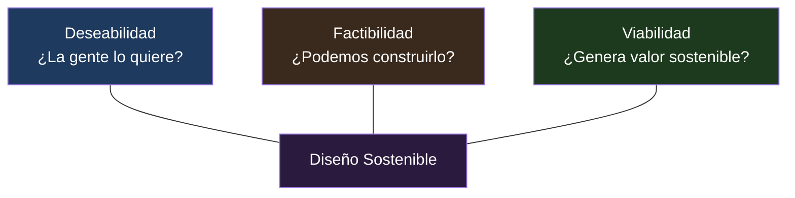

# Validation & Sustainability — Validación Empírica, Causa Raíz y Sostenibilidad del Sistema

> Las 7 áreas que transforman el orquestador de herramienta de ejecución a consultor senior

---

## Tabla de Contenidos

1. [Ciclo de Validación — Diseño Basado en Evidencia](#1-ciclo-de-validación--diseño-basado-en-evidencia)
   - 1.1 [Hipótesis de Diseño](#11-hipótesis-de-diseño)
   - 1.2 [MVP / Prototipo](#12-mvp--prototipo)
   - 1.3 [Validación Fuera de la Oficina](#13-validación-fuera-de-la-oficina)
   - 1.4 [Escalar vs Pivotar vs Iterar](#14-escalar-vs-pivotar-vs-iterar)
   - 1.5 [Registro de Validación](#15-registro-de-validación)
2. [Análisis de Causa Raíz — 5 Porqués](#2-análisis-de-causa-raíz--5-porqués)
   - 2.1 [Metodología](#21-metodología)
   - 2.2 [Brechas de Experiencia](#22-brechas-de-experiencia)
3. [Triple Balance — Deseabilidad × Factibilidad × Viabilidad](#3-triple-balance--deseabilidad--factibilidad--viabilidad)
4. [Escalabilidad y Flexibilidad](#4-escalabilidad-y-flexibilidad)
5. [Protección Jurídica y Gobernanza](#5-protección-jurídica-y-gobernanza)
6. [Curaduría Humana frente a IA](#6-curaduría-humana-frente-a-ia)
7. [Productización del Servicio de Diseño](#7--productización-del-servicio-de-diseño)

---

## 1. Ciclo de Validación — Diseño Basado en Evidencia

> El diseño no es un producto terminado — es una hipótesis. Cada línea, cada color, cada flujo debe ser validado con datos reales antes de escalar.

### El Ciclo Completo

```mermaid
graph LR
    H[Hipótesis de diseño] --> M[MVP / Prototipo]
    M --> V[Validación fuera de la oficina]
    V --> D{Datos validan hipótesis?}
    D -->|Sí| E[Escalar / Producir]
    D -->|No| P[Pivot o Iterar]
    P --> H
    
    style H fill:#1a1a2e,stroke:#4a4a6e
    style M fill:#1e3a5f,stroke:#3e6a9f
    style V fill:#5f1e1e,stroke:#9f3e3e
    style D fill:#2a2a1e,stroke:#5a5a3e
    style E fill:#1e3a1e,stroke:#3e6a3e
    style P fill:#3a2a1e,stroke:#6a4a3e
```



### Etapas del Ciclo

#### 1.1 Hipótesis de Diseño
Documentar explícitamente qué se espera que suceda:
```
Creemos que [cambio de diseño]
producirá [métrica esperada]
medido por [instrumento de medición]
validaremos cuando [criterio de éxito]
```

**Ejemplo:**
```
Creemos que simplificar el registro de 5 pasos a 2 pasos
producirá un aumento del 30% en completion rate
medido por analytics del formulario
validaremos cuando completion rate supere el 65% con n>500
```

#### 1.2 MVP / Prototipo Funcional
- No es un producto incompleto — es el **mínimo necesario para validar la hipótesis**
- Priorizar features que generan aprendizaje, no features que se ven bien
- Postergar animaciones, pulido visual, y branding completo hasta validar

#### 1.3 Validación "Fuera de la Oficina"
Llevar el MVP a usuarios reales, en contexto real:
- **Beta cerrada** con 20-50 usuarios target
- **Landing page test** con pre-registro (valida intención de compra antes de construir)
- **Concierge MVP**: ejecutar el servicio manualmente para validar necesidad
- **Wizard of Oz**: el usuario cree que interactúa con un sistema, pero hay humanos detrás

#### 1.4 Decisión: Escalar o Pivotar

| Señal | Acción |
|:------|:-------|
| Hipótesis validada con datos significativos | Escalar: producir versión completa, branding, animaciones |
| Hipótesis parcialmente validada | Iterar: ajustar variable específica, repetir ciclo |
| Hipótesis no validada (3+ ciclos) | Pivotar: cambiar una variable fundamental del modelo |

#### 1.5 Test A/B Estratégico
No probar colores de botón — probar **filosofías de producto**:

| Nivel | Qué probar | Ejemplo |
|:------|:-----------|:--------|
| **Estratégico** | Filosofía de producto completa | Onboarding guiado vs exploración libre |
| **Funcional** | Flujo alternativo | Checkout en 1 paso vs 3 pasos |
| **UX** | Patrón de interacción | Scroll infinito vs paginación |
| **Visual** | Sistema de diseño (solo tras validar lo anterior) | Paleta A vs Paleta B |

**Regla:** No hacer test visual hasta que el test estratégico o funcional haya validado la hipótesis central.

#### 1.6 Registro de Validaciones
```markdown
## V-2026-001: Simplificación de registro
- **Hipótesis**: 2 pasos → +30% completion rate
- **Métrica**: Completion rate ≥65% con n>500
- **Resultado**: 72.3% (n=847), significativo p<0.01
- **Decisión**: ESCALAR — producir versión completa
- **Aprendizaje**: La página de bienvenida post-registro tiene 42% bounce. Nueva hipótesis registrada como V-2026-002
```

### Trigger words
"validación", "hipótesis de diseño", "MVP validation", "test A/B estratégico", "fuera de la oficina", "beta cerrada", "concierge MVP", "wizard of oz", "escalar o pivotar", "evidence-based design"

---

## 2. Análisis de Causa Raíz — La Técnica de los 5 Porqués

> El cliente rara vez describe el problema real. El síntoma y la causa pueden estar a 5 niveles de distancia.

### Metodología

Cada problema es un síntoma. Preguntar "¿por qué?" repetidamente hasta encontrar la causa sistémica.

```
Problema observado: "Los usuarios abandonan el checkout en el paso 3"
↓ 1. ¿Por qué? Porque el formulario pide demasiada información
↓ 2. ¿Por qué? Porque pedimos datos que el usuario no entiende por qué los necesita
↓ 3. ¿Por qué? Porque el equipo de producto asumió que todos los campos eran obligatorios
↓ 4. ¿Por qué? Porque nunca se validó qué campos eran realmente necesarios para el negocio
↓ 5. ¿Por qué? Porque no hay un proceso de revisión de formularios contra datos reales
→ CAUSA RAÍZ: Falta de proceso de revisión basado en datos
```

### Detección de Brechas de Experiencia

Antes de diseñar, identificar qué tipo de brecha enfrenta el usuario:

| Tipo de Brecha | Síntoma | Solución de diseño |
|:---------------|:--------|:-------------------|
| **De conocimiento** | El usuario no sabe que existe la funcionalidad | Onboarding, tooltips, señalización visual |
| **De habilidad** | El usuario entiende pero no puede ejecutar | Simplificación, guiado paso a paso, automation |
| **De herramientas** | El usuario quiere pero el sistema no lo soporta | Nueva funcionalidad, integración, workaround |
| **De motivación** | El usuario puede pero no quiere | Value prop más clara, gamificación, reducción de fricción |
| **De confianza** | El usuario teme las consecuencias | Trust signals, garantías, transparencia, pruebas gratis |

### Cuándo aplicar 5 Porqués

| Momento | Cómo |
|:--------|:-----|
| **Discovery** (Pre-Fase 0) | En entrevistas con stakeholders y usuarios. Preguntar "¿por qué?" 5 veces en cada afirmación |
| **Post-mortem de feature** | Cuando una funcionalidad lanzada no tuvo adopción. Rastrear hasta la decisión original |
| **Análisis de churn** | Cuando un segmento de clientes se va. No aceptar "porque el precio" como respuesta final |
| **Revisión de diseño** | Cuando un diseño se siente "correcto" pero no funciona. Preguntar por qué se eligió cada elemento |
| **Debrief de investigación** | Después de entrevistas, mapear hallazgos en cadenas de 5 porqués |

### Trigger words
"5 porqués", "five whys", "causa raíz", "root cause", "brecha de experiencia", "brecha de conocimiento", "brecha de habilidad", "por qué los usuarios", "análisis de causa", "problema real vs síntoma", "Ishikawa", "fishbone"

---

## 3. Triple Balance — Deseabilidad × Factibilidad × Viabilidad

> Un diseño que la gente ama pero no se puede construir ni pagar no es diseño — es arte. El orquestador debe equilibrar los tres pilares simultáneamente.

### Los Tres Pilares



### 3.1 Deseabilidad
- **Método**: Entrevistas contextuales, 5 porqués, JTBD, Value Proposition Canvas
- **Pregunta clave**: ¿Esto resuelve un problema real que la gente está dispuesta a pagar por resolver?
- **Señal de alerta**: El stakeholder dice "esto es genial" pero los usuarios en pruebas no lo usan

### 3.2 Factibilidad
- **Método**: Technical spike, revisión de arquitectura, análisis de dependencias, patent search
- **Pregunta clave**: ¿Podemos construir esto con los recursos, tecnología y tiempo disponibles?
- **Señal de alerta**: El equipo de ingeniería dice "técnicamente se puede" pero da estimaciones 3x más largas
- **Checklist de factibilidad**:
  - ¿Existe la tecnología o hay que inventarla?
  - ¿Hay patentes que bloqueen la implementación?
  - ¿El equipo tiene la experiencia necesaria?
  - ¿El timeline es realista considerando otras prioridades?

### 3.3 Viabilidad (Económica + Impacto)
- **Método**: Business Model Canvas, proyecciones financieras, análisis de impacto ambiental/social
- **Pregunta clave**: ¿El diseño genera más valor del que cuesta producirlo y mantenerlo?
- **Doble dimensión**:
  - **Económica**: CAC < LTV, payback < 12 meses, margen saludable
  - **Impacto**: ¿El diseño tiene externalidades positivas o negativas? (accesibilidad, sostenibilidad, inclusión)

### Matriz de Decisión

| Deseabilidad | Factibilidad | Viabilidad | Acción |
|:------------|:------------|:-----------|:-------|
| ✅ Alta      | ✅ Alta     | ✅ Alta    | **Ejecutar ahora** — diseño prioritario |
| ✅ Alta      | ❌ Baja     | ✅ Alta    | **Investigar factibilidad** — technical spike o partnership |
| ✅ Alta      | ✅ Alta     | ❌ Baja    | **Repensar modelo de negocio** — el diseño funciona pero no es rentable |
| ❌ Baja      | ✅ Alta     | ✅ Alta    | **No diseñar** — solo porque se pueda no significa que se deba |
| ⚠️ Incierta | ✅ Alta     | ✅ Alta    | **Validar primero** — prototipo + test antes de construir |
| ❌ Baja      | ❌ Baja     | ❌ Baja    | **Descartar** — ninguna pila soporta la idea |

### Trigger words
"triple balance", "deseabilidad", "factibilidad", "viabilidad", "diseño sostenible", "desirability", "feasibility", "viability", "diseño viable", "balance de diseño"

---

## 4. Escalabilidad y Flexibilidad del Sistema

> Las startups mueren escalando antes de tiempo — o por tener sistemas de diseño rígidos que no evolucionan con el producto.

### 4.1 Identidades Adaptativas

La marca debe funcionar igual de bien en un favicon de 16×16 que en un billboard, en un tweet que en un video de 30s, en modo oscuro que en impreso.

| Principio | Qué significa | Cómo se logra |
|:----------|:--------------|:--------------|
| **Responsive Logo** | El logo cambia de formato según el contexto | Sistema de 3 variantes: horizontal → stacked → icon-only. Transiciones suaves entre variantes |
| **Color Adaptativo** | La paleta se ajusta al medio sin perder identidad | Valores separados por medio: digital (OKLCH/HSL), impreso (CMYK/Pantone), video (Rec.709) |
| **Tipografía Adaptativa** | Variable fonts que se ajustan al viewport y al contexto | Ejes de variación: weight, width, optical size. Min/max por contexto |
| **Motion Adaptativo** | Animaciones con y sin movimiento según preferencia | `prefers-reduced-motion` como default, no como afterthought. Versiones estáticas de cada animación |
| **Modo Contextual** | Dark mode, high contrast, modo económico de datos | Cada activo tiene variante para cada modo. No asumir fondo blanco |

### 4.2 Identidades Fragmentadas (Diseño Modular)

En lugar de un logo monolítico, un **sistema de partes intercambiables**:

```
Logo System = [Símbolo base] + [Tipografía variable] + [Patrón de fondo] + [Elementos modulares]
```

**Ejemplos de aplicación:**
- **Web**: Símbolo en el header, patrón como separador de secciones, tipografía variable en títulos
- **Empaque**: Símbolo + patrón como textura de fondo, tipografía para información
- **Redes**: Símbolo como avatar, patrón como story background, combinaciones según campaña
- **Producto**: Símbolo como splash screen, patrón como loading animation

**Ventajas:**
- La marca respira en diferentes contextos sin perder coherencia
- Se pueden crear "ediciones limitadas" visuales sin rediseñar la marca
- El sistema escala a nuevos productos sin forzar un logo único
- Reduce la fatiga de marca (el usuario no ve siempre lo mismo)

### 4.3 Prueba de Escalabilidad

Antes de lanzar, validar que el sistema pasa estas pruebas:

| Prueba | Qué mide |
|:-------|:---------|
| **Favicon test** | ¿El logo es reconocible a 16×16 píxeles? |
| **Grayscale test** | ¿Funciona sin color? (fotocopias, impresiones B/N) |
| **Inverted test** | ¿Funciona en blanco sobre negro? (dark mode, fondos oscuros) |
| **Tiny screen test** | ¿Funciona en smartwatch, widget de Android, Apple Watch? |
| **Huge format test** | ¿Funciona en billboard, presentación proyectada, mural? |
| **Motion test** | ¿Funciona quieto y en movimiento? (video, animación web) |
| **Audio test** | ¿La marca se reconoce sin verla? (sonic logo, voice assistant) |

### Trigger words
"escalabilidad de marca", "identidad adaptativa", "adaptive identity", "identidad fragmentada", "diseño modular", "responsive logo", "favicon test", "escalar sin perder esencia", "brand scalability"

---

## 5. Protección Jurídica y Gobernanza de Activos

> Comprar un dominio no es proteger una marca. El diseño sin registro legal es un activo sin dueño.

### 5.1 Registro Legal de Marca
- **Cuándo**: Antes de lanzar públicamente. El uso comercial previo al registro puede generar conflictos
- **Dónde**: SAPI (Venezuela), USPTO (EEUU), EUIPO (Europa), INPI (Latam)
- **Qué cubrir**: Nombre, logotipo, isotipo, eslogan, sonic logo (Clase 9)
- **Clases de Niza**: Identificar clases según el negocio antes de registrar
- **Costos**: $250-$2,000 por clase por país. Presupuestar como parte del proyecto de diseño

### 5.2 Gobernanza de Activos — RACI + Versionado

| Actividad | Responsable | Accountable | Consulted | Informed |
|:----------|:------------|:------------|:----------|:---------|
| Crear activo de marca | Diseñador | Brand Steward | Equipo de marketing | Todos |
| Revisar y aprobar | Brand Steward | CEO/CMO | Legal, Diseñador | Equipo |
| Publicar/Desplegar | Marketing | Brand Steward | Diseñador | Todos |
| Archivar versión anterior | Brand Steward | Brand Steward | — | Diseñador |
| Deprecar activo obsoleto | Brand Steward | CEO/CMO | Legal, Marketing | Todos |

**Versionado de marca (semver público):**
```
1.0.0 — Lanzamiento inicial del sistema de identidad
1.1.0 — Nuevas variantes de logo, paleta ampliada
2.0.0 — Rediseño mayor (cambio de logo, paleta, tipografía)
```

### Trigger words
"registro de marca", "SAPI", "clases de Niza", "RACI", "versionado de marca", "brand governance", "control de versiones de marca", "activos de marca", "protección jurídica", "marca registrada"

---

## 6. Curaduría Humana frente a IA

> La IA genera posibilidades — el humano proporciona significado. Sin curaduría humana, la IA produce ruido visual con alta resolución.

### Principio Rector
```
IA genera → Humano cura → Equipo valida → Sistema aprende
```

### Reglas de Gobernanza de IA en Diseño

| Regla | Explicación |
|:------|:------------|
| **1. Toda generación IA debe ser curada por un humano** | Ningún output de IA pasa a producción sin revisión humana. El humano es responsable del resultado final |
| **2. El humano define el "por qué"** | La IA no entiende contexto cultural, emocional, ni estratégico. El humano decide qué idea tiene valor |
| **3. IA para exploración, humano para decisión** | Usar IA para variantes, brainstorm, moodboards. Humano elije, refina, aprueba |
| **4. Respetar licencias y propiedad intelectual** | Verificar que los modelos usados no infrinjan derechos. No asumir que "IA generó" = "libre de derechos" |
| **5. Transparencia con el cliente** | Revelar qué partes del diseño fueron asistidas por IA. El cliente tiene derecho a saber |
| **6. No IA para decisiones estratégicas** | La selección de arquetipo de marca, posicionamiento, naming estratégico y voz de marca son decisiones humanas exclusivas |
| **7. Auditoría de sesgo** | Revisar outputs de IA por sesgos culturales, de género, raciales. La IA replica y amplifica sesgos de sus datos de entrenamiento |
| **8. Conservar el "error humano" intencional** | El imperfectismo curado (bordados, texturas, gestos manuales) es valioso justamente porque NO parece generado por IA |

### Lo que la IA NO puede hacer (humano obligatorio)

- Decidir el posicionamiento estratégico de la marca
- Elegir el arquetipo de marca que resuena culturalmente
- Definir la voz y personalidad de marca
- Juzgar qué emoción evoca un diseño en un contexto cultural específico
- Tomar responsabilidad legal por el diseño
- Entender las implicaciones éticas de una decisión de diseño
- Decidir cuándo romper una regla de diseño por impacto emocional

### Trigger words
"curaduría humana", "IA responsable", "gobernanza de IA", "human curatorship", "humano cura", "IA genera humano decide", "ethical AI design", "sesgo de IA", "imperfectismo vs IA", "sentido crítico IA"

---

## 7. Productización del Servicio de Diseño

> Para quienes viven del diseño: la incertidumbre del presupuesto mata la relación con el cliente. Un servicio productizado es un servicio que se vende como producto.

### 7.1 Metodología Fija — Precios Fijos

Estructura de servicio productizado:

| Componente | Descripción |
|:-----------|:------------|
| **Scope fijo** | Qué incluye y qué NO incluye. Ej: "Hasta 3 conceptos de logo, 2 rondas de revisión, entrega final en 5 formatos" |
| **Precio fijo** | Sin negociación por hora. El precio está en la landing page |
| **Proceso repetible** | Brief → Research → Diseño → Revisión → Entrega. Mismo proceso cada vez |
| **Canal único** | El cliente envía requests por un canal (Trello, Notion, formulario). Un request activo a la vez |
| **Turnaround fijo** | Primer draft en 48h. Cada ronda de revisión 24h |

### Ejemplo de Paquete

```
PAQUETE: Brand Identity Essentials
$3,500 — Precio fijo

Incluye:
- Brand platform (propósito, visión, valores, personalidad)
- 3 conceptos de logo con variantes
- Paleta de color (OKLCH + HEX + Pantone)
- Tipografía principal + secundaria
- Guía rápida de uso (1 página)
- Archivos en PNG, SVG, PDF
- 2 rondas de revisión por concepto

No incluye:
- Brand book completo
- Diseño de empaque
- Aplicaciones digitales
- Rondas extras de revisión ($500/ronda)

Plazo: 10 días hábiles desde la aprobación del brief
```

### 7.2 Pricing por Capacidad

```
Precio mensual objetivo = Ingreso mensual deseado / Número de clientes
```

**Ejemplo:** Quieres $15,000/mes y puedes manejar 5 clientes → precio mínimo $3,000/cliente/mes.

Rango 2026 para diseñador solo:
- **Entry**: $2,500-3,500/mes (alcance limitado, sin IA)
- **Mid**: $3,500-5,000/mes (con automatización IA parcial)
- **Premium**: $5,000-7,500/mes (full automation + estrategia)

### 7.3 Etapa Formativa — Entregar Capacitación

El activo más valioso que puedes dar al cliente no es el diseño — es la **capacidad de autogestionar su marca**.

**Entregables formativos:**
- **Plantillas de Canva** con la identidad precargada (el cliente puede crear posts sin deformar la marca)
- **Video tutorial** de 5-10 min explicando cómo usar los activos
- **Cheat sheet** de una página con do's/don'ts
- **Sesión de capacitación** de 1h con el equipo de marketing
- **Accesso al Brand Kit** con instrucciones claras

**Beneficio:** El cliente depende menos de ti para operar → te contrata para lo estratégico, no para lo operativo. La marca vive más años porque el equipo interno sabe usarla.

### 7.4 Plataformas Recomendadas

| Plataforma | Para qué |
|:-----------|:---------|
| **Canva** | Plantillas autogestionables para el cliente post-entrega |
| **Notion/Trello** | Canal único de requests + seguimiento |
| **Calendly** | Booking de sesiones de capacitación y revisión |
| **Dubsado/HoneyBook** | Contratos, facturación, flujo de aprobación |
| **Figma + FigJam** | Colaboración en tiempo real durante diseño |
| **Lemon Squeezy / Stripe** | Cobro recurrente de suscripciones |

### Trigger words
"productización", "servicio productizado", "design subscription", "pricing fijo", "metodología fija", "etapa formativa", "capacitación de marca", "plantillas Canva", "Designjoy", "MRR de diseño", "revenue de diseño", "paquete de diseño", "design package"

---

## Integración con el Orquestador

**Trigger words:** "validación", "hipótesis", "5 porqués", "causa raíz", "triple balance", "identidad adaptativa", "escalabilidad de marca", "curaduría humana", "IA responsable", "productización de diseño", "metodología fija", "capacitación de marca", "evidence-based design", "root cause", "design subscription", "brand governance", "servicio productizado"

**Flujo integrado:**

```
Fase 0 — Discovery (Pre-Fase 0)
  → strategy/validation-sustainability.md §2 (5 Whys + breaches)
  → strategy/brand-documentation.md §1 (Discovery & Diagnosis)
  → strategy/business-model-design.md (BMC + VPC)
  → strategy/validation-sustainability.md §3 (Triple Balance check)
  → Aprobación de stakeholders

Fase 0.5 — Validación
  → strategy/validation-sustainability.md §1 (Ciclo de Validación)
  → strategy/lean-design.md (MVP scope)
  → strategy/validation-sustainability.md §4 (Escalabilidad)
  → Prototipo → Test → Decisión (Escalar/Pivot/Iterar)

Fase 1 — Ejecución de Diseño
  → strategy/validation-sustainability.md §5 (RACI + governance)
  → strategy/brand-documentation.md (Brand Book + MIC)
  → strategy/validation-sustainability.md §6 (Curaduría humana)
  → Producción de activos

Fase 2 — Entrega + Formación
  → strategy/validation-sustainability.md §7 (Productización)
  → Brand Kit + Plantillas Canva + Capacitación
  → Decision Log + RACI final

Cross-cutting: Cada fase
  → strategy/metrics-framework.md (medir impacto)
  → strategy/validation-sustainability.md §3 (re-balancear constantemente)
```

**Relación con otros documentos:**

| Desde | Lee esto |
|:------|:---------|
| `strategy/business-model-design.md` | §1 (Ciclo de validación) y §3 (Triple balance) para cerrar el loop BMC → diseño |
| `strategy/lean-design.md` | §1 (Ciclo de validación) para profundizar MVP → validación → pivot |
| `strategy/brand-operations.md` | §5 (RACI + gobernanza) para complementar operaciones |
| `strategy/trends-2026.md` | §6 (Curaduría humana) y §4 (identidad adaptativa) para tendencias 2026 |
| `strategy/brand-documentation.md` | §7 (Productización) para la etapa formativa post-entrega |
| `strategy/legal-protection.md` | §5 (Registro legal) para protección completa |
| `strategy/metrics-framework.md` | §1 (Ciclo de validación) para medir impacto de cada hipótesis |
