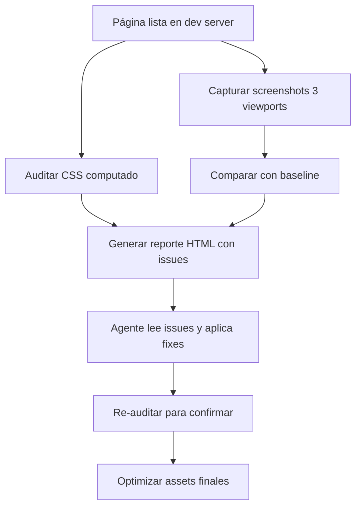

# Visual Review Module

## 1. Stack Instalado

| Herramienta | Rol | Comando |
|---|---|---|
| **Playwright CLI** (`playwright-cli`) | Screenshots, DOM inspección, console audit | `playwright-cli goto/screenshot/eval/console` |
| **ImageMagick** (`magick.exe`) | Redimensionar, convertir, overlay, annotate, bordes | `magick convert/resize/composite/montage` |
| **Libwebp** (`cwebp.exe`) | Convertir PNG/JPEG → WebP | `cwebp -q 80 in.png -o out.webp` |
| **sharp-cli** (`sharp`) | Procesamiento rápido (redimensionar, formatos, metadatos) | `sharp -i in.png -o out.webp resize 1200` |
| **pixelmatch + pngjs** | Diff pixel-level de screenshots (visual regression) | `node -e "pixelmatch(a,b,diff,w,h,{threshold:0.1})"` |
| **@squoosh/cli** | Compresión con códecs modernos (avif, webp2) | `squoosh-cli --avif '{quality:50}' in.png` |

## 2. Scripts Disponibles

### 2.1 `visual-review-pipeline.mjs`
Pipeline completo: captura screenshots en 3 viewports → corre auditoría CSS → genera reporte HTML.

```bash
node .agent/skills/visual-review/scripts/visual-review-pipeline.mjs --url http://localhost:3000 --routes /,/about,/pricing,/blog,/docs,/download
```

Flags:
- `--url` — Base URL del dev server
- `--routes` — Lista de rutas separadas por coma
- `--viewports` — Viewports a testear (default: `1440x900,768x1024,390x844`)
- `--output` — Directorio de output (default: `screenshots/`)
- `--report` — Generar reporte HTML (default: true)

### 2.2 `audit-css.mjs`
Auditoría profunda de estilos computados: contrast ratio, font-size mínimo, overflow, heading hierarchy, touch targets.

```bash
playwright-cli eval "$(cat .agent/skills/visual-review/scripts/audit-css.mjs)"
```

Checks:
- **Contrast ratio** — texto < 4.5:1 → warning
- **Font size mínimo** — texto < 11px → warning
- **Overflow** — elementos clip-eados → warning
- **Heading hierarchy** — skip de niveles (h1→h3, h2→h4) → warning
- **Touch targets** — < 44x44px → warning
- **Empty alt** — `` sin `alt=""` → warning
- **Console errors** — > 0 → error

### 2.3 `visual-regression.mjs`
Compara screenshots actuales vs baseline con pixelmatch. Reporta diferencias.

```bash
node .agent/skills/visual-review/scripts/visual-regression.mjs --baseline screenshots/baseline --current screenshots/latest
```

### 2.4 `optimize-assets.mjs`
Optimiza imágenes en el build output con squoosh + sharp + ImageMagick + cwebp.

```bash
node .agent/skills/visual-review/scripts/optimize-assets.mjs --input dist/assets --quality 80
```

## 3. Flujo de Trabajo



## 4. Referencia Rápida de Comandos

```bash
# Tomar screenshot
playwright-cli screenshot --full-page --filename=page.png

# Evaluar JS en página
playwright-cli eval "getComputedStyle(document.querySelector('h1')).fontSize"

# Ver console errors
playwright-cli console

# Procesar con ImageMagick
magick convert input.png -resize 50% -quality 85 output.jpg

# Diff screenshots
magick compare baseline.png current.png diff.png

# Convertir a WebP
cwebp -q 80 input.png -o output.webp

# Comprimir con squoosh
squoosh-cli --webp '{quality:75}' input.png

# Redimensionar con sharp
sharp -i input.png -o output.webp resize 1200
```
